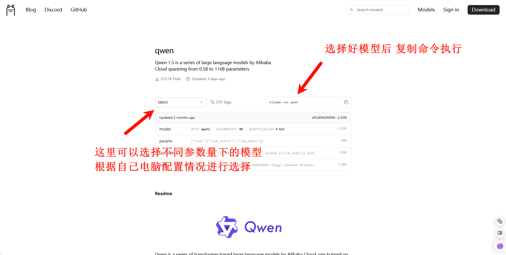

# SpringAI 集成AI及本地部署AI


本篇主要简述一下SpringAI 如何来调用AI接口，以及部署本地AI来调用AI接口。


## 项目依赖

在内部接入AI，需要导入一下依赖

```xml
<dependency>
    <groupId>org.springframework.ai</groupId>
    <artifactId>spring-ai-openai-spring-boot-starter</artifactId>
</dependency>
```

或者

```xml
<dependency>
    <groupId>org.springframework.ai</groupId>
    <artifactId>spring-ai-ollama-spring-boot-starter</artifactId>
</dependency>
```


正对不同模型，spring ai 提供了不同的依赖jar包，上述给出的示例就是 chat-gpt 和 ollama 两中接口，根据实际使用，选择不同依赖。

例如：


然后本人的pom文件使用的是一个快照版本 pom配置文件如下：

```xml
<dependencyManagement>
    <dependencies>
        <dependency>
            <groupId>org.springframework.ai</groupId>
            <artifactId>spring-ai-bom</artifactId>
            <version>1.0.0-SNAPSHOT</version>
            <type>pom</type>
            <scope>import</scope>
        </dependency>
    </dependencies>
</dependencyManagement>
```


使用上述的依赖的时候，maven官方还未将上述使用的依赖录入，所以我们这里需要改变一下仓库地址 pom配置文件内容如下

```xml
<!--	<repositories>-->
<!--		<repository>-->
<!--			<id>spring-milestones</id>-->
<!--			<name>Spring Milestones</name>-->
<!--			<url>https://repo.spring.io/milestone</url>-->
<!--		</repository>-->
<!--	</repositories>-->

	<repositories>
        <!--这里使用的是快照版本-->
		<repository>
			<id>spring-snapshot</id>
			<name>Spring Snapshot</name>
			<url>https://repo.spring.io/snapshot</url>
			<releases>
				<enabled>false</enabled>
			</releases>
		</repository>
	</repositories>
```


然后可以写代码调用接口了。


## 代码内容

### chat-gpt

#### 聊天

```java
@RestController
@RequestMapping("/chatgpt")
public class ChatGPTController {

    @Resource
    private OpenAiChatClient openAiChatClient;

    @GetMapping("/chat1")
    public String chat1(@RequestParam(value = "msg") String msg) {
        String call = openAiChatClient.call(msg);
        return call;
    }

    @GetMapping("/chat2")
    public String chat2(@RequestParam(value = "msg") String msg) {
        ChatResponse call = openAiChatClient.call(new Prompt(msg, OpenAiChatOptions.builder()
                .withModel("gpt-3.5-turbo") // 指定模型 版本
                .withTemperature(0.5F) // 值越大 准确率约低
                .build()));
        return call.getResult().getOutput().getContent();
    }
    @GetMapping("/chat3")
    public Object chat3(@RequestParam(value = "msg") String msg) {
        Flux<ChatResponse> stream = openAiChatClient.stream(new Prompt(msg, OpenAiChatOptions.builder()
                .withModel("gpt-3.5-turbo") // 指定模型 版本
                .withTemperature(0.5F) // 值越大 准确率约低
                .build()));
        return stream.collectList(); // 数据的序列， 一序列的数据，一个一个的数据返回
    }

}
```


#### 图片生成

```java
@RestController
@RequestMapping("/images")
public class OpenAIImageController {

    @Resource
    private OpenAiImageClient openAiImageClient;

    @RequestMapping("/image1")
    private String generateImage1(@RequestParam(value = "msg") String msg) {
        // 可以通过配置文件来设置参数属性
        ImageResponse imageResponse = openAiImageClient.call(new ImagePrompt(msg, OpenAiImageOptions.builder()
                .withQuality("hd") // 高清
                .withN(4)   // 指定生成图片数量
                .withHeight(1024)   // 指定分辨率
                .withWidth(1024)
                .build()));
        String url = imageResponse.getResult().getOutput().getUrl();
        return url;
    }
}
```


```yaml
spring:
  application:
    name: spring-ai-demo-01
    openai:
      api-key: xx
      base-url: xx
      image:
        options:
          width: xx
          height: xx
          n: xx
          model: xx
```


#### 音频转文本

```java
@RestController
@RequestMapping("/transcription")
public class TranscriptionController {

    @Resource
    private OpenAiAudioTranscriptionClient openAiAudioTranscriptionClient;

    @GetMapping("/transcribe1")
    public Object transcribe1() {
        // 将音频转文字
        // 这里将资源放在classpath目录下的
        org.springframework.core.io.Resource audio = new ClassPathResource("xxx.flac");
        String call = openAiAudioTranscriptionClient.call(audio);
        return call;
    }
}
```


#### 文本转音频

```java
@RestController
@RequestMapping("/tts")
public class TTSController {

    @Resource
    private OpenAiAudioSpeechClient openAiAudioSpeechClient;

    @GetMapping("/speak")
    public String speak() {
        String text = "语音内容";
        byte[] call = openAiAudioSpeechClient.call(text);
        writeBytesToFile(call, "output.mp3");
        return "success";
    }

    public static void writeBytesToFile(byte[] byteArray, String filePath) {
        try (BufferedOutputStream bos = new BufferedOutputStream(new FileOutputStream(filePath))) {
            bos.write(byteArray);
            System.out.println("字节数组已成功写入文件。");
        } catch (IOException e) {
            System.out.println("写入文件时出错：" + e.getMessage());
            e.printStackTrace();
        }
    }
}
```


#### 识别图片

```java
@RestController
@RequestMapping("/multi")
public class MultiModelController {

    @Resource
    private ChatClient chatClient;

    @GetMapping

    public Object multiModel(String msg, String imageUrl) {
        // 这里要指定图片类型
        UserMessage userMessage = new UserMessage(msg, List.of(new Media(MimeTypeUtils.IMAGE_PNG, imageUrl)));

        // 这里要指定模型
        ChatResponse call = chatClient.call(new Prompt(userMessage, OpenAiChatOptions.builder()
                .withModel(OpenAiApi.ChatModel.GPT_4_VISION_PREVIEW.getValue())
                .build()));
        return call.getResult().getOutput().getContent();
    }
}
```


### ollama

```java
@RestController
@RequestMapping("/ollama")
public class OllamaController {

    @Resource
    private OllamaChatClient ollamaChatClient;

    @GetMapping("/chat")
    public Object ollama(@RequestParam(value = "msg") String msg){
        String call = ollamaChatClient.call(msg);
        System.out.println(call);
        return call;
    }

    @GetMapping("/chat1")
    public Object ollama1(@RequestParam(value = "msg") String msg){
        ChatResponse response = ollamaChatClient.call(
                new Prompt(
                        msg,
                        OllamaOptions.create()
                                .withModel("qwen")
                                .withTemperature(0.4F)
                ));
        System.out.println(response.getResult().getOutput());
        return response.getResult().getOutput();
    }
}
```


第一种方式会去使用配置文件中指定的模型，第二种文件使用，代码指定的模型。如果在代码中指定了模型，以代码指定的模型进行调用 `.withModel("qwen")`  `.withTemperature(0.4F)` 设置问题回答的准确度，值越大准确率下降。还可以设置其他参数，通过代码或者写配置文件的形式进行设置，可自行查看官方文档。[Spring AI API :: Spring AI Reference](https://docs.spring.io/spring-ai/reference/1.0-SNAPSHOT/api/index.html)


在使用不同模型，`application.yml`配置内容也不同


API-KEY

```yaml
spring:
  application:
    name: spring-ai-demo-01
  ai:
    openai:
      api-key: xxx # 填写自己的 api-key
      base-url: https://api.openai.com
```


本地大模型：

```yaml
spring:
  application:
    name: spring-ai-demo-01
  ai:
    ollama:
      base-url: http://localhost:11434
      chat:
        options:
          model: qwen
```


## 本地模型部署


在 ollama 官网进行下载 [Ollama](https://ollama.com/) ，下载window版即可

下载完成后 就可以选择模型进行部署在本地上 ollama 的官方提供了各类模型部署的命令





如何所示就是正常下载并运行。我这个原来下载过了，如果是第一次执行这条命令，他会自动去下载模型。


默认模型运行端口`localhost:11434`，在配置文件中就可以应用自己本地的模型

配置文件中用本地模型的时候，要注意模型的名称要写完整，不然会报错 500 找不到模型


