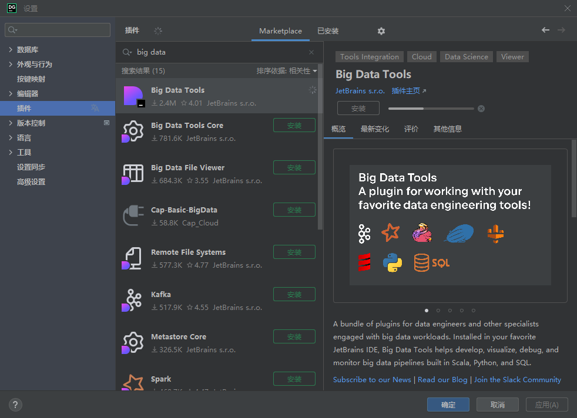
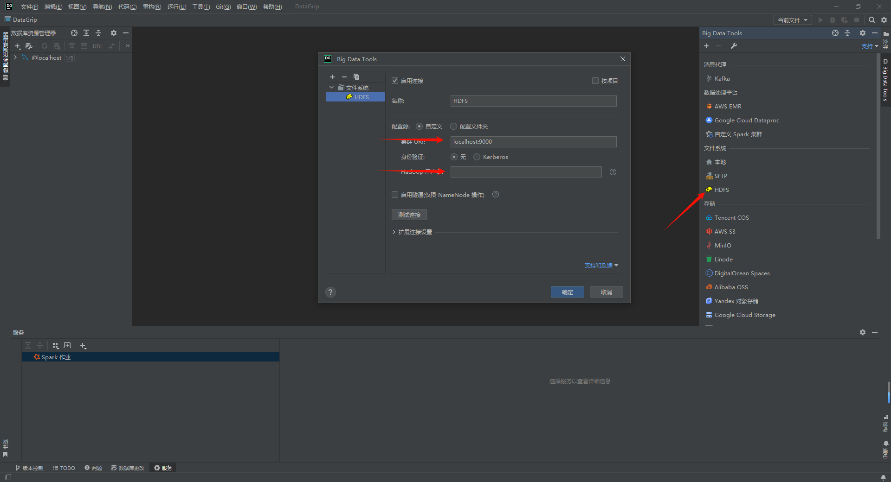
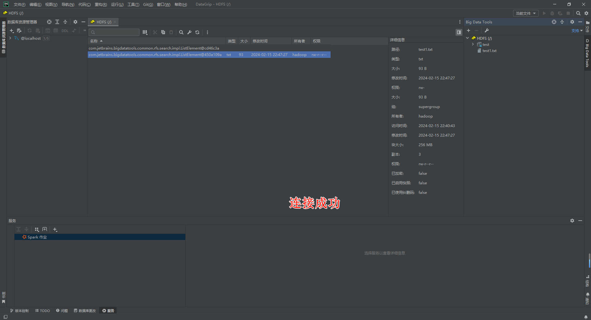

# HDFS集群部署


hadoop安装包下载 [Apache Hadoop](https://hadoop.apache.org/releases.html) 将下载的压缩包上传到虚拟机中进行解压

```sh
tar -zxf hadoop-3.3.6.tar.gz -C /export/server
```

构建软链接，规范文件夹命名

```sh
cd /export/server
ln -s /export/server/hadoop-3.3.6 hadoop
```


## 修改配置文件

进入hadoop文件夹中，修改配置文件

1. 配置`workers`文件

   ```sh
   cd /export/server/hadoop/etc/hadoop/
   vim workers
   ```

   删除原有的内容，修改为集群中主机名

   ```tex
   node1
   node2
   node3
   ```

2. 配置`hadoop-env.sh`文件

   ```sh
   vim hadoop-env.sh
   ```

   ```sh
   export JAVA_HOME=/export/server/jdk
   export HADOOP_HOME=/export/server/hadoop
   export HADOOP_CONF_DIR=$HADOOP_HOME/etc/hadoop
   export HADOOP_LOG_DIR=$HADOOP_HOME/logs
   ```

   指明JDK环境变量，Hadoop安装位置，Hadoop配置文件目录位置，Hadoop运行日志目录位置。

3. 配置`core-site.xml`文件

   ```sh
   vim core-site.xml
   ```

   ```xml
   <configuration>
       <!--HDFS文件系统的通讯路径-->
   	<property>
       	<name>fs.defaultFS</name>
           <value>hdfs://node1:8020</value>
       </property>
       <!--io操作文件缓冲区大小 131072bit-->
       <property>
       	<name>io.file.buffer.size</name>
           <value>131072</value>
       </property>
   </configuration>
   ```

   `hdfs://node1:8020`为整个HDFS内部通讯地址，协议为`hdfs://`，这里固定`node1`为NameNode所在机器。

4. 配置`hdfs-site.xml`文件

   ```sh
   vim hdfs-site.xml
   ```

   ```xml
   <configuration>
       <!--设置默认创建的文件权限设置 700 rwx------ -->
   	<property>
       	<name>dfs.datanode.data.dir.perm</name>
           <value>700</value>
       </property>
       <!--namenode元数据存储位置-->
       <property>
       	<name>dfs.namenode.name.dir</name>
           <value>/data/nn</value>
       </property>
       <!--namenode允许连接那些datanode节点连接-->
       <property>
       	<name>dfs.namenode.hosts</name>
           <value>node1,node2,node3</value>
       </property>
       <!--hdfs默认块大小-->
       <property>
       	<name>dfs.blocksize</name>
           <value>268435456</value>
       </property>
       <!--namenode处理的并发线程数-->
       <property>
       	<name>dfs.namenode.handler.count</name>
           <value>100</value>
       </property>
       <!--datanode的数据存储目录-->
       <property>
       	<name>dfs.datanode.data.dir</name>
           <value>/data/dn</value>
       </property>
   </configuration>
   ```

   

   根据配置，这里需要创建namenode和datanode数据存储的文件目录

   ```sh
   mkdir -p /data/nn
   mkdir -p /data/dn
   ```

   node1服务器需要创建这两个目录，而node2，node3作为datanode只需要创建`/data/dn`目录。


同样三个服务器都要进行相同的安装配置，这里通过远程复制文件将node1配置好的hadoop文件夹复制到node2，node3相同路径中

```sh
cd /export/server
scp -r hadoop-3.3.6 node2:/export/server
scp -r hadoop-3.3.6 node3:$pwd
```

在node2，node3中同样创建出软链接，规范文件命名

```sh
ln -s /export/server/hadoop-3.3.6/ /export/server/hadoop
```


## 配置环境变量

```sh
vim /etc/profile
```

```sh
export HADOOP_HOME=/export/server/hadoop
export PATH=$PATH:$HADOOP_HOME/bin:$HADOOP_HOME/sbin
```

三台服务器都要进行环境变量配置。


## 授权hadoop用户

在`root`用户权限下进行权限修改

```sh
chown -R hadoop:hadoop /data
chown -R hadoop:hadoop /export
```


## HDFS启动

格式化整个文件系统，进行初始化

**切换到`hadoop`用户权限下执行**

```sh
su - hadoop
hadoop namenode -format
```

启动

```sh
# 一键启动hdfs集群
start-dfs.sh
# 一件关闭hdfs集群
stop-dfs.sh
```


# HDFS的Shell操作


HDFS和Linux系统一样，使用根目录作为组织形式，是命令操作上和Linux系统一样，通过协议头进行目录路径区分是属于Linux系统或是HDFS文件系统。

Linux系统中路径协议头：`file://`

HDFS文件系统中路径协议头：`hdfs://xxxnode:8020`

在实际操作可以省略协议头，系统操作命令会自动进行识别


HDFS提供了两套操作命令：

老版本命令：`hadoop fs [generic option]`

新版本命令：`hdfs dfs [generic option]`

两中命令使用上相同


## 创建文件夹

```sh
hadoop fs -mkdir [-p] <path> ...

hdfs dfs -mkdir [-p] <path> ...
```

- `-p`：创建多级目录
- `<path>`：指定路径名


## 查看目录内容

```sh
hadoop fs -ls [-h -R] <path> ...

hdfs dfs -ls [-h - R] <path> ...
```

- `-h`：显示文件大小
- `-R`：递归查看指定目录及其子目录


## 上传文件到HDFS指定目录

```sh
hadoop fs -put [-f -p] <localsrc> ... <dst>

hdfs dfs -put [-f -p] <localsrc> .. <dst>
```

- `-f`：覆盖目标文件（已存在）
- `-p`：保留访问和修改时间，所有权和权限
- `localsrc`：本地文件系统（客户端所在机器）
- `dst`：目标文件系统（HDFS）


## 查看HDFS文件内容

```sh
hadoop fs -cat <src> ...

hdfs dfs -cat <src> ...
```

读取指定文件全部内容，显示在标准输出控制台

可使用管道符配合`more`

```sh
hadoop fs -cat <src> ... | more

hdfs dfs -cat <src> ... | more
```


## 下载HDFS文件

```sh
hadoop fs -get [-f -p] <src> ... <localdst>

hdfs dfs -get [-f -p] <src> ... <localdst>
```

下载文件到本地文件系统指定目录，`localdst`必须是目录

- `-f`：覆盖目标文件（已存在）
- `-p`：保留访问和修改时间，所有权和权限


## 拷贝HDFS文件

```sh
hadoop fs -cp [-f] <src> ... <dst>

hdfs dfs -cp [-f] <src> ... <dst>
```

- `-f`：覆盖目标文件（已存在）


## 追加数据到HDFS文件中

```sh
hadoop fs -appendToFile <localsrc> ... <dst>

hdfs dfs -appendToFile <localsrc> ... <dst>
```

将给定本地文件的内容追加到给定`dst`文件，`dst`如果文件不存在，将创建文件

从标准输入流读取内容进行追加，如下

```sh
echo "要追加的内容" | hdfs dfs -appendToFile - /path/to/destination/file.txt
```


## HDFS数据移动操作

```sh
hadoop fs -mv <src> ... <dst>

hdfs dfs -mv <src> ... <dst>
```

移动文件到指定文件夹下，可以使用该命令移动数据，重命名文件的名称。


## HDFS数据删除操作

```sh
hadoop fs -rm -r [-skipTrash] URI [URI ...]

hdfs dfs -rm -r [-skipTrash] URI [URI ...]
```

删除指定路径的文件或文件夹

- `-shikTrash`：跳过回收站，直接删除


回收站功能默认是关闭的，如果要打开需要在`core-site.xml`内配置

```xml
<configuration>
	<property>
    	<name>fs.trash.interval</name>
        <value>1440</value>
    </property>
    <property>
    	<name>fs.trash.checkpoint.interval</name>
        <value>120</value>
    </property>
</configuration>
```

文件回收存活时间为1天，回收站每两小时进行一次检查，删除超时的文件。


官方文档参考[Apache Hadoop 3.3.6 – Overview](https://hadoop.apache.org/docs/stable/hadoop-project-dist/hadoop-common/FileSystemShell.html)


## HDFS权限修改

- Linux的超级用户是`root`
- HDFS的超级用户是`启动namenode的用户`


修改用户和组

```sh
hadoop fs -chown [-R] root:root /xxx.txt

hdfs dfs -chown [-R] root:root /xxx,txt
```

修改权限

```sh
hadoop fs -chmod [-R] 777 /xxx.txt

hdfs dfs -chmod [-R] 777 /xxx.txt
```


- `-R`：递归操作，会修改子目录中所有子目录及其文件的用户/组，权限。


## HDFS客户端使用

在Jetbrains产品中下载 Big Data Tools插件




windows系统下基础设置

1. 解压Hadoop安装包到windows系统

2. 设置Hadoop环境变量`$HADOOP_HOME$`

3. 下载软链接放入`$HADOOP_HOME$/bin`

   `hadoop.dll`和`winutils.exe`：[cdarlint/winutils: winutils.exe hadoop.dll and hdfs.dll binaries for hadoop windows (github.com)](https://github.com/cdarlint/winutils)


配置插件进行连接







# HDFS的存储原理
