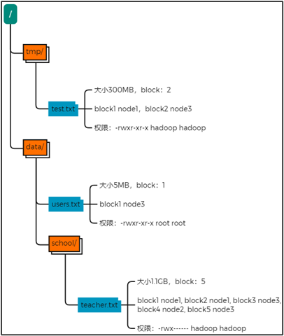
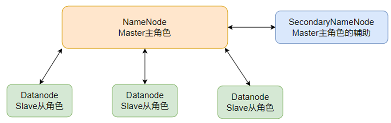
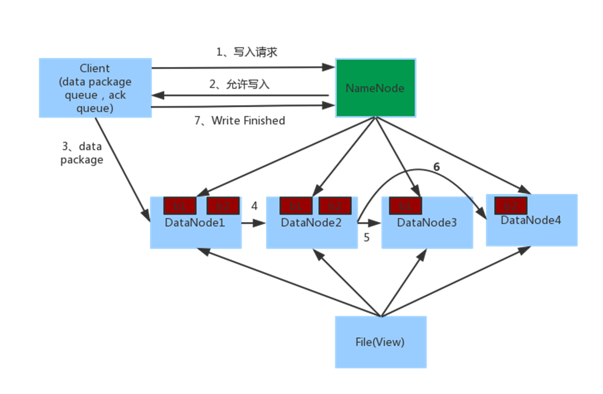
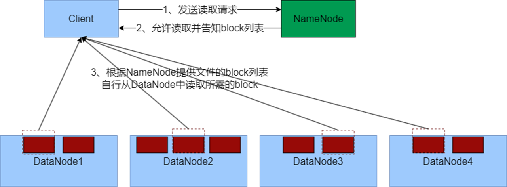

# HDFS集群部署


hadoop安装包下载 [Apache Hadoop](https://hadoop.apache.org/releases.html) 将下载的压缩包上传到虚拟机中进行解压

```sh
tar -zxf hadoop-3.3.6.tar.gz -C /export/server
```

构建软链接，规范文件夹命名

```sh
cd /export/server
ln -s /export/server/hadoop-3.3.6 hadoop
```


## 修改配置文件

进入hadoop文件夹中，修改配置文件

1. 配置`workers`文件

   ```sh
   cd /export/server/hadoop/etc/hadoop/
   vim workers
   ```

   删除原有的内容，修改为集群中主机名

   ```tex
   node1
   node2
   node3
   ```

2. 配置`hadoop-env.sh`文件

   ```sh
   vim hadoop-env.sh
   ```

   ```sh
   export JAVA_HOME=/export/server/jdk
   export HADOOP_HOME=/export/server/hadoop
   export HADOOP_CONF_DIR=$HADOOP_HOME/etc/hadoop
   export HADOOP_LOG_DIR=$HADOOP_HOME/logs
   ```

   指明JDK环境变量，Hadoop安装位置，Hadoop配置文件目录位置，Hadoop运行日志目录位置。

3. 配置`core-site.xml`文件

   ```sh
   vim core-site.xml
   ```

   ```xml
   <configuration>
       <!--HDFS文件系统的通讯路径-->
   	<property>
       	<name>fs.defaultFS</name>
           <value>hdfs://node1:8020</value>
       </property>
       <!--io操作文件缓冲区大小 131072bit-->
       <property>
       	<name>io.file.buffer.size</name>
           <value>131072</value>
       </property>
   </configuration>
   ```

   `hdfs://node1:8020`为整个HDFS内部通讯地址，协议为`hdfs://`，这里固定`node1`为NameNode所在机器。

4. 配置`hdfs-site.xml`文件

   ```sh
   vim hdfs-site.xml
   ```

   ```xml
   <configuration>
       <!--设置默认创建的文件权限设置 700 rwx------ -->
   	<property>
       	<name>dfs.datanode.data.dir.perm</name>
           <value>700</value>
       </property>
       <!--namenode元数据存储位置-->
       <property>
       	<name>dfs.namenode.name.dir</name>
           <value>/data/nn</value>
       </property>
       <!--namenode允许连接那些datanode节点连接-->
       <property>
       	<name>dfs.namenode.hosts</name>
           <value>node1,node2,node3</value>
       </property>
       <!--hdfs默认块大小-->
       <property>
       	<name>dfs.blocksize</name>
           <value>268435456</value>
       </property>
       <!--namenode处理的并发线程数-->
       <property>
       	<name>dfs.namenode.handler.count</name>
           <value>100</value>
       </property>
       <!--datanode的数据存储目录-->
       <property>
       	<name>dfs.datanode.data.dir</name>
           <value>/data/dn</value>
       </property>
   </configuration>
   ```

   

   根据配置，这里需要创建namenode和datanode数据存储的文件目录

   ```sh
   mkdir -p /data/nn
   mkdir -p /data/dn
   ```

   node1服务器需要创建这两个目录，而node2，node3作为datanode只需要创建`/data/dn`目录。


同样三个服务器都要进行相同的安装配置，这里通过远程复制文件将node1配置好的hadoop文件夹复制到node2，node3相同路径中

```sh
cd /export/server
scp -r hadoop-3.3.6 node2:/export/server
scp -r hadoop-3.3.6 node3:$PWD
```

在node2，node3中同样创建出软链接，规范文件命名

```sh
ln -s /export/server/hadoop-3.3.6/ /export/server/hadoop
```


## 配置环境变量

```sh
vim /etc/profile
```

```sh
export HADOOP_HOME=/export/server/hadoop
export PATH=$PATH:$HADOOP_HOME/bin:$HADOOP_HOME/sbin
```

三台服务器都要进行环境变量配置。


## 授权hadoop用户

在`root`用户权限下进行权限修改

```sh
chown -R hadoop:hadoop /data
chown -R hadoop:hadoop /export
```


## HDFS启动

格式化整个文件系统，进行初始化

**切换到`hadoop`用户权限下执行**

```sh
su - hadoop
hadoop namenode -format
```

启动

```sh
# 一键启动hdfs集群
start-dfs.sh
# 一件关闭hdfs集群
stop-dfs.sh
```

执行原理：

- 首先在执行此脚本机器上，启动`SecondaryNameNode`
- 读取`core-site.xml`内容（`fs.defaultFS`），确认`NameNode`所在机器，启动`NameNode`
- 读取`workers`内容，确认`DataNode`所在机器，启动全部`DataNode`


- 首先在执行此脚本机器上，关闭`SecondaryNameNode`
- 读取`core-site.xml`内容（`fs.defaultFS`），确认`NameNode`所在机器，关闭`NameNode`
- 读取`workers`内容，确认`DataNode`所在机器，关闭全部`DataNode`


单进程启停

```sh
hadoop-daemon.sh (start|status|stop) (namenode|secondarynamenode|datanode)

hdfs --daemon (start|status|stop) (namenode|secondarynamenode|datanode)
```


启动完成后，在浏览器打开`http://node1:9870`，即可查看HDFS文件系统的管理网页


# HDFS的Shell操作


HDFS和Linux系统一样，使用根目录作为组织形式，是命令操作上和Linux系统一样，通过协议头进行目录路径区分是属于Linux系统或是HDFS文件系统。

Linux系统中路径协议头：`file://`

HDFS文件系统中路径协议头：`hdfs://xxxnode:8020`

在实际操作可以省略协议头，系统操作命令会自动进行识别


HDFS提供了两套操作命令：

老版本命令：`hadoop fs [generic option]`

新版本命令：`hdfs dfs [generic option]`

两中命令使用上相同


## 创建文件夹

```sh
hadoop fs -mkdir [-p] <path> ...

hdfs dfs -mkdir [-p] <path> ...
```

- `-p`：创建多级目录
- `<path>`：指定路径名


## 查看目录内容

```sh
hadoop fs -ls [-h -R] <path> ...

hdfs dfs -ls [-h - R] <path> ...
```

- `-h`：显示文件大小
- `-R`：递归查看指定目录及其子目录


## 上传文件到HDFS指定目录

```sh
hadoop fs -put [-f -p] <localsrc> ... <dst>

hdfs dfs -put [-f -p] <localsrc> .. <dst>
```

- `-f`：覆盖目标文件（已存在）
- `-p`：保留访问和修改时间，所有权和权限
- `localsrc`：本地文件系统（客户端所在机器）
- `dst`：目标文件系统（HDFS）


## 查看HDFS文件内容

```sh
hadoop fs -cat <src> ...

hdfs dfs -cat <src> ...
```

读取指定文件全部内容，显示在标准输出控制台

可使用管道符配合`more`

```sh
hadoop fs -cat <src> ... | more

hdfs dfs -cat <src> ... | more
```


## 下载HDFS文件

```sh
hadoop fs -get [-f -p] <src> ... <localdst>

hdfs dfs -get [-f -p] <src> ... <localdst>
```

下载文件到本地文件系统指定目录，`localdst`必须是目录

- `-f`：覆盖目标文件（已存在）
- `-p`：保留访问和修改时间，所有权和权限


## 拷贝HDFS文件

```sh
hadoop fs -cp [-f] <src> ... <dst>

hdfs dfs -cp [-f] <src> ... <dst>
```

- `-f`：覆盖目标文件（已存在）


## 追加数据到HDFS文件中

```sh
hadoop fs -appendToFile <localsrc> ... <dst>

hdfs dfs -appendToFile <localsrc> ... <dst>
```

将给定本地文件的内容追加到给定`dst`文件，`dst`如果文件不存在，将创建文件

从标准输入流读取内容进行追加，如下

```sh
echo "要追加的内容" | hdfs dfs -appendToFile - /path/to/destination/file.txt
```


## HDFS数据移动操作

```sh
hadoop fs -mv <src> ... <dst>

hdfs dfs -mv <src> ... <dst>
```

移动文件到指定文件夹下，可以使用该命令移动数据，重命名文件的名称。


## HDFS数据删除操作

```sh
hadoop fs -rm -r [-skipTrash] URI [URI ...]

hdfs dfs -rm -r [-skipTrash] URI [URI ...]
```

删除指定路径的文件或文件夹

- `-shikTrash`：跳过回收站，直接删除


回收站功能默认是关闭的，如果要打开需要在`core-site.xml`内配置

```xml
<configuration>
	<property>
    	<name>fs.trash.interval</name>
        <value>1440</value>
    </property>
    <property>
    	<name>fs.trash.checkpoint.interval</name>
        <value>120</value>
    </property>
</configuration>
```

文件回收存活时间为1天，回收站每两小时进行一次检查，删除超时的文件。


官方文档参考[Apache Hadoop 3.3.6 – Overview](https://hadoop.apache.org/docs/stable/hadoop-project-dist/hadoop-common/FileSystemShell.html)


## HDFS权限修改

- Linux的超级用户是`root`
- HDFS的超级用户是`启动namenode的用户`


修改用户和组

```sh
hadoop fs -chown [-R] root:root /xxx.txt

hdfs dfs -chown [-R] root:root /xxx,txt
```

修改权限

```sh
hadoop fs -chmod [-R] 777 /xxx.txt

hdfs dfs -chmod [-R] 777 /xxx.txt
```


- `-R`：递归操作，会修改子目录中所有子目录及其文件的用户/组，权限。


## HDFS客户端使用

### Jetbrains插件

在Jetbrains产品中下载 Big Data Tools插件


windows系统下基础设置

1. 解压Hadoop安装包到windows系统

2. 设置Hadoop环境变量`$HADOOP_HOME$`

3. 下载软链接放入`$HADOOP_HOME$/bin`

   `hadoop.dll`和`winutils.exe`：[cdarlint/winutils: winutils.exe hadoop.dll and hdfs.dll binaries for hadoop windows (github.com)](https://github.com/cdarlint/winutils)


配置插件进行连接


### 使用NFS网关功能挂在HDFS到本地


配置HDFS

1. `core-site.xml`文件配置

```xml
<configuration>
    <!--允许hadoop用户代理任何其他用户组-->
	<property>
    	<name>hadoop.proxyuser.hadoop.groups</name>
        <value>*</value>
    </property>
    <!--允许代理任意服务器的请求-->
    <property>
    	<name>hadoop.proxyuser.hadoop.hosts</name>
        <value>*</value>
    </property>
</configuration>
```

2. `hdfs-site.xml`文件配置

```xml
<configuration>
    <!--NFS操作HDFS系统 使用的超级用户 (hdfs的启动用户为超级用户)-->
	<property>
    	<name>nfs.superuser</name>
        <value>hadoop</value>
    </property>
    <!--NFS接收数据上传时使用的临时目录-->
    <property>
    	<name>hadoop.dump.dir</name>
        <value>/tmp/.hdfs-nfs</value>
    </property>
    <!--NFS允许连接的客户端IP和权限 rw表示读写-->
    <property>
    	<name>nfs.exports.allowed.hosts</name>
        <value>192.168.88.1 rw</value>
    </property>
</configuration>
```


启动NFS功能

1. 将配置好后的`core-site.xml`和`hdfs-site.xml`发送到其他服务器上，进行相同的配置。

   ```/
   scp core-site.xml hdfs-site.xml node2:$PWD/
   scp core-site.xml hdfs-site.xml node3:$PWD/
   ```

2. 重启HDFS集群

   ```sh
   stop-dfs.sh
   start-dfs.sh
   ```

3. 停止Linux系统NFS相关进程

   ```sh
   systemctl stop nfs
   systemctl disable nfs
   yum remove -y rpcbind
   ```

4. 启动`portmap`（HDFS自带的rpcbing功能），**以root用户权限执行**

   ```sh
   hdfs --daemon start portmap
   ```

5. 启动`nfs`（HDFS自带的nfs功能），**以hadoop用户权限执行**

   ```sh
   hdfs --daemon start nfs3
   ```


检查NFS是否正常

在上述操作中，我们卸载了系统自带的rpcbin，缺少两个命令，需要在另一条datanode服务器上来查看

```sh
rpcbin -p node1

showmount -e node1
```


在windows挂在HDFS

1. 在windows的`控制面板/启用或关闭Windows功能`中选择NFS进行安装（windows专业版才具有）
2. 在windows的命令提示符中执行`net use X:\\192.168.88.130\!`，完成后即可看见网络位置出出现一个磁盘标识符


# HDFS的存储原理


## 存储原理


- 将文件分成几部分，分别存储在不同的服务器上
- HDFS存储系统中设定统一大小的管理单位——block块，每个块默认256MB（可修改），block块是HDFS最小存储单元
- 将文件拆分成block块，每个服务器存储一部分的块


- 丢失一个block块，会导致文件不完成，造成损坏

- HDFS存储系统通过多个副本（备份）来解决块数据丢失问题
- 每个block，默认设置有3个副本（本身一个块加上两个备份的块），备份的块分别存储在不同服务器上，不存储在本服务器上，提高安全性


> - 数据存入HDFS是分布式存储，即每个服务器节点，负责数据的一部分
> - 数据在HDFS上划分为一个个block块进行存储
> - 在HDFS上，数据block块可以有多个副本，提高数据安全性


## HDFS副本块配置

修改`hdfs-site.xml`文件进行配置

```xml
<configuration>
    <!--属性默认配置为3，一般情况下，无需主动配置-->
	<property>
    	<name>dfs.replication</name>
        <value>3</value>
    </property>
</configuration>
```


除了配置文件上对副本块数量进行设置，也可以通过上传通过命令来对副本块数量进行设置

```sh
hdfs dfs -D dfs.replication=2 -put <localsrc> ... <dst>
```


对于已经存在HDFS的文件，修改`dfs.replication`属性不会生效，可以通过以下命令进行修改

```sh
hdfs dfs -setrep [-R] 2 <path>
```

`-R`选项可选，使用`-R`表示对子目录也生效


## 检查文件副本

```sh
hdfs dfs <path> [-files [-blocks [-location]]]
```

- `-files`：列出路径内的文件状态
- `-files -blocks`：输出文件块报告
- `-files -blocks -locations`：输出每一个block的详情


## Block配置

修改`hdfs-site.xml`进行配置，HDFS默认设置为256MB一个

```xml
<configuration>
    <!--默认设置为256MB 268435456为二进制数表示-->
	<property>
    	<name>dfs.blocksize</name>
        <value>268435456</value>
        <description>设置HDFS块大小 单位是bit</description>
    </property>
</configuration>
```


## Block块管理

`namenode`基于一批`edits`和一个`fsimage`文件的配合，完成整个文件系统的管理和维护


- `edits`文件类似于日志记录，记录HDFS中每一次操作，以及本次操作影响的文件其对应的block
- 随着操作越多，`edits`记录文件越来越大，于是就会当记录到达一定数据量时，新创建`edits`文件，所以会存在多个`edits`文件，确保不会有超大的`edits`存在，保证检索性能


`fsimage`记录的内容




- 为了能够快速对block进行检索，需要合并`edits`文件，得到最终结果，于是全部`edits`文件，合并的最终成为`fsimage`文件
- `fsimage`文件记录HDFS命名空间中所有文件和目录的层次机构，以及每个文件和目录的属性信息，`edits`中记录的所有操作的最终结果直接体现在`fsimage`文件中，`fsimage`文件就相当于虚拟机的快照


### namenode元数据管理维护

1. 每次对HDFS的操作，均会被`edits`文件记录
2. `edits`达到大小上限后，开启新的`edits`记录
3. 定期进行`edits`合并操作
   - 如果当前没有`fsimage`文件，将全部`edits`合并为第一个`fsimage`
   - 如果已存在`fsimage`文件，将全部`edits`和已存在的`fsimage`进行合并，形成新的`fsimage`


### 元数据合并控制参数

元数据合并是一个定时操作

- `dfs.namenode.checkpoint.period`，默认3600秒（1小时）
- `dfs.namenode.checkpoint.txns`，默认1000000，即100W次事务

只要满足一个条件，就会执行一次合并操作

- `dfs.namenode.checkpoint.check.period`，默认每60秒检查一次


## SecondaryNameNode作用



SecondaryNameNode来进行元数据的合并，通过http从namenode拉去数据（edits和fsimage），然后合并完成后提供给namenode使用


## HDFS读写流程




### 数据写入流程

1. 客户端向`namenode`发送申请
2. `namenode`审核权限、剩余空间后，满足条件允许写入，并告诉客户端写入的`datanode`地址
3. 客户端向指定`datanode`发送数据包
4. `datanode`接受数据写入，同时完成数据备份的复制工作，将接受的数据分别发送给其他`datanode`进行备份
5. 写入完成后客户端通知`namenode`，`namenode`做元数据记录工作





### 数据读取流程

1. 客户端向`namenode`申请读取某文件
2. `namenode`判断客户端权限等细节，允许读取，并返回此文件的block列表
3. 客户端拿到block列表后自行寻找`datanode`读取即可


> 注意：
>
> 1. 读写过程中，`namenode`都不经手数据，均有客户端和`datanode`直接通讯，`namenode`只进行授权判断等
> 2. 读写中，客户端会被分配离自己最近的`datanode`，（网络距离最近）。HDFS内置网络距离计算算法，可以通过IP地址，路由表来推断网络距离


