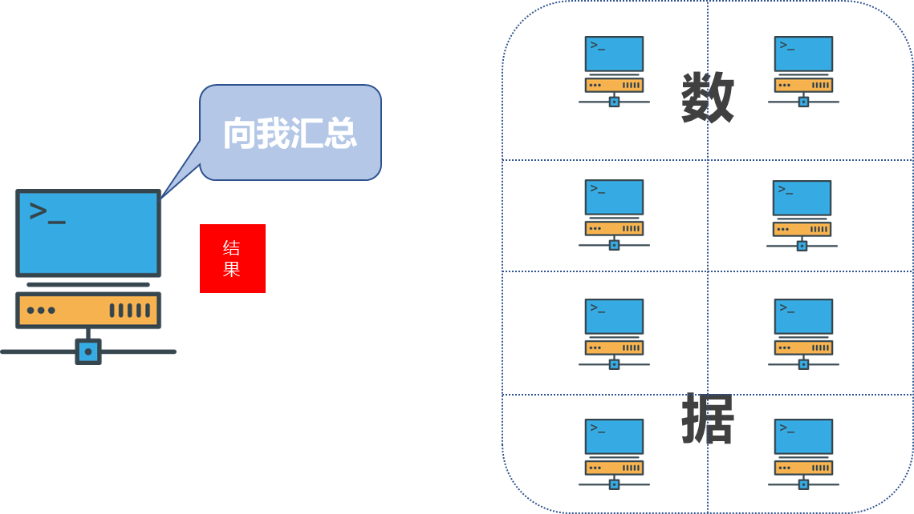
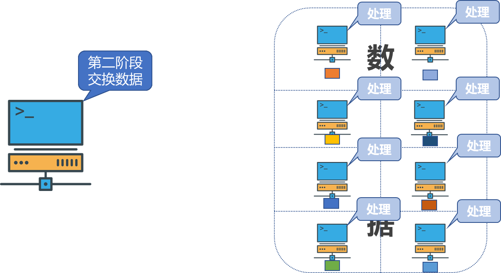
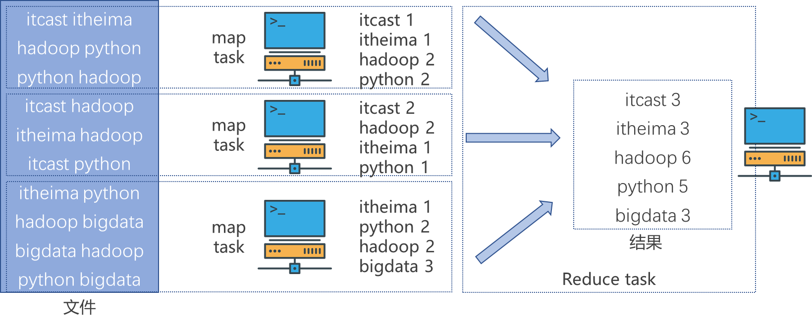
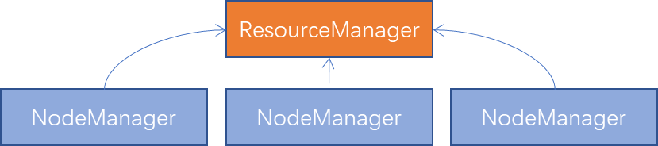
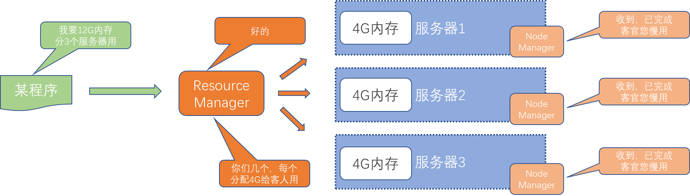
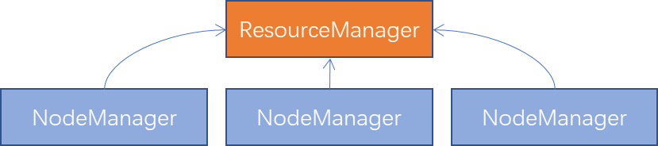

# 分布式计算概念


对数据进行处理，使用统计分析等手段得到需要的结果，多台服务器协同工作，共同完成一个计算任务

常见的两种工作模式：

1. 分散->汇总

   MapReduce

   1. 将数据进行分片，多台服务器各自负责一部分数据处理
   2. 然后将各自的结果，进行汇总处理，得到想要的结果

   

2. 中心调度->步骤执行

   大数据体系的Spark，Flink

   1. 由一个节点作为中心调度管理者，将任务划分为几个具体步骤
   2. 管理者安排每个机器执行任务，彼此交换数据，最终得到结果数据

   

   


# MapReduce概述


MapReduce是Hadoop内提供的进行分布式计算的组件，属于"分散->汇总"模式的分布式计算框架，提供分布式数据计算

MapReduce提供`Map`和`Reduce`两个编程接口，其中

- `Map`功能接口提供了分散的功能，由服务器分布式对数据进行处理
- `Reduce`功能提供了汇总（聚合）的功能，将分布式的处理结果汇总统计

编程中实现`Map Reduce`功能即可


运行机制

- 将执行的需求分解为多个`Map Task`和`Reduce Task`
- 将`Map Task`和`Reduce Task`分配到对应的服务器去执行


示例：




# YARN概述


MapReduce是基于YARN运行的。YARN是Hadoop内提供的进行分布式资源调度的组件


分布式资源调度是指在一个由多个计算节点组成的分布式系统中，有效地管理和分配系统资源的过程。这些资源可以包括计算资源（如CPU、内存、存储）、网络带宽以及其他相关资源。分布式资源调度的主要目标是确保系统资源得到充分利用，提高系统的性能和可靠性。


YARN管控整个集群的资源进行调度


程序向YARN申请所需资源，YARN为程序分配所需资源提供程序使用

YARN调度资源给MapReduce分配和管理运行资源


# YARN架构


## 核心架构




YARN架构有两个角色：

- 主角色：`ResourceManager`，整个集群的资源调度着，负责协调调度各个程序所需的资源
- 从角色：`NodeManager`，单个服务器的资源调度者，负责调度单个服务器上的资源提供给应用程序使用




## YARN容器


`NodeManager`预先占用一部分资源，然后将这部分资源提供给程序使用，被占用的这部分资源就是容器（Container）

- `NodeManager`会在服务器上构建一个容器（提前占用资源）
- 然后将容器的资源提供给程序使用，程序在运行容器内，无法突破容器的资源限制


## 辅助架构


YARN的架构中除了核心角色`ResourceManager`和`NodeManager`，还可以搭配两个辅助角色

- 代理服务器：Web Application Proxy Web应用代理
- 历史服务器：应用程序历史信息记录服务


### web应用代理

默认请款下，它作为资源管理器（RM）一部分运行，但是可以配置独立模式下运行，使用代理可以减少通过YARN进行基于网络的攻击的可能性

YARN在运行时提供一个Web UI站点，可供用户在浏览器查看YARN的运行信息，对外提供Web站点会有安全性问题，而代理服务器的功能就是最大限度保障对Web UI的访问时安全的

开启代理服务器，可以提供YARN在开放网络中的安全性，但不是绝对安全只能是辅助提高一些


配置独立模式下运行，修改`yarm-site.xml`中`yarn.web-proxy.address`参数即可


### JobHistoryServer历史服务器

记录历史运行的程序信息以及产生的日志并提供Web UI站点供用户使用浏览器查看

将容器中程序运行产生的日志信息，统一收集到HDFS中，然后通过浏览器来查看到所有日志记录，可以保留历史数据，随时查看历史运行程序信息


# MapReduce & YARN 部署




1. `ResourseManager`进程作为管理节点
2. `NodeManager`进程作为工作节点
3. `ProxyServer、JobHistoryServer`为辅助节点


MapReduce运行在YARN容器内，无需启动独立进程

| **组件**         | **配置文件** | **启动进程**                                                 | **备注**       |
| ---------------- | ------------ | ------------------------------------------------------------ | -------------- |
| Hadoop HDFS      | 需修改       | 需启动  •NameNode作为主节点  •DataNode作为从节点  •SecondaryNameNode主节点辅助 | 分布式文件系统 |
| Hadoop YARN      | 需修改       | 需启动  •ResourceManager作为集群资源管理者  •NodeManager作为单机资源管理者  •ProxyServer代理服务器提供安全性  •JobHistoryServer记录历史信息和日志 | 分布式资源调度 |
| Hadoop MapReduce | 需修改       | 无需启动任何进程  MapReduce程序运行在YARN容器内              | 分布式数据计算 |


## MapReduce配置文件


1. 修改`$HADOOP_HOME/etc/hadoop/mapred-env.sh`文件，添加环境变量

```sh
# 设置JDK路径
export JAVA_HOME=/export/server/jdk
# 设置JobhistoryServer进程内存为16
export HADOOP_JOB_HISTORYSERVER_HEAPSIZE=1000
# 设置日志级别为INFO
export HADOOP_MAPRED_ROOT_LOGGER=INFO,RFA
```

2. 修改`$HADOOP_HOME/etc/hadoop/mapred-site.xml`文件，添加配置信息

```xml
<configuration>
	<property>
        <name>mapreduce.framework.name</name>
        <value>yarn</value>
        <description>MapReduce的运行框架设置为YARN</description>
    </property>
    <property>
        <name>mapreduce.jobhistory.address</name>
        <value>node1:10020</value>
        <description>历史服务器通讯端口为node1:10020</description>
    </property>
    <property>
        <name>mapreduce.jobhistory.webapp.address</name>
        <value>node1:19888</value>
        <description>历史服务器web端口为node1:19888</description>
    </property>
    <property>
        <name>mapreduce.jobhistory.intermediate-done-dir</name>
        <value>/data/mr-history/tmp</value>
        <description>历史信息在HDFS的记录临时路径</description>
    </property>
    <property>
        <name>mapreduce.jobhistory.done-dir</name>
        <value>/data/mr-history/done</value>
        <description>历史信息在HDFS的记录路径</description>
    </property>
    <property>
        <name>yarn.app.mapreduce.am.env</name>
        <value>HADOOP_MAPRED_HOME=$HADOOP_HOME</value>
        <description>MapReduce HOME 设置为 HADOOP_HOME</description>
    </property>
    <property>
        <name>mapreduce.map.env</name>
        <value>HADOOP_MAPRED_HOME=$HADOOP_HOME</value>
        <description>MapReduce HOME 设置为 HADOOP_HOME</description>
    </property>
    <property>
        <name>mapreduce.reduce.env</name>
        <value>HADOOP_MAPRED_HOME=$HADOOP_HOME</value>
        <description>MapReduce HOME 设置为 HADOOP_HOME</description>
    </property>    
</configuration>
```


## YARN配置文件


1. 修改`$HADOOP_HOME/etc/hadoop/yarn-env.sh`文件，配置环境变量

```sh
# 设置JDK路径
export JAVA_HOME=/export/server/jdk
# 设置HADOOP环境变量
export HADOOP_HOME=/export/server/hadoop
# 设置配置文件路径的环境变量
export HADOOP_CONF_DIR=$HADOOP_HOME/etc/hadoop
# 设置日志文件路径的环境变量
export HADOOP_LOG_DIR=$HADOOP_HOME/logs
```

2. 修改`$HADOOP_HOME/etc/hadoop/yarn-site.xml`文件，添加配置信息

```xml
<configuration>
	<!--核心配置-->
    <property>
    	<name>yarn.resourcemanager.hostname</name>
        <value>node1</value>
        <description>ResourceManager设置在node1节点</description>
    </property>
    <property>
    	<name>yarn.nodemanager.local-dirs</name>
        <value>/data/nm-local</value>
        <description>NodeManager中间数据本地存储路径</description>
    </property>
    <property>
    	<name>yarn.nodemanager.log-dirs</name>
        <value>/data/nm-log</value>
        <description>NodeManager数据日志本地存储路径</description>
    </property>
    <property>
    	<name>yarn.nodemanager.aux-services</name>
        <value>mapreduce-shuffle</value>
        <description>为MapReduce程序开启Shuffle服务</description>
    </property>
    
    <!--额外配置-->
    <property>
        <name>yarn.log.server.url</name>
        <value>http://node1:19888/jobhistory/logs</value>
        <description>历史服务器URL</description>
    </property>
    <property>
        <name>yarn.web-proxy.address</name>
        <value>node1:8089</value>
        <description>代理服务器主机和端口</description>
    </property>
    <property>
        <name>yarn.log-aggregation-enable</name>
        <value>true</value>
        <description>开启日志聚合</description>
    </property>
    <property>
        <name>yarn.nodemanager.remote-app-log-dir</name>
        <value>/tmp/logs</value>
        <description>程序日志HDFS的存储路径</description>
    </property>
    <property>
        <name>yarn.resourcemanager.scheduler.class</name>
        <value>org.apache.hadoop.yarn.server.resourcemanager.scheduler.fair.FairScheduler</value>
        <description>选择公平调度器</description>
    </property>
</configuration>
```


将修改后的MapReduce配置文件和YARN配置文件分发到其它的服务器节点中

```sh
scp mapred-env.sh mapred-site.xml yarn-env.sh yarn-site.xml node2:$PWD
scp mapred-env.sh mapred-site.xml yarn-env.sh yarn-site.xml node3:$PWD
```


没有节点信息
