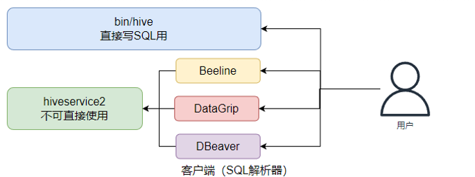

# Apache Hive 概述


MapReduce支持程序开发（Java，Python等），但不支持SQL开发。Apache Hive是一款分布式SQL计算工具，主要功能就是 将SQL语句翻译成MapReduce程序运行。

基于Hive为用户提供了分布式SQL计算的能力，写的是SQL，执行的是MapReduce


# 模拟实现Hive功能


针对一条SQL语句，需要知道数据文件位置，列分隔符，每一列数据类型和意义，这些信息需要进行单独进行存储，对数据文件进行一个解释说明，管理这些信息，即元数据管理


## 元数据管理

元数据管理功能：

- 数据位置
- 数据结构
- 对数据的描述

等，进行记录


## 解析器

解析器的作用：完成SQL到MapReduce转换功能，提交到MapReduce程序并收集执行结果


## Hive架构


# Hive基础架构


- 元数据存储

  通常存储在关系数据库，如mysql/derby中。

  Hive中元数据包括表的名字，表的列和分区及其属性，表的属性（是否为外部表），表的数据所在目录等

  Hive提供了 Metastore 服务进程提供元数据管理功能

- Driver驱动程序，包括语法解释器，计划编译器，优化器，执行器

  完成HQL查询语句从词法分析，语法分析，编译，优化以及查询计划的生成。生成的查询计划存储在HDFS中，并在随后有执行引擎调用执行。

  这部分内容不是具体的服务进程，而是封装在Hive所依赖的Jar文件即Java代码中

- 用户接口

  包括CLI，JDBC/ODBC，Web GUI。CLI：为shell命令行，Hive中Thrift服务器允许外部客户端通过网络与Hive进行交互，类似于JDCB或ODBC协议。WebGUI是通过浏览器访问Hive

  Hive提供了Hive shell、ThriftServer等服务进程向用户提供操作接口


# Hive部署


Hive是单机工具，只需要部署在一台服务器即可。虽然是单机工具，但是可以提交分布式运行的MapReduce程序运行


这里使用MySQL作为元数据存储管理


## 安装MySQL数据库

1. 配置yum仓库

```sh
# 更新密钥
rpm --import https://repo.mysql.com/RPM-GPG-KEY-mysql-2022

# 安装MySQL yum库
rpm -Uvh http://repo.mysql.com//mysql57-community-release-el7-7.noarch.rpm

# 如果有依赖冲突 可以选择删除
rpm -e [依赖名称]
```

2. 使用yum安装MySQL

```sh
yum -y install mysql-community-server
```

3. 设置MySQL开机自启

```sh
# 启动MySQL
systemctl start mysqld
# 查看MySQL服务状态
systemctl status mysqld
# 设置开机自启
systemctl enable mysqld
```

4. 获取MySQL的初始密码，更改密码

```sh
grep 'temporary password' /var/log/mysqld.log

mysql -uroot -p

初始密码
```

```mysql
# 设置简单密码 这里降低MySQL的密码安全级别
set global validate_password_policy=LOW; # 密码安全级别最低
set global validate_password_length=4; # 密码长度最低4位

# 更改密码
alter user 'root'@'localhost' identified by '123456';
# 授权root远程登录 %表示任意IP地址
# 密码表示给远程登录独立设置密码，和本地登录的密码可以不同
grant all privileges on *.* to root@"%" identified by '123456' with grant option;

# 刷新权限 生效
flush privileges;
```


## 配置Hadoop


Hive的运行依赖于Hadoop（HDFS、MapReduce、YARN都依赖）

同时涉及到HDFS文件系统的访问，需要配置Hadoop的代理用户，设置hadoop用户允许代理（模拟）其他用户


修改配置文件`core-site.xml`，并分发到其他节点，重启HDFS集群

```xml
    <property>
        <name>hadoop.proxyuser.hadoop.hosts</name>
        <value>*</value>
    </property>
    <property>
        <name>hadoop.proxyuser.hadoop.groups</name>
        <value>*</value>
    </property>
```

这一步可以切换到hadoop权限下进行


## Hive安装配置

1. 权限切换

```sh
su - hadoop
```

2. 在官网上下载压缩包

```tex
https://archive.apache.org/dist/hive/hive-3.1.3/apache-hive-3.1.3-bin.tar.gz
```

3. 上传服务器解压

```sh
tar -zxf apache-hive-3.1.3-bin.tar.gz -C /export/server/
```

4. 设置软链接

```sh
ln -s /export/server/apache-hive-3.1.3-bin /export/server/hive
```

5. 下载MySQL驱动jar包

```tex
https://repo1.maven.org/maven2/mysql/mysql-connector-java/5.1.34/mysql-connector-java-5.1.34.jar
```

6. 将下载好的驱动jar放入 Hive安装文件夹的lib目录内

7. 修改`hive-env.sh`文件

```sh
cd /export/server/hive/conf/
mv hive-env.sh.template hive-env.sh
vim hive-env.sh
```

```sh
export HADOOP_HOME=/export/server/hadoop
export HIVE_CONF_DIR=/export/server/hive/conf
export HIVE_AUX_JARS_PATH=/export/server/hive/lib
```

8. 修改`hive-site.xml`文件

```xml
<configuration>
	<property>
    	<name>javax.jdo.option.ConnectionURL</name>
        <value>jdbc:mysql://node1:3306/hive?createDatabaseIfNotExist=true&amp;useSSL=false&amp;useUnicode=true&amp;characterEncoding=UTF-8</value>
    </property>
    <property>
    	<name>javax.jdo.option.ConnectionDriverName</name>
        <value>com.mysql.jdbc.Driver</value>
    </property>
    <property>
    	<name>javax.jdo.option.ConnectionUserName</name>
        <value>root</value>
    </property>
    <property>
    	<name>javax.jdo.option.ConnectionPassword</name>
        <value>123456</value>
    </property>
    <property>
        <name>hive.server2.thrift.bind.host</name>
        <value>node1</value>
    </property>
    <property>
    	<name>hive.metastore.uris</name>
        <value>thrift://node1:9083</value>
    </property>
    <property>
    	<name>hive.metastore.event.db.notification.api.auth</name>
        <value>false</value>
    </property>
</configuration>
```

9. 初始化元数据库

```mysql
# 在MySQL新建数据库 hive
create database hive charset utf-8;
```

```sh
cd /export/server/hive
bin/schematool -initSchema -dbType mysql -verbos
```

初始化成功后，hive库中新建74张元数据表

10. 启动Hive

确保Hive文件夹所属位hadoop用户，创建一个hive的日志文件夹

```sh
mkdir /export/server/hive/logs
```


**启动元数据管理服务**，必须启动，否则无法工作

```sh
# 前台启动
/export/server/hive/bin/hive --service metastore
# 后台启动
nohup /export/server/hive/bin/hive --service metastore >> /export/server/hive/logs/metastore.log 2>&1 &
```

**启动客户端**

```sh
# 方式1 Hive Shell方式 可以直接写SQL
/export/server/hive/bin/hive

# 方式2 Hive ThriftServer方式 不可直接写SQL 需要外部客户端链接使用
/export/server/hive/bin/hive --service hiveserver2
```


最后成功结果


## Hive体验

首先要确保启动Metastore服务

```sh
nohup /export/server/hive/bin/hive --service metastore >> /export/server/hive/logs/metastore.log 2>&1 &
```

然后启动Hive Shell客户端

```sh
/export/server/hive/bin/hive
```


在Hive Shell环境中可以直接写SQL语句

示例：

```sql
create table tb_user(id int, name string, gender string);
insert into tb_user values(1, '张三', '男'), (2, '李斯', '男'), (3, '馨雅', '女');
select gender, count(*) from tb_user group by gender;
select * from tb_user;
```


Hive的数据默认存储在HDFS中`/user/hive/warehouse`中


MySQL中存储的是元数据，用于管理


可以通过YARN的Web UI来验证SQL语句启动的Map Reduce程序，`http://node1:8088`


只有参与分布式计算的才会执行MapReduce程序，而示例中最后一条查询全部信息，并没有涉及到计算，所以没有执行MapReduce程序


## 客户端


Hive除了Metastore必须启动外，客户端提供了两种启动方式

```sh
# 方式1 Hive Shell方式 可以直接写SQL
/export/server/hive/bin/hive

# 方式2 Hive ThriftServer方式 不可直接写SQL 需要外部客户端链接使用
/export/server/hive/bin/hive --service hiveserver2
```


方式1即上述示例，在Hive的Shell客户端直接写SQL语句

此外还有通过Hive ThriftSerer 第三发客户端连接使用，hiveserver2是Hive内置的一个ThriftServer服务，提供Thrift端口供其他客户端连接




```sh
/export/server/hive/bin/hive --service hiveserver2 >>/export/server/hive/logs/hiveserver2.log 2>&1 &
```


`8389 RunJar`即为启动的hiveserver2服务，对外提供的默认端口为`10000`


### beeline客户端

beeline客户端是Hive中内置的外部客户端

```sh
# 启动beeline
/export/server/hive/bin/beeline
```

进入beeline中后，需要配置连接，连接hiveserver2提供的端口

```hive
!connect jdbc:hive2://node1:10000
# 用户名 需要hdfs权限
hadoop
# 密码没有设置 可以为空

```


如图，连接成功


### DataGrip客户端


