# 数据库操作


创建数据库

```hive
create database [if not exists] myshive;
```

使用数据库

```hive
use myhive;
```

查看数据库详情

```hive
des database myhive;
```


数据库本质就是HDFS之上的文件夹

默认数据库存放路径是HDFS的`/user/hive/warehouse`内


创建数据库可指定HDFS中存放路径

```hive
create database myhive2 location '/myhive2';
```

使用`location`关键字，可以指定数据库在HDFS的存储路径


删除数据库

```hive
drop database myhive2 [cascade];
```

如果数据库中有表，删除会报错，使用关键字`cascade`，强制删除数据库，包含数据库下面的表


```hive
create database [if not exists] db_name [location file_path];

drop database db_name [cascade]
```


# 数据表操作


## 表操作语法和数据类型


### 数据类型

| **分类** | **类型**  | **描述**                                       | **字面量示例**                                               |
| -------- | --------- | ---------------------------------------------- | ------------------------------------------------------------ |
| 原始类型 | BOOLEAN   | true/false                                     | TRUE                                                         |
|          | TINYINT   | 1字节的有符号整数 -128~127                     | 1Y                                                           |
|          | SMALLINT  | 2个字节的有符号整数，-32768~32767              | 1S                                                           |
|          | INT       | 4个字节的带符号整数                            | 1                                                            |
|          | BIGINT    | 8字节带符号整数                                | 1L                                                           |
|          | FLOAT     | 4字节单精度浮点数1.0                           |                                                              |
|          | DOUBLE    | 8字节双精度浮点数                              | 1.0                                                          |
|          | DEICIMAL  | 任意精度的带符号小数                           | 1.0                                                          |
|          | STRING    | 字符串，变长                                   | “a”,’b’                                                      |
|          | VARCHAR   | 变长字符串                                     | “a”,’b’                                                      |
|          | CHAR      | 固定长度字符串                                 | “a”,’b’                                                      |
|          | BINARY    | 字节数组                                       |                                                              |
|          | TIMESTAMP | 时间戳，毫秒值精度                             | 122327493795                                                 |
|          | DATE      | 日期                                           | ‘2016-03-29’                                                 |
|          |           | 时间频率间隔                                   |                                                              |
| 复杂类型 | ARRAY     | 有序的的同类型的集合                           | array(1,2)                                                   |
|          | MAP       | key-value,key必须为原始类型，value可以任意类型 | map(‘a’,1,’b’,2)                                             |
|          | STRUCT    | 字段集合,类型可以不同                          | struct(‘1’,1,1.0), named_stract(‘col1’,’1’,’col2’,1,’clo3’,1.0) |
|          | UNION     | 在有限取值范围内的一个值                       | create_union(1,’a’,63)                                       |


### 基础建表

```sql
CREATE [EXTERNAL] TABLE tb_name
	(col_name col_type [COMMENT col_comment], ......)
	[COMMENT tb_comment]
	[PARTITIONED BY(col_name, col_type, ......)]
	[CLUSTERED BY(col_name, col_type, ......) INTO num BUCKETS]
	[ROW FORMAT DELIMITED FIELDS TERMINATED BY '']
	[LOCATION 'path']
```

- `[EXTERNAL]`，外部表，需搭配

  - `[ROW FORMAT DELIMITED FIELDS TERMINATED BY '']`指定列分隔符

  - `[LOCATION 'path']`表数据路径

  - 外部表示意

    ```sql
    CREATE EXTERNAL TABLE test_ext(id int) COMMENT 'external table' ROW FORMAT DELIMITED FIELDS TERMINATED BY '\t' LOCATION 'hdfs://node1:8020/tmp/test_ext';
    ```

    

- `[COMMENT tb_comment]`表注释，可选

- `[PARTITIONED BY(col_name, col_type, ......)]`基于列分区

  ```sql
  -- 分区表示意
  CREATE TABLE test_ext(id int) COMMENT 'partitioned table' PARTITION BY(year string, month string, day string) ROW FORMAT DELIMITED FIELDS TERMINATED BY '\t';
  ```

- `[CLUSTERED BY(col_name, col_type, ......)]`基于列分桶

  ```sql
  CREATE TABLE course (c_id string,c_name string,t_id string) CLUSTERED BY(c_id) INTO 3 BUCKETS ROW FORMAT DELIMITED FIELDS TERMINATED BY '\t';
  ```


<hr>

Hive中创建表可分为内部表，外部表，分区表，分桶表，不同类型的表有各自的用途。

- 内部表

```hive
create table table_name ...
```

未被`external`关键字修饰即为内部表，即普通表。内部表又称为管理表，内部表数据存储的位置由`hive.metastore.warehouse.dir`参数决定，默认（`/user/hive/warehouse`），**删除内部表会直接删除元数据（metadata）及存储数据**，因此内部表不适合和其他工具共享数据。


- 外部表

```hive
create external table table_name ... location ...
```

被`external`关键字修饰即是外部表，即关联表。外部表是指表数据可以在任何位置，通过`location`关键字指定。数据存储的不同也代表这个表在理念是并不是被Hive内部管理的，而是可以随意临时链接到外部数据上的。


在删除外部表的时候，仅仅是删除元数据（表的信息），不会删除数据本身。


## 内部表操作


代码示例

```hive
create database if not exists myhive;
use myhive;
create table if not exists stu(id int, name string);
insert into stu values (1, '馨雅'), (2, '南笙');
select * from stu;
```


结果示例

在HDFS上。查看表的数据存储文件

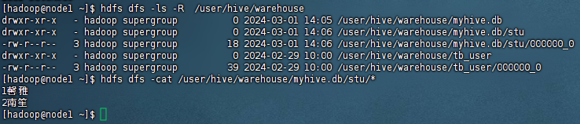


从显示结果，发现两列数据并没有分隔，这是应为默认的分隔符是`\001`，是一种特殊字符，ASCII值，键盘是打不出来的，在有些文本编辑器上显示`SOH`

分隔符可以自行指定，在创建表的时候指定

```hive
create table if not exists stu2(id int, name string) row format delimited fields terminated by '\t';
insert into stu2 values (1, '馨雅'), (2, '南笙');
```

这里设置为`\t`为分隔符，查看新创建的文件

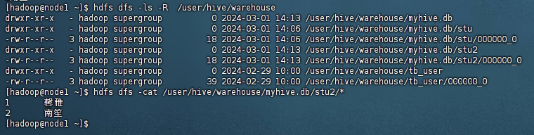


其他创建表的形式

- 基于查询结果建表

```hive
create table stu3 as select * from stu2;
```

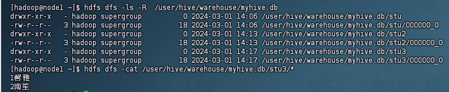

在建表时，只要没有指定间隔符，都是以默认`\001`作为间隔符


- 基于已存在的表结构建表

```hive
create table stu4 like stu2;
```

这个建表只是创建表结构，表中的内容，并不会被创建出。且这个间隔符是是会根据原来表的设定而设置


查看表类型和详情

```hive
desc formatted stu2;
```


删除内部表

```hive
drop table table_name;
```

**删除内部表，表信息以及表数据全部都被删除**


## 外部表操作

外部表，创建表被`external`修饰，从概念上是被认为并非Hive拥有的表，只是临时关联数据去使用

外部表和数据是相互独立，即

- 可以先有表，然后把数据移动到表指定的location中
- 也可以先有数据，然后创建表通过location执行数据


1. 创建外部表

```hive
create external table test_external_table1(id int, name string) 
row format delimited fields terminated by '\t' location '/tmp/test_ext1';
```

2. 创建完表，可以查看表中并没有数据

```hive
select * from test_external_table1;
```

3. 在Linux本地创建文件，然后移动到HDFS中

```sh
hdfs dfs -put test_data.txt /tmp/test_ext1
```

示例文件数据`test_data.txt`，数据列用`\t`分隔

```tex
1	馨雅
2	南笙
```

4. 直接查看结果

```hive
select * from test_external_table1;
```


1. 先存在数据，后创建表。数据沿用上一次上传了的数据
2. 创建表

```hive
create external table test_ext2(id int, name string) row format delimited fields terminated by '\t' location '/tmp/test_ext1';
```

3. 查看数据

```hive
select * from test_ext2;
```


从这两次操作，两张表用的是同一个数据。数据和表之间是映射关系，两张表映射到同一个数据上

删除外部表和内部表操作相同

```hive
drop table test_ext2;
```

这里的删除只会删除表的元数据，不会真正去删除数据文件


内外部表转换

- 查看表类型

```hive
desc formatted table_name;
```

- 内部表转外部表

```hive
alter table stu set tblproperties ('EXTERNAL'='TRUE');
```

- 外部表转内部表

```hive
alter table test_ext2 set tblproperties ('EXTERNAL'='FALSE');
```

`'EXTERNAL'='FALSE'`，一定是大写


## 数据加载和导出


### LOAD语法 加载


```hive
load data [local] inpath 'filepath' [overwrite] into table table_name;
```

- `load data`：加载数据
- `local`：是否在Linux本地还是HDFS文件系统中
- `'filepath'`：数据文件路径
- `overwrite`：是否覆盖或者追加


**如果基于HDFS进行load加载数据，源数据文件会消失，本质是移动到表所在目录中**


### INSERT SELECT语法 加载


```hive
insert [overwrite|into] table table_name [partition (partcol1=val1, partcol2=val2, ...) [if not exists]] select select_statement from from_statememt;
```

将select查询语句的结果插入到其他表中，被select查询的表可以是内部表或外部表


数据在本地推荐 `load data`

数据在HDFS

- 如果不保留原始文件，推荐使用`load data`
- 如果保留原始文件，推荐使用`insert select`

数据已经在表中

- 只可以`insert select`


### INSERT OVERWRITE语法 导出


```hive
insert overwrite [local] directory 'file_dir' [row format delimited fields terminated by '\t'] select select_statement from from_statement []
```

在不指定列分隔符，使用默认列分隔符，`local`选择是导出到Linux本地还是HDFS文件系统中


### hive shell 导出

通过`/export/server/hive/bin/hive`导出

```sh
/export/server/hive/bin/hive -e "sql语句" > file_path
/export/server/hive/bin/hive -f "sql脚本路径" > file_path
```

这里`file_path`指定到具体文件名


## 分区表操作

将数据按照一定原则切分成一个个小文件，比如说将文件按照年。月、日进行分区，每一个分区，是一个文件夹

Hive支持多个字段作为分区，实际就是多级文件夹，多分区带有层级关系


基本语法

```hive
create table table_name (...) partitioned by (分区列 列类型, ...) row format delimited fields terminated by '';
```


示例代码

```hive
create table score (id int, name string) partitioned by (grade string, class string) row format delimited fields terminated by '\t';
load data local inpath '/home/hadoop/list1.txt' into table score partition (grade='1', class='1');
load data local inpath '/home/hadoop/list1.txt' into table score partition (grade='1', class='2');
load data local inpath '/home/hadoop/list1.txt' into table score partition (grade='2', class='1');
load data local inpath '/home/hadoop/list1.txt' into table score partition (grade='2', class='3');
```

查看表结果

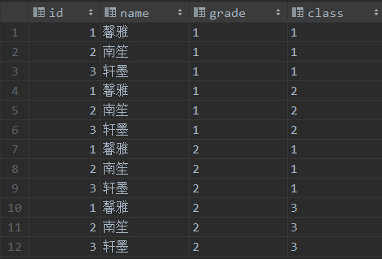

文件内容

```tex
1	馨雅
2	南笙
3	轩墨
```


这里我们可以发现有`grade class`两个字段被创建出来

文件内容没有这两个字段内容，而是再加载数据的时候来指定分区

同时我们可以去查看数据在HDFS存储形式

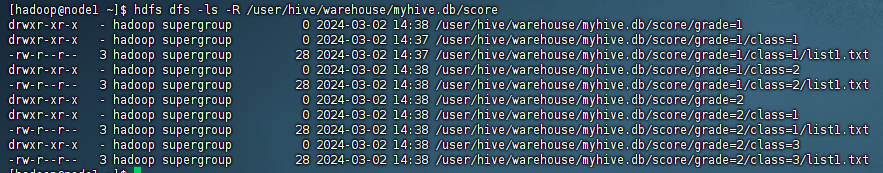


按照分区，这里实际数据文件存储就是通过不同层级文件夹来区分，减少对数据的查找量


- 查看分区

```hive
show partitions score;
```

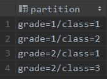


- 添加分区

```hive
alter table score add partition(grade='3', class='1') partition(grade='4', class='1');
```

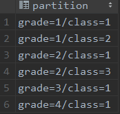


但是我们此时去产看表，没有发现有这个分区的内容，是因为该分区我们没有上传任何，有文件夹但是为空，可以查看目录

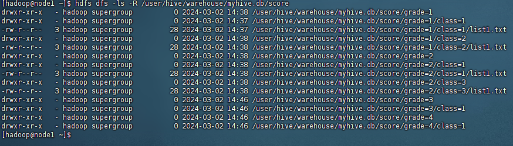

可以发现新创建的目录下并没有数据文件，但该分区确实存在


- 删除分区

```hive
alter table score drop partition(grade='2');
```

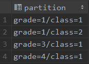

可以看到删除分区，删除分区后，默认情况下，hive也会删除对应在HDFS中的数据文件

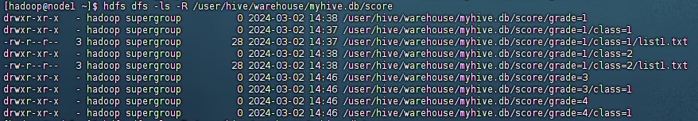


## 分桶表操作


分桶表和分区表一样通过改变表的存储模式，从而完成对表的优化，但是和分区不同，**分区时将表拆分到不同的子文件夹中进行存储，而分桶是将表拆分到固定数量的不同文件中进行存储**


- 开启分桶的自动优化（自动匹配reduce task数量和桶数量一致）

```hive
set hive.enforce.bucketing=true;
```


- 创建分桶表

```hive
create table table_name (id string, ...) clustered by (c_id) into 3 buckets [row format delimited fields terminated by '\t'];
```


示例代码

```hive
create table course (c_id string, c_name string, t_id string) clustered by (c_id)
into 3 buckets row format delimited fields terminated by '\t';
```


分桶表数据加载

桶表的数据加载不能通过load data加载，只能通过insert select

一般采用创建一个临时表，通过load data加载数据进入临时表，然后通过insert select 从临时表向桶表插入数据


```hive
create table course_temp (c_id string, c_name string, t_id string) row format delimited fields terminated by '\t';
load data local inpath '/home/hadoop/course.txt' into table course_temp;
insert overwrite table course select * from course_temp cluster by (c_id);
```

`course.txt`

```tex
1	语文	周杰轮
2	英语	周杰轮
3	数学	王力鸿
4	音乐	周杰轮
5	体育	林均街
6	物理	王力鸿
7	历史	周杰轮
```


分桶表内部机制原理

- 分桶设置，`into 3 buckets`，即分桶数量为3，那么表文件的数量就限定为3

  当数据插入的时候，需要一分为3，进入三个桶文件中

  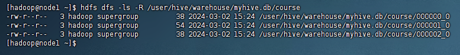

- 数据的三分划分基于分桶列的值进行哈希值进行取模来决定

  以上述示例解释就是计算出`c_id`的哈希值，然后对这个哈希值进行取模运算，运算结果即为该条数据应该存放在哪一个文件中

- 分桶数据新增就需要计算hash值，而load data不会触发MapRude，即没有计算过程，只是简单的移动数据，所以load data 无法用于分桶表的数据插入


分区表性能提升：在指定分区的前提下，减少被操作的数据量，从而提升性能

分桶表性能提升：基于分桶列的特定操作，如 过滤 join 分组 均可带来性能提升


## 修改表操作


- 表重命名

```hive
alter table old_table_name rename to new_table_name;
```

- 修改表属性

```hive
alter table table_name set tblproperties table_properties;
```

- 添加分区

```hive
alter table table_name partition(xx='xxx');
```

- 修改分区值

```hive
alter table table_name partition (xx='xx') rename to partition (xx='yy');
```

虽然通过这样的方式我们把分区名称改了，但是对应文件夹中并没有被修改，这里只是修改了元数据，在mysql定位到文件存在HDFS位置

- 删除分区

```hive
alter table table_name drop partition (xx='xx');
```

- 修改列名

```hive
alter table table_name change xx yy int;
```

- 删除表

```hive
drop table table_name;
```

删除内部表的数据文件，而外部表的数据文件不会删除


## 复杂类型操作


### Array类

```tex
zhangsan	beijing,shanghai,tianjin,hangzhou
wangwu	changchun,chengdu,wuhan,beijin
```


建表语句

```hive
create table test_array(name string, work_location array<string>)
row format delimited fields terminated by '\t'
collection items terminated by ',';
```


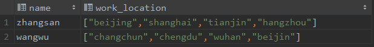


- `row format delimited fields terminated by '\t' `：指定列分隔符
- `collection items terminated by ','`：指定集合元素的分隔符


数据查看

```hive
select * from test_array;
select name, size(test_array.work_location) location from test_array;
select * from test_array where array_contains(work_location, 'tianjin');
```


### Map类

```tex
1,林杰均,father:林大明#mother:小甜甜#brother:小甜,28
2,周杰伦,father:马小云#mother:黄大奕#brother:小天,22
3,王葱,father:王林#mother:如花#sister:潇潇,29
4,马大云,father:周街轮#mother:美美,26
```


建表语句

```hive
create table test_map(id int, name string, members map<string, string>, age int)
row format delimited fields terminated by ','
collection items terminated by '#'
map keys terminated by ':';
```

- `map keys terminated by ':'`：指定key-value的分隔符


数据查看

```hive
select * from test_map;
select id, name, members['father'] father from test_map;
select id, name, map_keys(members) from test_map;
select id, name, map_values(members) from test_map;
select id, name, size(members) from test_map;
select * from test_map where array_contains(map_keys(members), 'sister');
```


### Struct类


struct类是一个复合类型，可以在一个列中存放多个子列，每个子列允许设置类型和名称


示例文件内容

```tex
1#周杰轮:11
2#林均杰:16
3#刘德滑:21
4#张学油:26
5#蔡依临:23
```


建表语句

```hive
create table test_struct(id int, info struct<name:string, age:int>)
row format delimited fields terminated by '#'
collection items terminated by ':';
```


数据加载与查询语句

```hive
load data local inpath '/home/hadoop/data_for_struct.txt' into table test_struct;
# 直接使用列名.子列名 即可从struct中取出子列查询
select id, info.name, info.age from test_struct;
```


struct的分隔符通过`collection items terminated by ':'`来指定，且struct类型只需要分隔数据即可（数据中不记录key，key是建表定义的固定的）


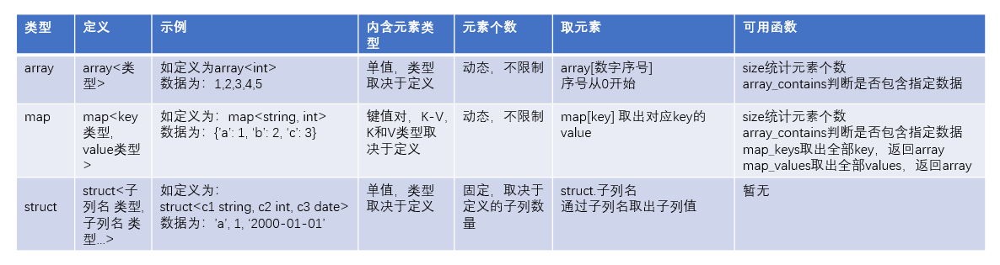


# 数据查询


## 基本查询


语法示例

```hive
-- 查询所有
select * from itheima.orders;
-- 查询单列
select orderId, totalMoney, userName, userAddress, payTime from orders;
-- 查询数据量
select count(*) from orders;
-- 过滤广东省订单
select * from orders where userAddress like '%广东%';
-- 找出广东省单笔最大的订单
select * from orders where userAddress like '%广东%' order by totalMoney desc limit 1;
-- 统计未支付、已支付的人数
select isPay, count(*) from orders group by isPay;
-- 在已付款中，统计每个用户最高的一笔消费金额
select userId, max(totalMoney) as max_money from orders where isPay = 1 group by userId;
-- 统计每个用户平均订单消费额
select userId, avg(totalMoney) from orders group by userId;
-- 统计每个用户的平均订单消费额，过滤大于10000的数据
select userId, avg(totalMoney) avg_money  from orders group by userId having avg_money > 10000;
-- join订单表和用户表，找出用户名
select o.orderId, o.userId, u.userName, o.totalMoney, o.userAddress, o.payTime from orders o join users u on o.userId = u.userId;
```


在Hive中基本查询和普通的SQL语句没有区别


## RLIKE正则匹配


正则表达式

| 字符   | 匹配                                                     |
| ------ | -------------------------------------------------------- |
| .      | 任意单个字符，除换行符                                   |
| []     | []中任意一个字符                                         |
| -      | []内字符表示范围                                         |
| ^      | 在[]内开头，匹配除[]内的字符之外的任意一个字符           |
| \|     | 或                                                       |
| \      | 将下一个字符标记为特殊字符、文本、反向引用或八进制转义符 |
| *      | 零次或多次匹配前面的字符                                 |
| +      | 一次或多次匹配前面的字符                                 |
| ?      | 一次或零次匹配前面的字符                                 |
| p{n}   | 正好匹配n次                                              |
| p{n,}  | 至少匹配n次                                              |
| p{n,m} | n$\le$m，至少匹配n次，最多匹配m次                        |
| \d     | 数字字符匹配                                             |
| \D     | 非数字字符匹配                                           |
| \w     | 单词字符                                                 |
| \W     | 非单词字符                                               |
| \s     | 空白字符                                                 |
| \S     | 非空白字符                                               |
| \f     | 匹配换页符                                               |
| \n     | 匹配换行符                                               |


示例

```hive
-- 查找广东省
select * from orders where userAddress rlike '.*广东.*';
-- 查找用户地址是： xx省 xx市 xx区的数据
select * from orders where userAddress rlike '..省 ..市 ..区';
-- 查找用户姓为 张 王 邓
select * from orders where userName rlike '[张王邓]\\S+';
-- 查看手机号符合： 188****0***规则
select * from orders where userPhone rlike '188\\d{4}0\\d{3}';
```


## Union联合


Union用于将多个select语句的结果组合成单个结果集

每个select语句返回的列的数量和名称必须相同。否则，引发架构错误

```hive
select ...
	union [all]
select ...
```


示例

```hive
select * from course where t_id = '周杰轮'
    union
select * from course where t_id = '王力鸿';
```

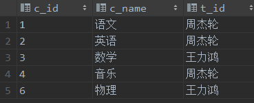


**union默认有去重功能**，通过加上关键字`all`，则不去重

```hive
select t_id, count(*) from (
    select * from course where t_id = '周杰轮'
        union all
    select * from course where t_id = '王力鸿'
) as u group by t_id;
```


union可以用在任何需要select发挥的地方


## 数据采样


Hive提供快速抽样的语法，可以快速从大表中随机抽取一些数据给用户查看


### TABLESAMPLE函数

进行随机抽样

```hive
select ... from table_name tablesample (bucket x out of y on (colname | rand()))
```

- `y`：表示将表数据随机划分成y份（y个桶）
- `x`：表示从y里面随机抽取第x份数据作为取样
- `colname`：表示随机的依据基于某个列的值
- `rand()`：表示随机的依据基于整行


示例代码

```hive
select userName, orderId, totalMoney from orders tablesample( bucket 1 out of 10 on userName);
```

将数据分成10个桶，然后选择第1个桶的数据


- 使用colname作为随机依据，则其他条件不变下，每个抽样结果一致
- 使用rand()作为随机依据，每次抽样结果都不同


基于数据块抽样

```hive
select ... from table_name tablesample (num rows | num percent | num(k|M|G));
```

- `num rows`：表示抽样num条数据
- `num percent`：表示抽样num百分百比例的数据，百分比是基于数据块大小，而不是行数
- `num(K|M|G)`：表示抽取num大小，单位可以是K,M,G表示Kb,Mb,Gb


使用这种语法抽样，条件不变每一次抽样的结果都一致，**无法做到随机，只是按照数据顺序从前向后取**。


## Virtual Column虚拟列


Hive目前可用3个虚拟列

- `INPUT_FILE_NAME`：显示数据行所在的具体文件
- `BLOCK_OFFSET_INSIDE_FILE`：显示数据行所在文件的偏移量
- `ROW_OFFSET_INSIDE_BLOCK`：显示数据所在HDFS块的偏移量
  - 此虚拟列需要设置：`set hive.exec.rowoffset=true`才可使用


示例

```hive
set hive.exec.rowoffset=true;
select *, INPUT__FILE__NAME, BLOCK__OFFSET__INSIDE__FILE, row__offset__inside__block from myhive.course;
```

- 需要注意是两个`-`

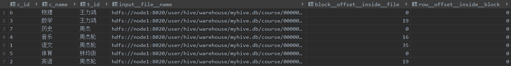


虚拟列的作用

- 查看行级别的数据详细参数
- 可以用于where、 group by等各类统计计算中
- 可以协助进行错误排查工作


