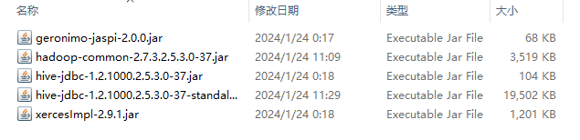
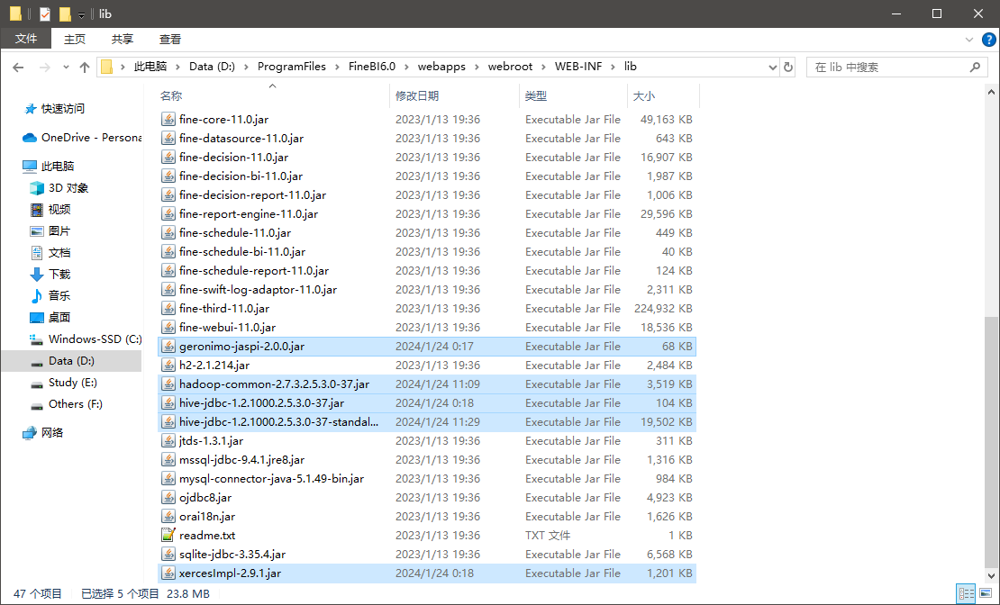
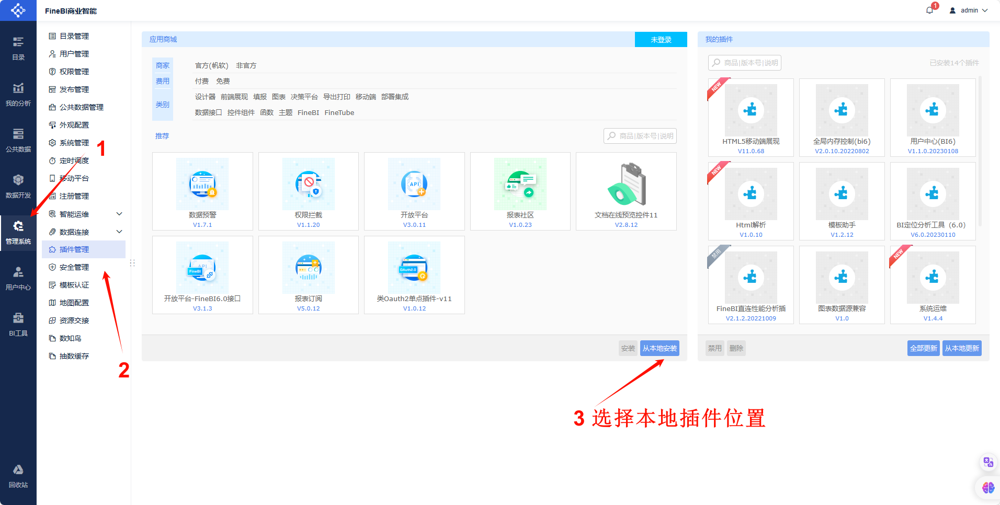
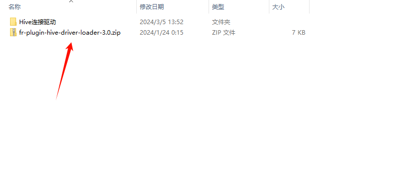
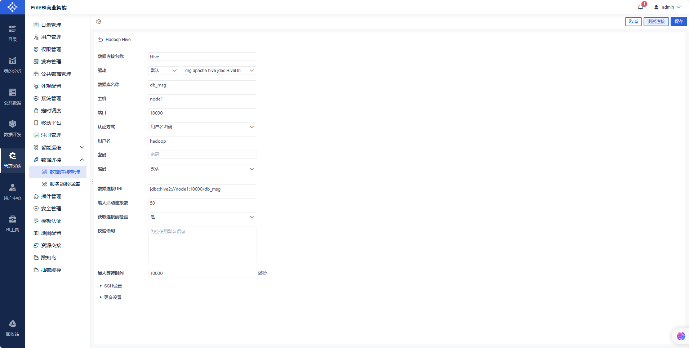
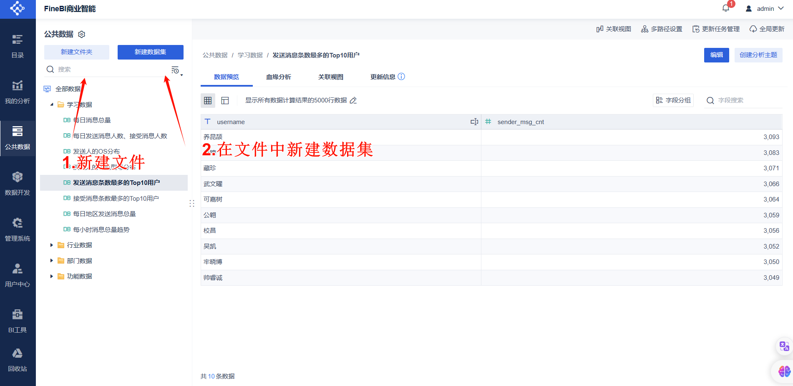
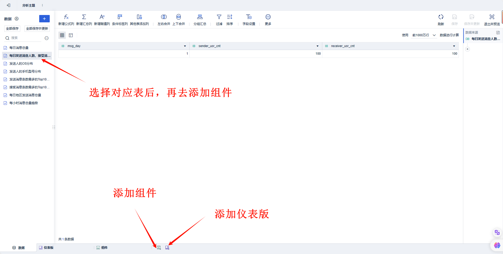

# 实战案例


## hive数据库相关操作

```hive


-- 建库 建表
drop database if exists db_msg cascade ;
create database db_msg;
use db_msg;

drop table if exists db_msg.tb_msg_source;
create table db_msg.tb_msg_source(
    msg_time string comment '消息发送时间',
    sender_name string comment '发送人昵称',
    sender_account string comment '发送人账号',
    sender_sex string comment '发送人性别',
    sender_ip string comment '发送人ip地址',
    sender_os string comment '发送人操作系统',
    sender_phonetype string comment '发送人手机型号',
    sender_network string comment '发送人网络类型',
    sender_gps string comment '发送人GPS定位',
    receiver_name string comment '接收人昵称',
    receiver_ip string comment '接收人IP',
    receiver_account string comment '接收人账号',
    receiver_os string comment '接收人操作系统',
    receiver_phonetype string comment '接收人手机型号',
    receiver_network string comment '接受人网络类型',
    receiver_gps string comment '接收人GPS定位',
    receiver_sex string comment '接收人性别',
    msg_type string comment '消息类型',
    distance string comment '双方距离',
    message string comment '消息内容'
);

-- 加载数据 测试是否数据加载成功
load data local inpath '/home/hadoop/chat_data-30W.csv' into table db_msg.tb_msg_source;
select * from tb_msg_source tablesample ( 100 rows );

-- 数据清洗
-- 对字段为空的不合法数据进行过滤
-- 通过时间指端构建天和小时
-- 从GPS的经纬度提取经度和纬度
-- 将ETL以后的结果保存到一张新的Hive表中

create table db_msg.tb_msg_etl as
select
    *,
    day(msg_time) as msg_day,
    hour(msg_time) as msg_hour,
    split(sender_gps, ',')[0] as sender_lng,
    split(sender_gps, ',')[1] as sender_lat
from tb_msg_source where length(sender_gps) > 0;
select * from db_msg.tb_msg_etl tablesample ( 100 rows );
select count(*) from db_msg.tb_msg_etl;

-- ETL E: Extract 抽取 T: Transform 转换 L: Load 加载


-- 需求指标统计
-- 统计每日消息总量
create table if not exists tb_rs_total_msg_cnt
comment '每日消息总量' as
select
    msg_day,
    count(*) as total_msg_cnt
from tb_msg_etl group by msg_day;
select * from tb_rs_total_msg_cnt;

-- 统计每小时消息量、发送和接受用户数
create table if not exists tb_rs_hour_msg_cnt
comment '每小时消息总量趋势' as
select
    msg_hour,
    count(sender_account) as sender_usr_cnt,
    count(receiver_account) as receiver_usr_cnt
from tb_msg_etl group by msg_hour;
select * from tb_rs_hour_msg_cnt;

-- 统计每日各地区发送消息总量
create table if not exists tb_rs_loc_cnt
comment '每日地区发送消息总量' as
select
    msg_day,
    sender_lng,
    sender_lat,
    count(*) as total_msg_cnt
from db_msg.tb_msg_etl group by msg_day, sender_lng, sender_lat;
select * from db_msg.tb_rs_loc_cnt;

-- 统计每日发送和接受用户人数
create table if not exists tb_rs_usr_cnt
comment '每日发送消息人数、接受消息人数' as
select
    msg_day,
    count(distinct sender_account) as sender_usr_cnt,
    count(distinct receiver_account) as receiver_usr_cnt
from tb_msg_etl group by msg_day;
select * from tb_rs_usr_cnt;

-- 统计发送消息条数最多的top10用户
create table if not exists db_msg.tb_rs_s_usr_top10
comment '发送消息条数最多的Top10用户' as
select
    sender_name as username,
    count(*) as sender_msg_cnt
from tb_msg_etl group by sender_name order by sender_msg_cnt desc limit 10;
select * from db_msg.tb_rs_s_usr_top10;

-- 统计接受消息条数最多的Top10用户
create table if not exists db_msg.tb_rs_r_usr_top10
comment '接受消息条数最多的Top10用户' as
select
    receiver_name as username,
    count(*) as receiver_msg_cnt
from tb_msg_etl group by receiver_name order by receiver_msg_cnt desc limit 10;
select * from db_msg.tb_rs_r_usr_top10;

-- 统计发送人的手机型号分布情况
create table if not exists db_msg.tb_rs_sender_phone
comment '发送人的手机型号分布' as
select
    sender_phonetype,
    count(distinct sender_account) as cnt
from db_msg.tb_msg_etl group by sender_phonetype;
select * from db_msg.tb_rs_sender_phone;


-- 统计发送人的手机操作系统分布
create table if not exists db_msg.tb_rs_sender_os
comment '发送人的OS分布' as
select
    sender_os,
    count(distinct sender_account) as cnt
from db_msg.tb_msg_etl group by sender_os;
select * from db_msg.tb_rs_sender_os;
```


## 可视化展示


BI：Business Intelligence，商业智能

指用现代数据仓库技术，线上分析处理技术，数据挖掘和数据展现技术进行数据分析以实现商业价值。


### FineBI安装


[FineBI - BI数据分析软件_企业级大数据分析平台](https://www.finebi.com/)

帆软软件有限公司退出的一款商业智能产品


下载安装包，进行安装


下载完成后，找到安装将，一下jar，复制移动到FineBI安装目录下`webapps\webroot\WEB-INF\lib`文件中







我们自己放的Hive驱动包会与FineBI自带的驱动包产生冲突，导致FineBI无法识别我们自己的驱动包，这里需要安装FineBI官方提供的驱动包隔离插件







构建配置，测试是否连接成功







然后点击每一张表，将数据更新一边，进行数据加载


在加载数据库表，可能会出现`comment`中文乱码，是MySQL构建元数据库编码出现问题

执行时机：准备数据库表阶段和清洗数据阶段都可，须在完成需求生成结果表之前完成

```mysql
-- 在Hive的MySQL元数据库中执行
use hive;
-- 1.修改字段注释字符集
alter table COLUMNS_V2 modify column COMMENT varchar(256) character set utf8;
-- 2.修改表注释字符集
alter table TABLE_PARAMS modify column PARAM_VALUE varchar(4000) character set utf8;
-- 3.修改分区表参数，以支持分区键能够用中文表示
alter table PARTITION_PARAMS modify column PARAM_VALUE varchar(4000) character set utf8;
alter table PARTITION_KEYS modify column PKEY_COMMENT varchar(4000) character set utf8;
-- 4.修改索引注解
alter table INDEX_PARAMS modify column PARAM_VALUE varchar(4000) character set utf8;
```


在MySQL安装的时候，修改`\etc\my.cnf`文件修改编码

```tex
[client]
defaults-character-set=utf8

[mysqld]
character_set_server=utf8
```

重启MySQL


注意如果是后面修改字符集编码，之前创建的数据库和数据表的编码不会被修改，需要单独进行编码修改


然后弹框，选择你需要的数据集





