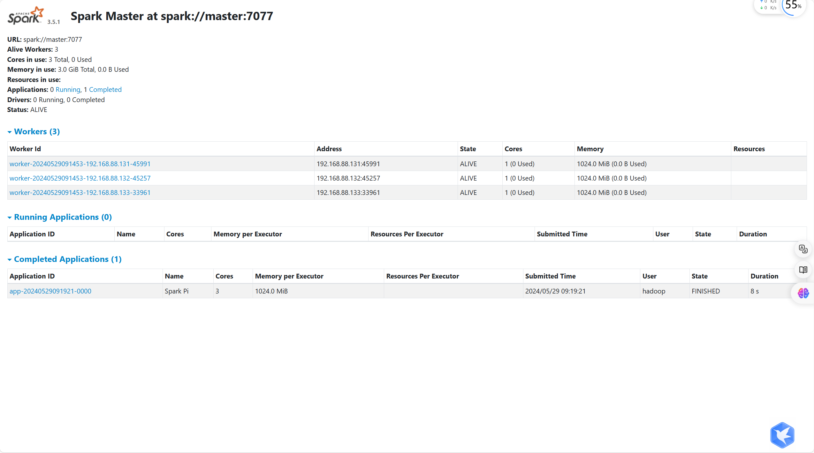

# Zookeeper安装集群

下载 zookeeper，进行解压[**https://dlcdn.apache.org/zookeeper/zookeeper-3.8.4/apache-zookeeper-3.8.4-bin.tar.gz**](https://dlcdn.apache.org/zookeeper/zookeeper-3.8.4/apache-zookeeper-3.8.4-bin.tar.gz)

```sh
 sudo tar -zxf apache-zookeeper-3.8.4-bin.tar.gz -C /export/server/
```

构建软链接，规范命名

```sh
cd /export/server
ln -s /export/server/apache-zookeeper-3.8.4-bin/ zookeeper
```


配置 zookeeper 

```sh
cd /export/server/zookeeper/conf
cp zoo_sample.cfg zoo.cfg
```


```sh
vim /export/server/zookeeper/conf/zoo.cfg
```

配置内容

```tex
tickTime=2000
# zookeeper数据存储目录
dataDir=/export/server/zookeeper/data
clientPort=2181
initLimit=5
syncLimit=2
server.1=node1:2888:3888
server.2=node2:2888:3888
server.3=node3:2888:3888
server.4=master:2888:3888
```


创建目录，配置节点标志的信息

```sh
mkdir /export/server/zookeeper/data
vim /export/server/zookeeper/data/myid
```

这里我使用的master虚拟机，在 zoo.cfg 配置的为 4 所以这个文件里面填入一个 4 即可（配置本机对应的节点）

```tex
4
```


修改解药后这个软件的组（不必要）

```sh
cd /export
chown hadoop:hadoop server
```


将上述安装包，分发到其他虚拟机上

```sh
cd /export/server/
scp -r apache-zookeeper-3.8.4-bin/ node1:$PWD
scp -r apache-zookeeper-3.8.4-bin/ node2:$PWD
scp -r apache-zookeeper-3.8.4-bin/ node3:$PWD
```

分发后的虚拟机要配置对应的软连接和修改 myid 文件内容

```sh
ln -s /export/server/apache-zookeeper-3.8.4-bin/ zookeeper
mkdir /export/server/zookeeper/data
vim /export/server/zookeeper/data/myid
```


配置环境变量

```sh
vim /etc/profile
```

```tex
export ZOOKEEPER_HOME=/export/server/zookeeper
export PATH=$PATH:$ZOOKEEPER_HOME/bin
```


将修改的配置文件信息分发到其他虚拟机上

```sh
cd /etc
scp profile node1:$PWD
scp profile node2:$PWD
scp profile node3:$PWD
```

生效配置文件

```sh
source /etc/profile
```

启动命令，需要在每一台虚拟机上执行

```sh
zkServer.sh start
```

验证

```sh
jps # 看是否存在进程QuorumPeerMain

zkCli.sh # 进入zookeeper 看是否报错

ls /
```


>这里注意的是需要启动多台虚拟机，然后验证连接是否成功
>
>如果出现问题，可以通过 `/export/server/zookeeper/log/` 目录下的日志文件来纠错


# HBase集群安装


下载 [**https://dlcdn.apache.org/hbase/2.5.8/hbase-2.5.8-bin.tar.gz**](https://dlcdn.apache.org/hbase/2.5.8/hbase-2.5.8-bin.tar.gz)， 解压

```sh
tar -zxf hbase-2.5.8-bin.tar.gz -C /export/server/
```

创建软连接，

```sh
ln -s /export/server/hbase-2.5.8/ /export/server/hbase
```

修改配置文件，修改`conf/hbase-env.sh`文件

```sh
cd /export/server/hbase/config
vim hbase-env.sh
```

```tex
export JAVA_HOME=/export/server/jdk
export HBASE_MANAGES_ZK=false
export HBASE_DISABLE_HADOOP_CLASSPATH_LOOKUP="true"
```

修改配置文件，修改`conf/hbase-site.xml`文件

```sh
vim hbase-site.xml
```

```tex
<configuration>
        <!-- HBase数据在HDFS中的存放的路径 -->
        <property>
            <name>hbase.rootdir</name>
            <value>hdfs://master:8020/hbase</value>
        </property>
        <!-- Hbase的运行模式。false是单机模式，true是分布式模式。若为false,Hbase和Zookeeper会运行在同一个JVM里面 -->
        <property>
            <name>hbase.cluster.distributed</name>
            <value>true</value>
        </property>
        <!-- ZooKeeper的地址 -->
        <property>
            <name>hbase.zookeeper.quorum</name>
            <value>master,node1,node2,node3</value>
        </property>
        <!-- ZooKeeper快照的存储位置 -->
        <property>
            <name>hbase.zookeeper.property.dataDir</name>
            <value>/export/server/apache-zookeeper-3.8.4-bin/data</value>
        </property>
        <!--  V2.1版本，在分布式情况下, 设置为false -->
        <property>
            <name>hbase.unsafe.stream.capability.enforce</name>
            <value>false</value>
        </property>
</configuration>
```

修改配置文件，修改`conf/regionservers`文件

```sh
vim regionservers
```

填入如下内容

```tex
node1
node2
node3
master
```

> 如果文件中原本有localhost 删除


修改权限，然后分发给其他节点

```sh
cd /export
chown -R hadoop:hadoop server/
cd /export/server
su - hadoop
scp -r hbase-2.5.8/ node1:$PWD
scp -r hbase-2.5.8/ node2:$PWD
scp -r hbase-2.5.8/ node3:$PWD
```

每台虚拟机需要创建软连接

配置环境变量

```sh
su
vim /etc/profile
```

```tex
export HBASE_HOME=/export/server/hbase
export PATH=$HBASE_HOME/bin:$PATH
```

```sh
source /etc/profile
```

分发到其他虚拟机上，生效配置文件


启动HBase

>  请确保：Hadoop HDFS、Zookeeper是已经启动了的

```sh
start-hbase.sh

# 如需停止可使用
stop-hbase.sh
```


验证HBase

浏览器访问：[http://master:16010](http://master:16010)


# Spark集群安装

1. 下载 Spark包

```tex
https://dlcdn.apache.org/spark/spark-3.5.1/spark-3.5.1-bin-hadoop3.tgz
```


2. 解压创建软链接

```sh
 tar -zxf spark-3.5.1-bin-hadoop3.tgz -C /export/server/
 ln -s /export/server/spark-3.5.1-bin-hadoop3/ /export/server/spark
```


3. 修改配置文件名称

```sh
cd /export/server/spark/conf/
mv spark-env.sh.template spark-env.sh
mv workers.template workers
```

注意：早期版本可能没有`workes.template` 这个文件，它对应的是`slaves.template`这个文件


4. 修改配置文件 `spark-env.sh`

```sh
# 设置JAVA安装目录
JAVA_HOME=/export/server/jdk

# HADOOP软件配置文件目录 读取HDFS上文件和运行YARN集群
HADOOP_CONF_DIR=/export/server/hadoop/etc/hadoop
YARN_CONF_DIR=/export/server/hadoop/etc/hadoop

# 指定spark 主节点的IP和提交任务的通信端口
export SPARK_MASTER_HOST=master
export SPARK_MASTER_PORT=7077

SPARK_MASTER_WEBUI_PORT=8080
SPARK_WORKER_CORES=1
SPARK_WORKER_MEMORY=1g
```


5. 修改 `workers`文件

```sh
node1
node2
node3
```


6. 修改分组然后分发到其他服务器

可选：

```sh
 chown -R hadoop:hadoop  /export/server
```

```sh
su - hadoop
cd /export/server/
scp -r spark-3.5.1-bin-hadoop3/ node1:$PWD
scp -r spark-3.5.1-bin-hadoop3/ node2:$PWD
scp -r spark-3.5.1-bin-hadoop3/ node3:$PWD
```


7. 在其他节点创建spark软链接

```sh
 ln -s /export/server/spark-3.5.1-bin-hadoop3/ /export/server/spark
```


8. 启动 spark 集群

```sh
# 启动命令
/export/server/spark/sbin/start-all.sh 

# 停止命令
/export/server/spark/sbin/stop-all.sh
```


9. 提交测试任务

```sh
/export/server/spark/bin/spark-submit --master spark://master:7077 --class org.apache.spark.examples.SparkPi /export/server/spark/examples/jars/spark-examples_2.12-3.5.1.jar 
```


查看 [master:8080](http://master:8080)




在运行 spark 提示 节点处于安全状态

```sh
hdfs dfsadmin -safemode leave

hdfs dfsadmin -safemode forceExit # 强制退出安全模式
```

