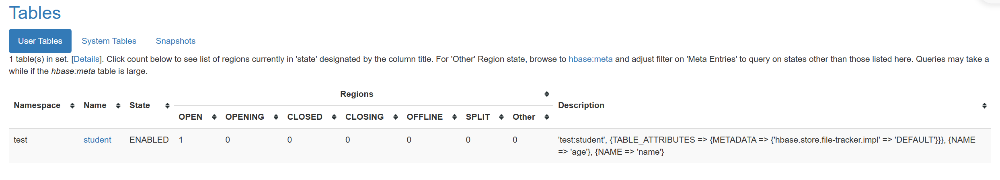
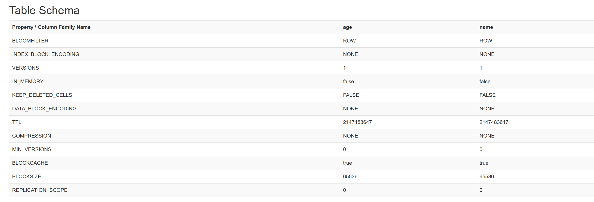
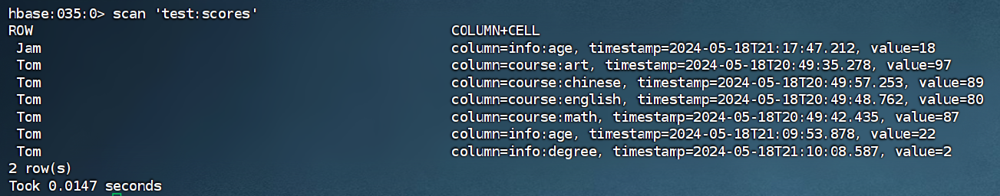

# HBase基本命令

### 打开HBase

```sh
hbase shell
```


### 创建命名空间

```sh
create_namespace 'test'
```


### 删除命名空间

```sh
drop_namespace 'test'
```

这样删除，要保证命名空间必须为空


### 列举出命名空间

```sh
list_namespace
```


### 查看指定命名空间配置

```sh
describe_namespace 'test'
```


### 列举指定命名空间中的表

```hive
list_namespace_tables 'test'
```


### 修改命名空间属性

```sh
alter_namespace 'test', {METHOD=>'set', 'hbase.namespace.quota.maxregion'=>'10'}
```

> 'hbase.namespace.quota.maxregion' 属性表示命名空间的最大区域数限制。区域（Region）是 HBase 分布式存储的基本单元，表被分割成多个区域进行存储和处理。该属性的值设为 '10'，意味着命名空间 'test' 最多可以拥有 10 个区域。
>
> 通过使用 `alter_namespace` 命令并提供其他属性和值，你可以修改命名空间的其他配置，例如设置配额、访问权限等


| 参数       | 功能                                                         |
| ---------- | ------------------------------------------------------------ |
| NAME       | 设置列族名                                                   |
| VERSIONS   | 设置最大版本数量                                             |
| TTL        | 设置列族可以设置生存时间，以秒为单位<br>HBase将在到达到期时间后自动删除该列族 |
| BLOCKCACHE | 设置读缓存状态                                               |
| SPLITS     | 设置建表 region 预分区                                       |


### 创建表

```sh
create '命名空间:表名','列族名1', ... '列族名n'

create 'test:student', 'name', 'age'
```

创建表时，如果没有指定命名空间，这里默认使用 `default` 的命令空间


```sh
create '命名空间:表名', {语法参数}

create 'test:student', {NAME => 'name'}, {NAME => 'age', VERSIONS => 5}
```


```sh
create 'test:practice', 'f1', SPLITS=>['10', '20', '30', '40']
```

> 利用SPLITS，可以设置表的Region分割点，将表按照分割点分割成多个Region，每个Region分别存放在不同Region服务器上，实现负载均衡


### 查看表

可用通过 UI 来查看





通过命令查看

#### 查看制定表的结构

```sh
desc 'test:student'

describle 'test:student'
```


#### 查看表名

```sh
list
```


#### 判断制定表是否存在

```sh
exists 'test:student'
```


### 修改表

修改（添加）列族（列族存在就是修改，不存在就是添加）

```sh
alter '命名空间:表名', {语法参数}
```


删除列族

```sh
alter '命名空间:表名', {NAME=>'f1', METHOND=>'delete'}

alter '命名空间:表名', 'delete'=>'f1'
```


修改表属性

```sh
alter '命名空间:表名', MAX_FILESIZE=>'134217728'  # 设置表属性

alter '命名空间:表名', METHOD=>'table_att_unset', NAME=>'MAX_FILESIZE' # 删除表属性
```


```sh
alter 'test:practice', {NAME=>'f2'}, {NAME=>'f3', VERSIONS=>'20'}
```


### 删除表

在删除表之前，要先禁用表

```sh
disable '命名空间:表名'
drop '命名空间:表名'
```


### 表数据增加

```sh
put '命名空间:表名', '行键', '列族:列标识符', '插入值'

put '命名空间:表名', '行键', '列族:列标识符', '插入值', '时间戳'
```


```sh
put 'test:scores', 'Tom', 'course:art', '97'
put 'test:scores', 'Tom', 'course:math', '87'
put 'test:scores', 'Tom', 'course:english', '80'
put 'test:scores', 'Tom', 'course:chinese', '89'
```


> HBase数据不是按行来添加，而是按照键值对的方式进行数据添加
>
> HBase的数据类型只有一个”字节数组“，没有整型


### 表数据获取

```sh
get '命名空间:表名', '行键', {其他参数}
```

通过指定表名，行键，列族，列，时间戳，版本号来获取相应单元格的值

> HBase是按照行键的值来进行数据的查找的


| 参数      | 功能                   |
| --------- | ---------------------- |
| COLUMN    | 设置参查询数据的列簇名 |
| TIMESTAMP | 设置查询数据的时间戳   |
| VERSIONS  | 设置查询数据的最大版本 |
| FILTER    | 设置查询数据的过滤条件 |


### 表数据扫描

```sh
scan '表名', {其他参数}
```

> scan是进行全表的数据显示，因此是不需要给出行键参数的


| 参数      | 功能                   |
| --------- | ---------------------- |
| CCOLUMN   | 设置参查询数据的列簇名 |
| TIMESTAMP | 设置查询数据的时间戳   |
| VERSIONS  | 设置查询数据的最大版本 |
| FILTER    | 设置查询数据的过滤条件 |
| STARTROW  | 设置起始 Row Key       |
| LIMIT     | 设置返回数据的数量     |
| REVERSED  | 设置倒叙扫描           |


```sh
get 'test:scores', 'Tom' # 所有列族的数据都会显示出来
 
get 'test:scores', 'Tom', {COLUMN=>'course'} # 只显示指定的列族的数据

get 'test:scores', 'Tom', {COLUMN=>['course','info']} # 显示多个指定的列族的数据

get 'test:scores', 'Tom', {COLUMN=>['course:english']} # 显示某一个列族中某一列的数据

count 'test:scores' # 统计行数 HBase对表中数据数量的统计是按照行键来进行的 一个行键对应一条数据

scan 'test:scores' # 不区分行键，表中所有数据都会显示出来
```




### 表数据删除


```sh
delete '命名空间:表名', '行键', '列簇' # 指定列族中的数据

deleteall '命名空间:表名', '行键' # 删除行键对应所有列族中的数据
```

> HBase的删除，只是在数据上加上了 ’delete‘ 标签，数据没有真正删除


### 表数据清空

```sh
truncate '命名空间:表名'
```

> 删除表中所有数据，不管原来定义有多少个 Region，清空后只会保留一个Region


```sh
truncate_preserve '命名空间:表名'
```

> 删除表中所有数据，并且保留原来定义的 Region 个数


```sh
delete 'test:scores', 'Tom', 'course:english' 
# 如果该数据有多个版本，则删除命令只能删除最近一个版本的值，其他版本还会保留并显示出来

deleteall 'test:scores', 'Tom' # 删除该行键一行的数据

truncate 'test:scores' # 清空表中的内容 表结构没有被删除
```

