# Spark启动


spark是一个计算框架，他主要就是去取代 hadoop 中 MapReduce 计算，所以启动 spark 之前要启动 hadoop 的 dfs 和 yarn

```sh
start-dfs.sh
start-yarn.sh
```

集群启动 Spark

```sh
/export/server/spark/sbin/start-all.sh 
```

进入 Spark-Shell命令

```sh
/export/server/spark/sbin/spark-shell [--master [spark://master:7077 | yarn]]
```

- `--master spark://master:7077`：以 standalone 模式启动，执行命令
- `--master yarn`：以 YARN 模式启动， 执行命令
- 不加任何参数，则表示以本地模式启动

spark-shell退出

```sh
:q
```

如果执行命令，报错 节点处于安全模式，执行一下命令，关闭安全模式

```sh
hdfs dfsadmin -safemode leave

hdfs dfsadmin -safemode forceExit # 强制退出安全模式
```


# 创建RDD


## 从集合中创建 RDD

```scala
parallelize()
```

通过该函数把一般数据结构加载为 RDD

```Scala
def parallelize[T: ClassTag](seq: Seq[T], numSlices: Int = defaultParallelism): RDD[T]
```

- `T`: 这是泛型类型参数，表示集合中元素的类型。
- `[T: ClassTag]`: 这表示需要一个隐式的 `ClassTag` 对象来帮助运行时引用泛型类型 `T`。这是 Scala 语言中的一个特性，用于在运行时获取泛型类型的信息。
- `seq: Seq[T]`: 这是要转换为 RDD 的输入集合，类型为 `Seq[T]`，其中 `T` 是泛型类型参数。
- `numSlices: Int = defaultParallelism`: 这是可选参数，用于指定 RDD 在分区时的切片数量。默认值是 `defaultParallelism`，表示使用默认的并行度。
- `defaultParallelism`可以在安装Spark系统时进行参数配置，如果没有进行配置，则会将Spark集群中CPU的个数作为默认分区数

这个方法的作用是将输入的集合转换为一个分布式数据集 RDD，并根据指定的切片数量进行分区。然后，你可以对这个 RDD 执行各种转换和操作，以进行并行处理和分析数据。


示例

```scala
val list=List(1,2,3)
val rdd1=sc.parallelize(list)
rdd1.partitions.size
val rdd2=sc.parallelize(list,2)
rdd2.partitions.size
```


## 从外部创建 RDD

```scala
textFile()
```

通过该函数直接加载数据文件生成 RDD

```scala
def textFile(path: String, minPartitions: Int = defaultMinPartitions): RDD[String]
```

- `path: String`: 这是要读取的文本文件的路径，作为字符串传入。(Linux或者HDFS文件路径)
- `minPartitions: Int = defaultMinPartitions`: 这是可选参数，用于指定 RDD 的最小分区数量。默认情况下，`defaultMinPartitions` 会根据 Spark 集群的配置自动确定最小分区数量。

> RDD编程都是使用双引号，单引号会报错
>
> 在 Spark 集群中使用 `textFile` 方法从本地文件系统（比如 Linux 本地文件系统）读取文件时，确实需要注意一些问题。如果你在 Spark 集群中运行一个作业，且该作业需要读取一个位于本地文件系统的文件，那么确保所有的节点（master 和 slave）上都有相同的文件副本是非常重要的。
>
> 在这种情况下，如果某个节点上缺少了需要读取的文件，那么该节点就无法完成作业的任务，可能会导致作业执行失败。因此，确保所有节点上都有相同的文件副本对于作业的成功执行是至关重要的。
>
> 本地文件名前面要加上“file://” (HDFS文件不需要)


示例：

```scala
val student = sc.textFile("/user/root/sparkdata/student.txt")
val bigdata = sc.textFile("/user/root/sparkdata/result_bigdata.txt")
val math = sc.textFile("/user/root/sparkdata/result_math.txt")
student.collect()
```

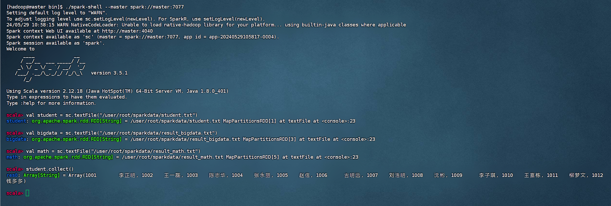


# RDD算子


## map(func)算子

在 Spark 中，`map(func)` 是一个常用的转换算子，用于对 RDD 中的每个元素应用指定的函数 `func`，并返回一个新的 RDD。具体来说，`map(func)` 算子会将函数 `func` 应用于 RDD 中的每个元素，并将结果组成一个新的 RDD 返回。

map操作不会改变RDD的分区数目。

示例：

```scala
val list=List(1,2,3)
val rdd1=sc.parallelize(list)
val rdd2=rdd1.map(x=>x*x)
rdd1.collect()
rdd2.collect()
```

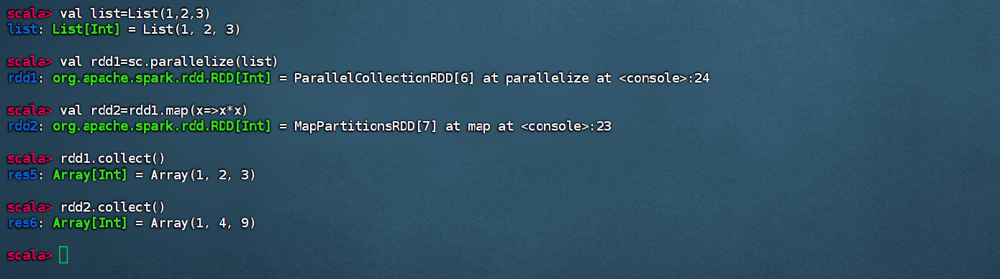


## flatMap(func)算子

在 Spark 中，`flatMap(func)` 算子类似于 `map(func)` 算子，但它适用于处理每个输入元素并将其映射到零个或多个输出元素的情况。具体来说，`flatMap(func)` 算子会对 RDD 中的每个元素应用指定的函数 `func`，然后将所有输出合并成一个新的 RDD。

示例：

```scala
val rdd_f1=sc.parallelize(List("I am learning spark", "I like spark"))
rdd_f1.collect()
val rdd_f2=rdd_f1.map(x=>x.split(" "))
rdd_f2.collect()
val rdd_f3=rdd_f1.flatMap(x=>x.split(" "))
rdd_f3.collect()
```

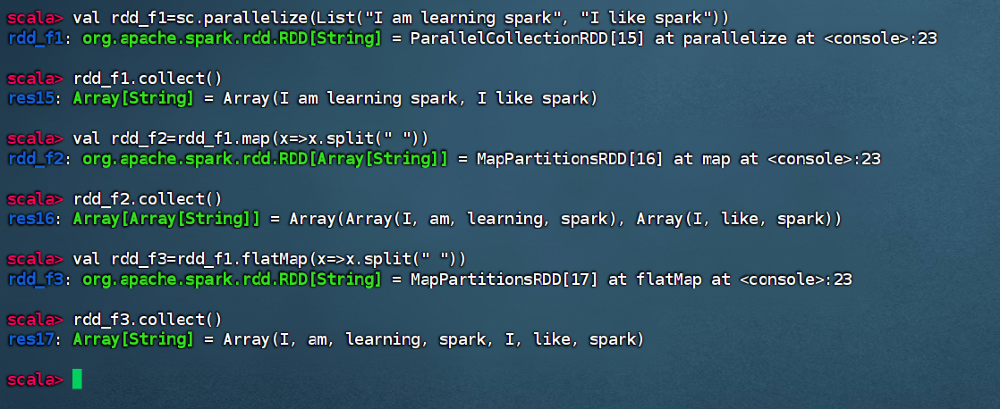


## mapPartitions(func)算子

`mapPartitions(func)` 算子是 Spark 中用于对 RDD 的每个分区应用指定函数 `func` 的一种转换操作。与 `map(func)` 算子不同，`mapPartitions(func)` 会将函数 `func` 应用于 RDD 的每个分区，而不是每个单独的元素。这意味着，`mapPartitions(func)` 的输入是一个分区的迭代器，输出是一个新分区的迭代器。

示例：

```scala
val list=List(1, 3, 5, 7, 9, 2, 4, 6, 8, 10)
val rdd=sc.parallelize(list)
val rdd_mapPartitions=rdd.mapPartitions(x=>x.filter(_>3))
rdd_mapPartitions.collect()
```

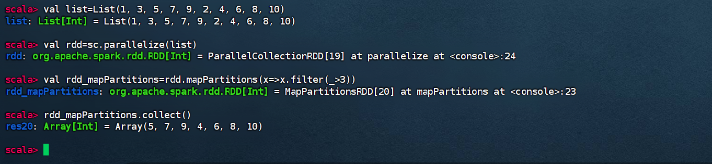


## sortBy()算子

```scala
sortBy(f:(T)=>k,ascending,numPartitions)
```

在 Spark 中，`sortBy` 算子用于对 RDD 中的元素进行排序。它接受一个函数作为参数，该函数指定了用于排序的关键值。

- 参数f：(T)=>K：T是RDD中要被排序每一个元素，K返回的值是元素中要进行排序的值 (排序的值）
- ascending：决定排序后RDD中的元素是升序还是降序，默认是true，也就是升序，false为降序排序
- numPartitions：该参数决定排序后的RDD的分区个数，默认排序后的分区个数和排序之前的个数相等

示例：

```scala
val list=List(("daniel", 20), ("daisy", 10), ("smith", 23), ("tom", 21))
val rdd_age=sc.parallelize(list)
rdd_age.collect()
val rdd_age_sort=rdd_age.sortBy(x=>x._2, false)
rdd_age_sort.collect()
```

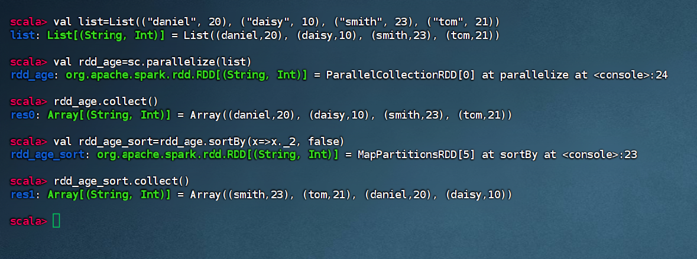


## filter(func)算子

在 Spark 中，`filter(func)` 算子用于根据给定的条件函数 `func` 对数据集中的每个元素进行过滤，并返回符合条件的元素组成的新数据集。

具体来说，`filter(func)` 算子会对数据集中的每个元素应用条件函数 `func`，如果该函数返回 true，则保留该元素；如果返回 false，则过滤掉该元素。最终，`filter(func)` 返回一个包含符合条件的元素的新数据集。

示例：

```scala
val list=List(("daniel", 20), ("daisy", 10), ("smith", 23), ("tom", 21))
val rdd_age=sc.parallelize(list)
rdd_age.collect()
val rdd_age_filter=rdd_age.filter(x=>x._2>20)
rdd_age_filter.collect()
```

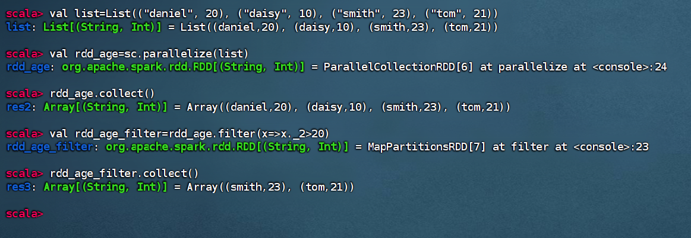


## collect()算子

返回RDD中所有元素

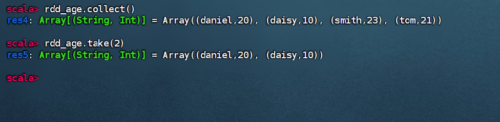

## take(num)算子

返回RDD前面num个元素

示例：


## 综合测试用例1

```scala
val bigdata=sc.textFile("/user/root/sparkdata/result_bigdata.txt")
bigdata.collect()
val bigdata_map_f1=bigdata.map(x=>x.split("\t"))
bigdata_map_f1.collect()
val math=sc.textFile("/user/root/sparkdata/result_math.txt")
val math_map_f1=math.map(x=>x.split("\t"))
math_map_f1.collect()
val bigdata_map_f2=bigdata_map_f1.map(x=>(x(0),x(1), x(2).toInt))
val math_map_f2=math_map_f1.map(x=>(x(0),x(1), x(2).toInt))
val bigdata_sort=bigdata_map_f2.sortBy(x=>x._3, false)
bigdata_sort.collect()
val math_sort=math_map_f2.sortBy(x=>x._3, false)
math_sort.collect()
bigdata_sort.take(5)
math_sort.take(5)
```

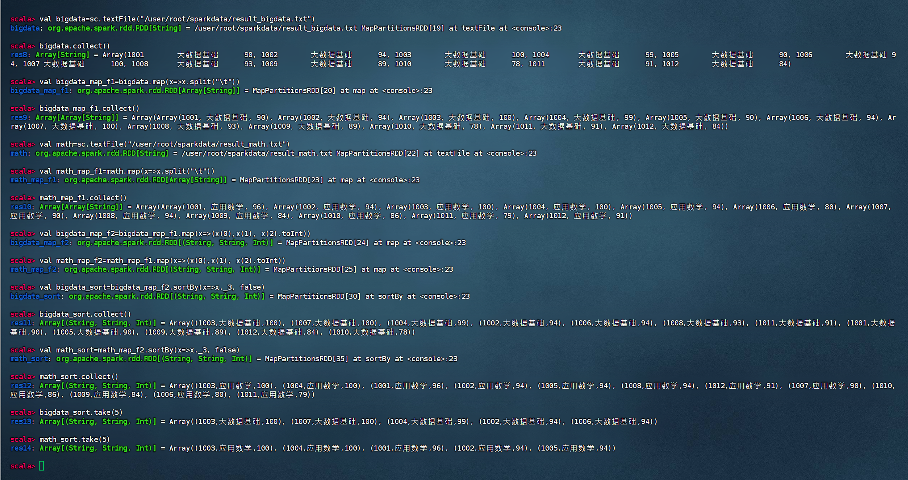


## distinct([numPartitions])算子

在 Spark 中，`distinct([numPartitions])` 算子用于返回一个包含数据集中不同元素的新数据集。该算子会**移除数据集中的重复元素**，并返回一个包含唯一元素的新数据集。

具体来说，`distinct([numPartitions])` 算子会遍历整个数据集，并找出其中的唯一元素，然后返回一个新的数据集，其中包含这些唯一元素。可选参数 `numPartitions` 用于指定结果数据集的分区数，可以控制输出数据集的分区情况。

示例：

```scala
val list=List(1,2,3,4,3)
val rdd1=sc.parallelize(list)
rdd1.collect()
val rdd2=rdd1.distinct()
rdd2.collect()
```

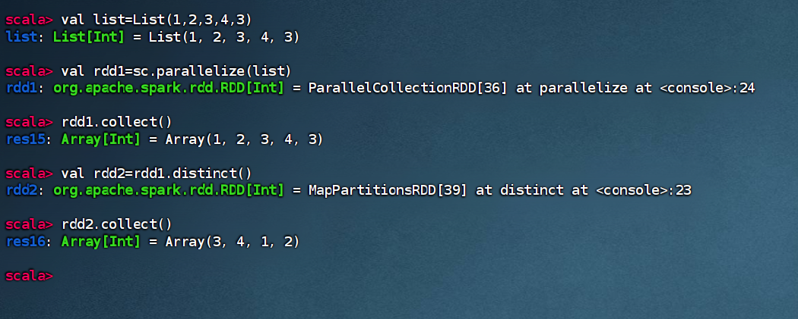


## union(otherDataset)算子

在 Spark 中，`union(otherDataset)` 算子用于将两个数据集进行**合并**，返回一个包含两个数据集所有元素的新数据集。具体来说，`union` 算子会将当前数据集和另一个数据集 `otherDataset` 中的元素合并成一个新的数据集，包含两个数据集所有元素。

示例：

```scala
val rdd1 = sc.parallelize(List(1, 2, 3, 4))
val rdd2 = sc.parallelize(List(3, 4, 5, 6))
val unionRDD = rdd1.union(rdd2)
unionRDD.collect()
```

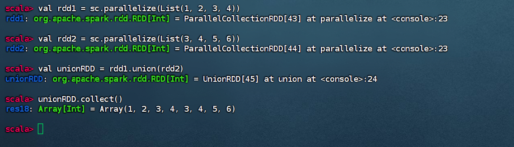


## intersection(otherDataset)算子

在 Spark 中，`intersection(otherDataset)` 算子用于返回两个数据集的**交集**，即返回一个新的数据集，其中包含同时存在于两个原始数据集中的元素。

具体来说，`intersection(otherDataset)` 算子会比较当前数据集和另一个数据集 `otherDataset`，并返回一个新的数据集，其中包含同时存在于两个数据集中的元素。

示例：

```scala
val rdd1 = sc.parallelize(List(1, 2, 3, 4, 5))
val rdd2 = sc.parallelize(List(3, 4, 5, 6, 7))
val intersectRDD = rdd1.intersection(rdd2)
intersectRDD.collect()
```

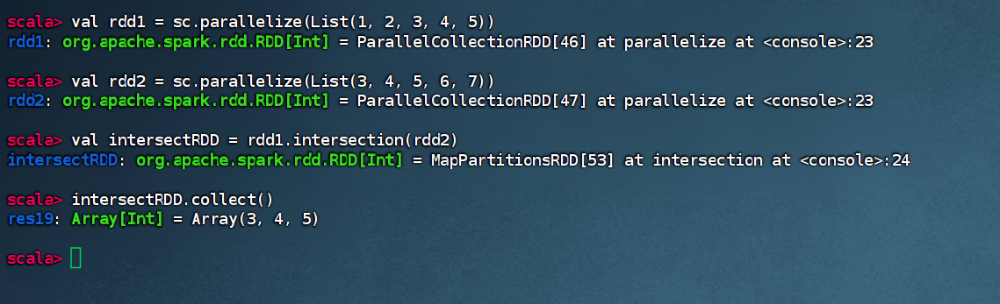


## subtract(otherDataset)算子

在 Spark 中，`subtract(otherDataset)` 算子用于返回两个数据集的**差集**，即返回一个新的数据集，其中包含存在于当前数据集但不存在于另一个数据集中的元素。

具体来说，`subtract(otherDataset)` 算子会从当前数据集中移除存在于另一个数据集 `otherDataset` 中的元素，并返回一个新的数据集，其中包含仅存在于当前数据集中的元素。

```scala
val rdd1 = sc.parallelize(List(1, 2, 3, 4, 5))
val rdd2 = sc.parallelize(List(3, 4, 5, 6, 7))
val subtractRDD = rdd1.subtract(rdd2)
subtractRDD.collect()
```

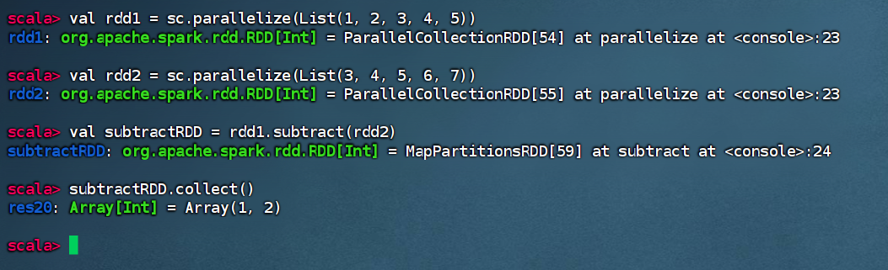


## cartesian(otherDataset)算子

在 Spark 中，`cartesian(otherDataset)` 算子用于计算两个数据集的**笛卡尔积**（Cartesian product），返回一个新的数据集，其中包含了两个原始数据集所有可能的元素对组合。

具体来说，`cartesian(otherDataset)` 算子会将当前数据集中的每个元素与另一个数据集 `otherDataset` 中的每个元素进行配对，生成所有可能的元素对，并返回一个新的数据集。

```scala
val rdd1 = sc.parallelize(List('A', 'B'))
val rdd2 = sc.parallelize(List(1, 2, 3))
val cartesianRDD = rdd1.cartesian(rdd2)
cartesianRDD.collect()
```

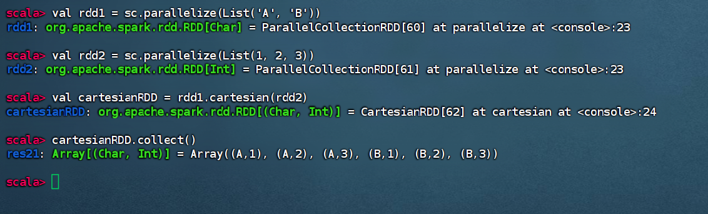


## 综合测试用例2

```scala
val bigdata=sc.textFile("/user/root/sparkdata/result_bigdata.txt").map(x=>x.split("\t")).map(x=>(x(0),x(1),x(2).toInt))
val math=sc.textFile("/user/root/sparkdata/result_math.txt").map(x=>x.split("\t")).map(x=>(x(0),x(1),x(2).toInt))
val bigdata_map_f1=bigdata.filter(x=>x._3>=100).map(x=>x._1)
val math_map_f1=math.filter(x=>x._3>=100).map(x=>x._1)
val result1=bigdata_map_f1.union(math_map_f1).distinct()
val result2=bigdata_map_f1.intersection(math_map_f1)
result1.collect()
result2.collect()
```

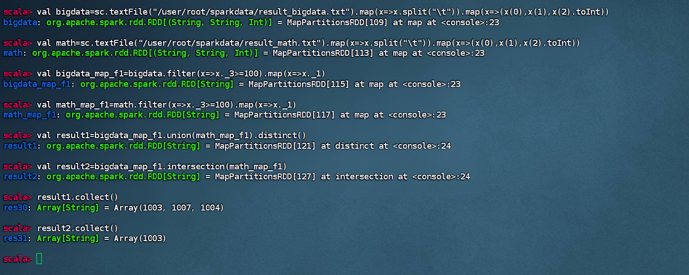


# 键值对RDD


## 创建键值对RDD

将一个普通的RDD转化为一个PairRDD时，可以使用map算子来进行操作，传递的函数需要返回键值对 (二元组)。

示例：
```scala
val rdd1=sc.parallelize(List("a", "b", "c"))
val rdd2=rdd1.map(x=>(x, 1))
rdd2.collect()
rdd2.keys.collect()
rdd2.values.collect()
```

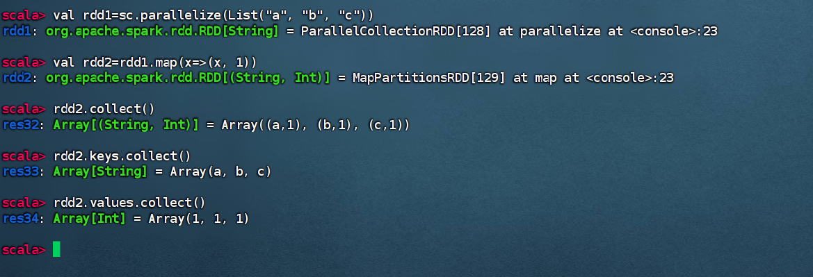


## mapValues(func)算子

在 Spark 中，`mapValues(func)` 算子用于对键值对 RDD 中的每个值应用一个函数，返回一个新的键值对 RDD，其中键保持不变，而值经过指定的函数映射。

具体来说，`mapValues(func)` 算子会对键值对 RDD 中的每个值应用给定的函数 `func`，并返回一个新的键值对 RDD，其中键保持不变，而值经过函数映射后更新。

```scala
val rdd1=sc.parallelize(List("a", "b", "c"))
val rdd2=rdd1.map(x=>(x, 1))
val rdd3=rdd2.mapValues(x=>(x,1))
```

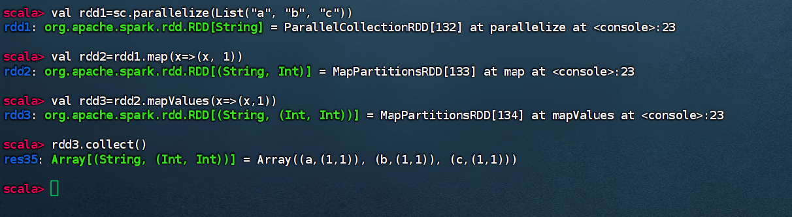


## groupByKey([numPartitions])算子

在 Spark 中，`groupByKey([numPartitions])` 算子用于将键值对 RDD 按照键进行分组，返回一个新的键值对 RDD，其中每个键关联的值被收集到一个集合中。可选参数 `numPartitions` 用于指定结果RDD的分区数。

具体来说，`groupByKey` 算子会将键值对 RDD 中的数据按照键进行分组，然后将相同键的值收集到一个集合中，并返回一个新的键值对 RDD，其中每个键与其对应的值集合相关联。

```scala
val pairRDD = sc.parallelize(List(("apple", 3), ("banana", 5), ("apple", 7), ("banana", 2)))
val groupedRDD = pairRDD.groupByKey()
groupedRDD.collect()
```

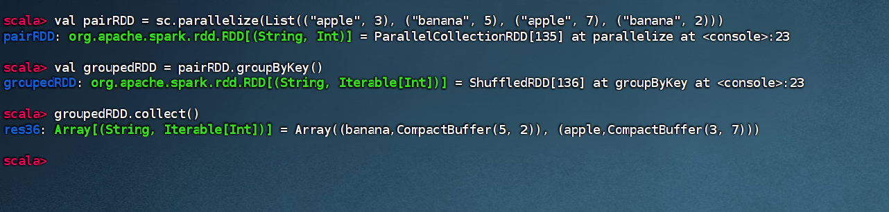


## reduceByKey(func, [numPartitions])算子

将键值对RDD按键分组后进行聚合（groupByKey算子只按照键进行分组，但是并不进行聚合操作），返回一个（K，V）类型组成的新RDD，其中新RDD每个键的值使用给定的聚合函数func进行聚合（大多是进行累加操作），该函数必须是（V，V）=>V类型。

聚合函数func中的((x,y)=>x+y)，其中x和y表示键Key相同的两个键值对的值Value，不是键值对（递归操作）。

```scala
val pairRDD = sc.parallelize(List(("apple", 3), ("banana", 5), ("apple", 7), ("banana", 2), ("banana", 4)))
val reducedRDD = pairRDD.reduceByKey((x, y) => x + y)
reducedRDD.collect()
```

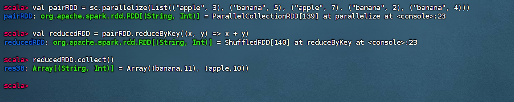


## join(otherDataset, [numPartitions])算子

把两个键值对RDD的数据中具有相同键的值整合起来（join算子是对两个键值对RDD的操作。与intersection算子不同）

在 Spark 中，`join(otherDataset, [numPartitions])` 算子用于将两个键值对 RDD 根据它们的键进行连接操作，返回一个新的键值对 RDD。可选参数 `numPartitions` 用于指定结果RDD的分区数。

具体来说，`join` 算子会将两个键值对 RDD 中具有相同键的元素进行连接操作，返回一个新的键值对 RDD，其中每个相同键的值被组合成一个键值对。如果两个 RDD 中存在相同键的元素，那么这些元素将被连接起来形成一个新的键值对。如果某个键只在其中一个 RDD 中出现，则不会被包含在结果中。

```scala
val rdd1 = sc.parallelize(List(("A", 1), ("B", 2), ("C", 3)))
val rdd2 = sc.parallelize(List(("A", "apple"), ("B", "banana"), ("D", "dog")))
val joinedRDD = rdd1.join(rdd2)
joinedRDD.collect()
```

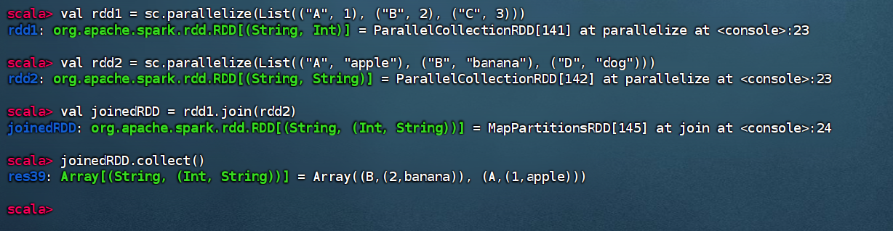


## lookup(key: K)算子

n作用于（K,V）键值对类型的RDD上，返回指定键K的所有V值

在 Spark 中，`lookup(key: K)` 是针对键值对 RDD 的一种操作，用于查找指定键对应的所有值，并返回一个列表。这个操作只能用于 PairRDD。

具体来说，`lookup` 操作接受一个键作为参数，然后返回与该键相关联的所有值组成的列表。如果给定的键在 RDD 中不存在，则返回一个空列表。

```scala
val pairRDD = sc.parallelize(List(("apple", 3), ("banana", 5), ("apple", 7), ("banana", 2)))
val result = pairRDD.lookup("apple")
println(result)
val result2 = pairRDD.lookup("orange")
println(result2)
```

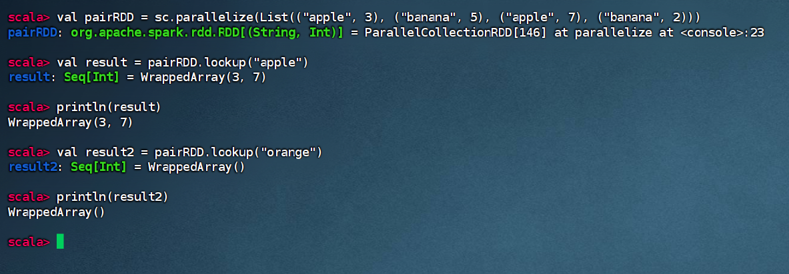


## count()算子

n计算RDD中所有元素个数

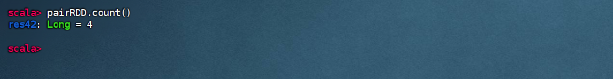


# 文件读取与存储


## saveAsTextFile(path: String）

把RDD保存到HDFS的文本文件中。参数path是HDFS的保存文件路径（重点：是一个目录，而不是一个文件名，保存文件名是part-00000等）

```scala
val rdd = sc.parallelize(List("Hello", "Spark", "World"))
rdd.saveAsTextFile("/user/root/result/t1")
```

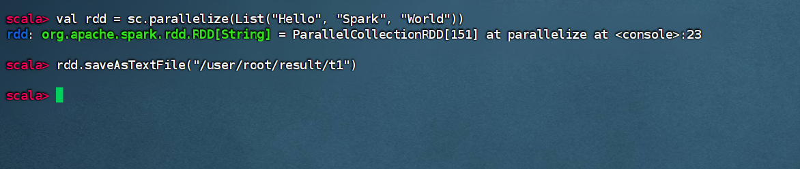

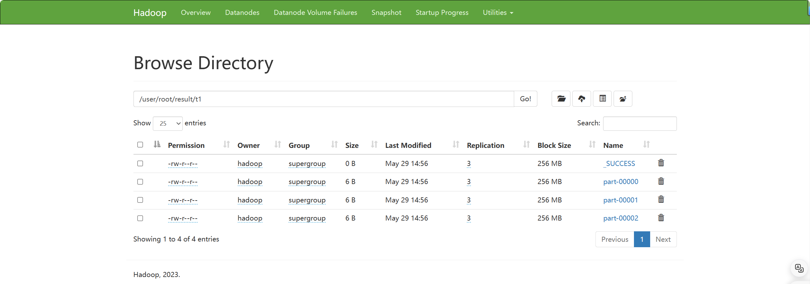


## repartition(numPartitions: Int)算子

改变RDD中的并行级别（分区数），它使用shuffle重新分发数据。

nRDD默认的数据分区数是3个，如果想改变保存RDD的分区数，可以使用repartition算子。

```scala
val rdd = sc.parallelize(List("Hello", "Spark", "World"))
rdd.repartition(1).saveAsTextFile("/user/root/result/t2")
```

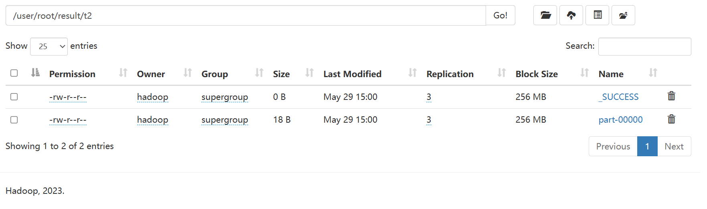

这里就保存了一个文件。
