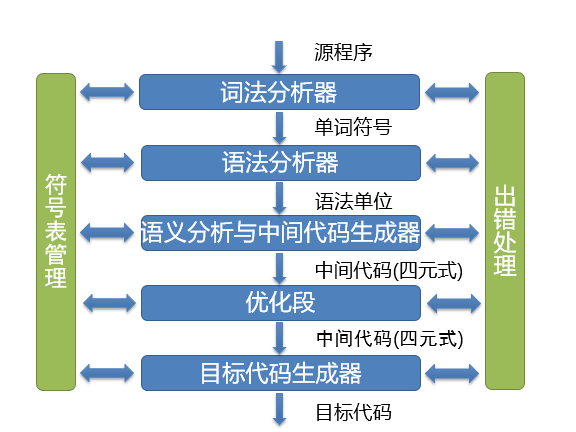
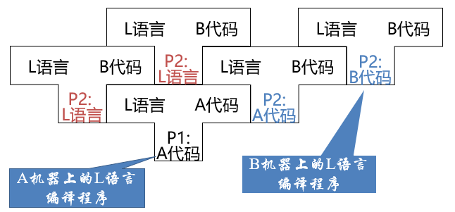

# 第1讲 引论

## 编译过程

1. 词法分析

   输入源程序，对构成源程序的字符串进行扫描和分解，识别出单词符号

2. 语法分析

   在词法分析的基础上，根据语法规则把单词符号分解成各类语法单位

3. 中间代码产生

   对各类语法单位按语言语义进行初步翻译（四元式）

4. 优化

   对前阶段产生的中间代码进行加工变换，以及在最后阶段产生更高效的目标代码

5. 目标代码产生

   把中间代码变换成特定机器上的目标代码

## 编译框架

### 出错处理

发现源程序中的错误，把有关错误信息报告给用户

- 语法错误：源程序中不符合语法（或词法）规则的错误
- 语义错误：源程序中不符合语义规则的错误

- 编译前端

  与源语言有关，如词法分析、语法分析、语义分析与中间代码产生，与机器无关的优化

- 编译后端

  与目标机有关，与目标机有关的优化，目标代码产生

## 编译程序生成

- 高级语言书写

  利用已有的某种语言的编译程序实现另一语言的编译程序

- 移植方法

  把一种机器上的编译程序移植到另一种机器上

用L语言编写一个程序P2，P2的功能是实现L语言到B语言的翻译

L语言在经过P2:A代码编译生成的是B机器上能够运行的B代码，这里的B代码是一个能在B机器上运行，实现L语言编译生成B代码的功能

L语言然后经过P2:B代码编译生成在B机器上运行的B代码

- 自编译方式

- 编译程序自动产生

