# 词法分析概述

## 主要任务

扫描源程序，按照构词规则识别出每个单词，构词错误，输出错误信息

1. 扫描源程序，读入字符到输入缓冲区
2. 按构词规则识别单词，输出单词本身及其种别码
3. 过滤源程序中无用成分，例如注释、空格、换行等
4. 调用错误处理程序，识别并定位错误

# 高级语言单词

## 分类

1. 关键字

   高级语言的关键字一般都是固定的，例如C语言中的 `int`，`break`，`while`等

2. 标识符

   标识符的作用是标识命名的对象，以便程序引用，可以代表变量、常量、函数、过程、类和对象。标识符有构词规则，例如C语言中，标识符以字母或下划线开头，后面跟着若干字母，下划线，数字

3. 运算符

   包括算术运算符、逻辑运算符和关系运算符

4. 界符

   主要用来分隔单词，例如C语言中的`,` `;` `""` `''`, `{}` `[]` `()` `/* */` 空格以及换行符等

5. 常数

   常数是程序设计语言中固定不变的值，又分为整型，实型，字符型和字符串型，其中整型中又有十进制，八进制，十六进制，实型常量用来表示带有小数和指数的数值

## 种别码

<table>
    <tr>
        <td>类别</td>
        <td>单词</td>
        <td>编码</td>
        <td>类别</td>
        <td>单词</td>
        <td>编码</td>
    </tr>
    <tr>
        <td rowspan='20'>关键字</td>
        <td>void</td>
        <td>101</td>
        <td rowspan='29'>运算符</td>
        <td>(</td>
        <td>301</td>
    </tr>
    <tr>
        <td>char</td>
        <td>102</td>
        <td>)</td>
        <td>302</td>
    </tr>
    <tr>
        <td>int</td>
        <td>103</td>
        <td>[</td>
        <td>303</td>
    </tr>
    <tr>
        <td>float</td>
        <td>104</td>
        <td>]</td>
        <td>304</td>
    </tr>
    <tr>
        <td>double</td>
        <td>105</td>
        <td>!</td>
        <td>305</td>
    </tr>
    <tr>
        <td>struct</td>
        <td>106</td>
        <td>*</td>
        <td>306</td>
    </tr>
    <tr>
        <td>typedef</td>
        <td>107</td>
        <td>*=</td>
        <td>307</td>
    </tr>
    <tr>
        <td>sizeof</td>
        <td>108</td>
        <td>/</td>
        <td>308</td>
    </tr>
    <tr>
        <td>const</td>
        <td>109</td>
        <td>/=</td>
        <td>309</td>
    </tr>
    <tr>
        <td>return</td>
        <td>110</td>
        <td>%</td>
        <td>310</td>
    </tr>
    <tr>
        <td>continue</td>
        <td>111</td>
        <td>%=</td>
        <td>311</td>
    </tr>
    <tr>
        <td>break</td>
        <td>112</td>
        <td>+</td>
        <td>312</td>
    </tr>
    <tr>
        <td>if</td>
        <td>113</td>
        <td>++</td>
        <td>313</td>
    </tr>
    <tr>
        <td>else</td>
        <td>114</td>
        <td>+=</td>
        <td>314</td>
    </tr>
    <tr>
        <td>switch</td>
        <td>115</td>
        <td>-</td>
        <td>315</td>
    </tr>
    <tr>
        <td>case</td>
        <td>116</td>
        <td>-=</td>
        <td>316</td>
    </tr>
    <tr>
        <td>default</td>
        <td>117</td>
        <td>&lt;</td>
        <td>317</td>
    </tr>
    <tr>
        <td>for</td>
        <td>118</td>
        <td>&lt;=</td>
        <td>318</td>
    </tr>
    <tr>
        <td>do</td>
        <td>119</td>
        <td>&gt;</td>
        <td>319</td>
    </tr>
    <tr>
        <td>while</td>
        <td>120</td>
        <td>&gt;=</td>
        <td>320</td>
    </tr>
    <tr>
        <td rowspan='4'>界符</td>
        <td>{</td>
        <td>201</td>
        <td>==</td>
        <td>321</td>
    </tr>
    <tr>
        <td>}</td>
        <td>202</td>
        <td>!=</td>
        <td>322</td>
    </tr>
    <tr>
        <td>;</td>
        <td>203</td>
        <td>&amp;&amp;</td>
        <td>323</td>
    </tr>
    <tr>
        <td>,</td>
        <td>204</td>
        <td>||</td>
        <td>324</td>
    </tr>
    <tr>
        <td rowspan='5'>单词类别</td>
        <td>整数</td>
        <td>500</td>
        <td>=</td>
        <td>325</td>
    </tr>
    <tr>
        <td>字符</td>
        <td>600</td>
        <td>&lt;&lt;</td>
        <td>326</td>
    </tr>
    <tr>
        <td>字符串</td>
        <td>700</td>
        <td>&gt;&gt;</td>
        <td>327</td>
    </tr>
    <tr>
        <td>标识符</td>
        <td>800</td>
        <td>&amp;</td>
        <td>328</td>
    </tr>
    <tr>
        <td>实数</td>
        <td>1000</td>
        <td>|</td>
        <td>329</td>
    </tr>
</table>

# 单词识别

状态转换图

1. 有限个结点，结点用圆圈表示，成为状态
2. 状态之间用带箭头的弧表示，成为边
3. 弧上标记的符号是状态转换的条件
4. 初态用双箭头标识 `=>`
5. 至少有一个终态，用双圈表示

## 状态图合并

1. 将多个状态图的开始状态合并成一个开始状态
2. 将各个图中读取相同符号到达的状态进行合并
3. 从开始状态出发画出多条边，分别识别原来多个状态图从开始状态出发的边上标识的符号类，将相同标识的边进行合并
4. 检查合并后的状态名称，修改至不同

下面是识别标识符和数字的状态图转换图

## 超前搜索技术

超前搜索技术是提前查看而不读取的方式，只有向前看到某个符号确定单词或单词类别后才继续读入

# 词法分析器设计

主要任务：扫描源程序，识别单词，查找单词的toke值，转换并输出token串，输出相应错误信息

1. 读一非空字符
2. 首字符分类
3. 识别标识符/关键字
4. 识别数值类型常数
5. 处理注释和除号
6. 识别字符常数
7. 识别字符串常数
8. 识别其他界符和运算符

# 正则表达式与有穷表达式

## 符号和符号串

符号

- 一个高级语言程序能够使用的全体字符构成的集合称为字母表，即该语言的合法字符集，通常用$\Sigma$表示，是一个有穷非空集合，其中每个元素称为一个符号。

符号串

- 符号串是指由该字母表中的符号构成的有穷序列，又称为字。集合$\Sigma$上的单个符号也可以称为符号串。

## 集合

若集合$U$中的所有元素都是字母表$\Sigma$上的符号串，则称为$U$为$\Sigma$上符号串的集合，也称$U$为$\Sigma$上的语言

> 注意：
>
> 1. $\varnothing$ 表示不含元素空集 $\{\}$
> 2. $\varepsilon$ 表示空字，空串
> 3. $\{\varepsilon\}$ 表示含有空字的集合

集合运算

|  运算  |     表示     |                          定义                          |      备注       |
| :----: | :----------: | :----------------------------------------------------: | :-------------: |
|   并   | $U\bigcup V$ |       $U\bigcup V=\{s|s\in U \; or \; s\in V\}$        |                 |
|  连接  |     $UV$     | $UV=\{\alpha\beta\;|\;\alpha\in U\;and\;\beta\in V\}$  |                 |
|  方幂  |   $V^{n}$    |           $V^n=V^{n-1}V,V^0=\{\varepsilon\}$           |                 |
|  闭包  |   $V^{*}$    | $V^*=V^0\bigcup V^1\bigcup V^2\bigcup V^3\bigcup\dots$ | V出现一次或多次 |
| 正闭包 |   $V^{+}$    |                       $V^+=VV^*$                       |  V至少出现一次  |

## 正则表达式

正则表达式也成为**正规式**，可以描述所有通过某个字母表上的符号串集合应用**并、连接和闭包运算**而得到的语言，是一种描述字符串构成模式（Pattern）的方法，检查某一个字符串是否含有某个特定的子模式串。

一个正则表达式 $r$ 所描述的符号串集合称为**正规集**，也称为正则表达式描述的语言，记为 $L(r)$ 

| 正规式                 | 正规集                                   |
| ---------------------- | ---------------------------------------- |
| a                      | {a}                                      |
| ba*                    | 所有以b开头后跟任意多个a的串             |
| a½b                    | {a,b}                                    |
| ab                     | {ab}                                     |
| (a½b)(a½b)             | {aa,ab,ba,bb}                            |
| a*                     | {e  ,a,aa, ……}  任意个a的串              |
| (a½b)*                 | {e  ,a,b,aa,ab  ……} 所有由a  或b组成的串 |
| (a\|b)*(aa\|bb)(a\|b)* | 所有含有两个相继的a或两个相继的b的串     |

1. $\varepsilon$ 是一个正则表达式，表示的正规集 $L(\varepsilon)=\{\varepsilon\}$，即该语言只包含空串

2. 对任何 $\alpha \in \Sigma$， $\alpha$ 是 $\Sigma$ 上的一个正则表达式，它所表示的正规集 $L(\alpha)=\{\alpha\}$

3. 设 $e_1$ 和 $e_2$ 是 $\Sigma$ 上的正则表达式，所表示的正规集分别为 $L(e_1)$ 和  $L(e_2)$，则：

   1. $(e_1)$ 是正则表达式，它表示的正规集为 $L(e_1)$

   2. $e_1|e_2$ 是正则表达式，它表示的正规集为 $L(e_1)\bigcup L(e_2)$

   3. $e_1\cdot e_2$ 是正则表达式，它表示的正规集为 $L(e_1)L(e_2)$

   4. $e_1^*$ 是正则表达式，它表示的正规集为 $(L(e_1))^*$

**有限次**使用上述三步骤而定义的表达式才是 $\Sigma$ 上的正规式，仅由这些正规式所表示的集合才是 $\Sigma$ 上的正规集

## 有穷自动机

有穷自动机(也称有限自动机)作为一种识别装置，它能准确地识别正规集，即识别正规文法所定义的语言和正规式所表示的集合，引入有穷自动机这个理论，是为词法分析程序的自动构造寻找特殊的方法和工具

有穷自动机分为**确定的有穷自动机（Deterministic Finite Automata，DFA）**和**不确定的有穷自动机（Nondeterministic Finite Automata，NFA）**

==确定的有穷自动机是指在一个状态下输入一个符号，状态换到唯一的下一个状态==

==不确定的有穷自动是指一个状态下输入一个符号，可能有两个或两个以上的后继状态==

### DFS

DFS是一个由五元组定义的数学模型：
$$
M=(S,\Sigma,\delta, s_0,F)
$$
其中：

1.  $S$ 是一个有穷状态集
2.  $\Sigma$ 是一个有穷输入字母表
3.  $\delta$ 是状态转换函数。是在 $S\times\Sigma\rightarrow S$ 上的单值映射，$δ (s，a)=s’ (s∈S，s’∈S) $，就意味着，当前状态为 $s$，输入符为 $a$ 时，将转换为下一个状态 $s^{'}$，我们把 $s^{'}$ 称作 $s$ 的一个后继状态
4. s~0~  ∈ S 是唯一的一个初态
5. $F\subseteq S$ 是一个终态集（可空），也称为可接收状态或者结束状态

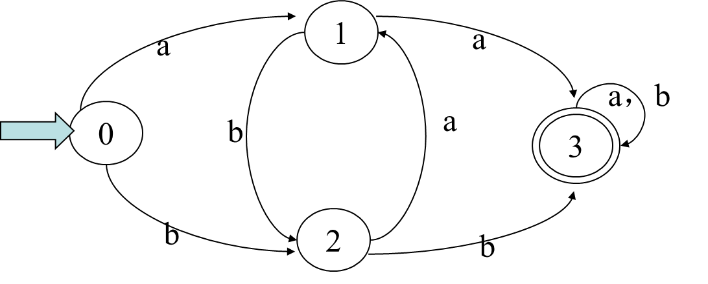

一个DFA可以表示成一个状态图(或称状态转换图)。假定DFA M含有m个状态，n个输入字符，那么这个状态图含有m个结点，每个结点最多有n个弧射出

DFS确定性表现

- 对任何状态s ∈S，在读入了输入符号a ∈ Σ 之后，能够**唯一地确定**下一个状态
- 映射函数δ：S×Σ→S是一个**单值**函数
- 从状态转换图来看，若字母表Σ含有n个输入字符，那末任何一个状态结点**最多有n条弧射出**，而且每条弧以一个**不同的输入字符**标记

1. 字α可为DFA M所接受（识别）：对于Σ* 中的任何字α，若存在一条从初态结点到某个终态结点的通路，且这条通路上所有弧的标记符号连接成的字等于α
2. 若M的初态结点又是终态结点，则空字ε可为M所识别
3. DFA M所能识别的符号串的全体记为L(M)
4. 对于任何两个有穷自动机M和M′，如果L(M)=L(M′)，则称M与M′是**等价**的

> $\Sigma$ 上一个符号串集 $V\subseteq\Sigma^{*}$ 是正规的，当且仅当存在一个 $\Sigma$ 上的确定有穷自动机M，使得V=L(M)
>
> 怎么理解？# TODO

### NFA

NFA 是一个五元组定义的数据模型
$$
M=(S,\Sigma,\delta,S_0,F)
$$
其中：

1. $S$ 为状态的**有穷**状态集
2. $\Sigma$ 为**有穷**输入字母表
3. $\delta$ 为 $S\times\Sigma^{*}$ 到 $S$ 的幂集 $2^S$ 的一种映射：$S\times\Sigma\rightarrow2^S$
4. $S_0\subseteq S$ 是初始状态集
5. $F\subseteq S$ 为终止状态集（可空）

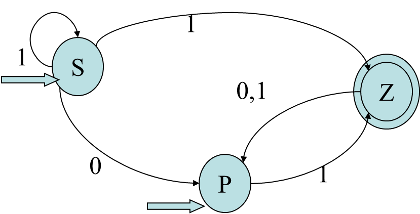

一个含有m个状态，n个输入字符的NFA的状态转换图：有m个结点，每个结点可射出**若干条**弧与别的结点相连接，每条弧用 $\Sigma^{*}$ 上的一个字来表示(这些字可以相同，也可以是ε)

整个图**至少有一个初始结点以及若干个(可以是0个)终态结点**，某些结点既可以是初态结点，又可以是终态结点

1. 对于Σ*中的任何一个串t，若存在一条从某一初态结点到某一终态结点的通路，且这条通路上所有弧的标记字依序连接成的串(不理采那些标记为ε的弧)等于t，则称t可为NFA M所识别(读出或接受)

2. 若M的某些结点既是初态结点又是终态结点；或者存在一条从某个初态结点到某个终态结点的道路,其上所有弧的标记均为ε，那么空字ε可为M所接受
3. NFA M所能接受的符号串的全体记为L(M)

> $\Sigma$ 上一个符号串集 $V\subseteq\Sigma^*$ 是正规的，当且仅当存在一个 Σ 上的不确定的有穷自动机M，使得V=L(M)

### DFA与NFS主要区别

1. DFA任何状态都没有 ε 转换，即没有任何状态可以不进行输入符号的匹配就直接进入下一个状态
2. DFA对任何状态*s*和任何输入符号*a*，最多只有一条标记为*a*的边离开*s*，即转换函数 $\delta:\ S\times\Sigma\rightarrow S$ 是一个单值部分函数
3. DFA的初态唯一，NFA的初态为一集合

### NFA的确定化

1. 增加状态X,Y,使之成为新的唯一的初态和终态。从X引 **ε** 弧到原初态结点, 从原终态结点引 **ε** 弧到Y结点

2. 对状态图进一步进行如下形式的改变：

   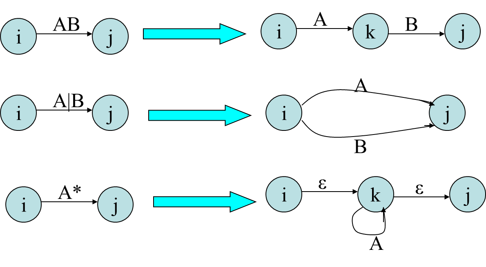

3. 对NFA开始确定化，首先求出从构建好的初始状态的 $\varepsilon-closure(I)$ , 然后从这个闭包集合求对 α 弧转换

   $Ia = ε-closure(J)$ ,其中 $J=move(I,a)$ ，即所有可从 $I$ 中的某一状态经过一条 $\alpha$ 弧而到达的状态的全体

   有两步的计算，一是求 $\varepsilon$ 字闭包 然后去对 α 弧转换

   示例：

   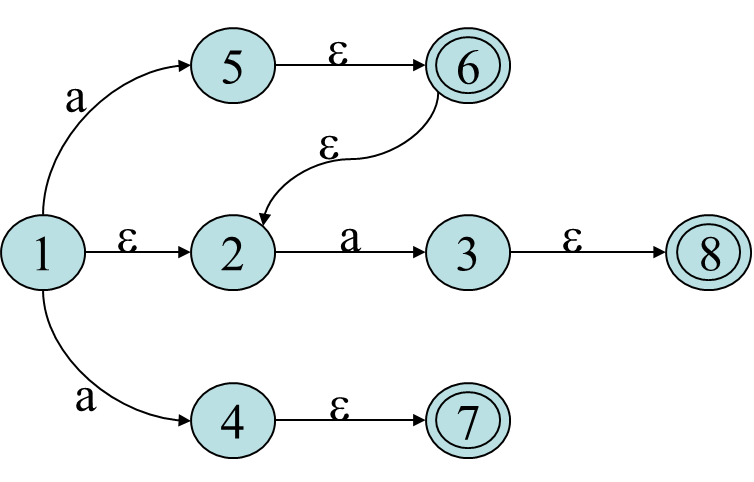
   $$
   I=\{1,2\},  J=move(I,a)= \{5,3,4\} \\
   Ia=\varepsilon -closure(\{5,3,4\})=\{2,3,4,5,6,7,8\}
   $$

4. 构造状态转换表

   1. $\Sigma=\{a_1…a_k\}$, 则初始时该表有 $k+1$ 列，分别为$I、Ia_1 …I_ak$，首行首列为 $\varepsilon-closure(X)$，(X为开始结点)

   2. 每行的值 $Ia_k=\varepsilon-closure(move(I,a))$，其行数未知

   3. 将新产生的 $Ia_k$ 集合加入到I中作为新的一行，并求该集合 $I$ 的$Ia_1 …Ia_k$ ，重复之，直到状态不再增加

   4. 初态就是首行首列的状态，终态是含有原终态的集合。

完整示例：

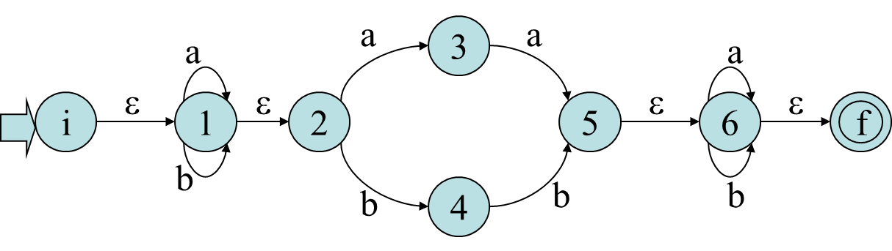

状态转换表

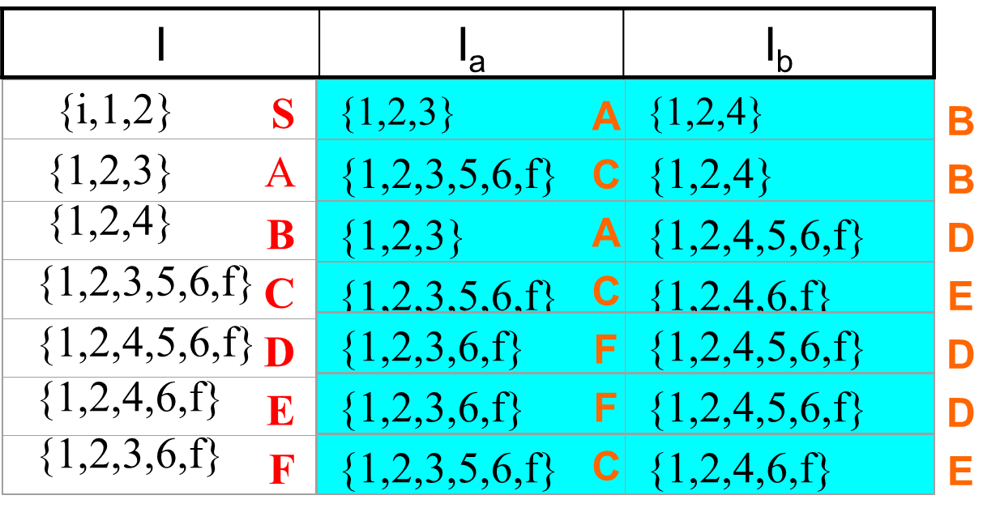

等价的DFA

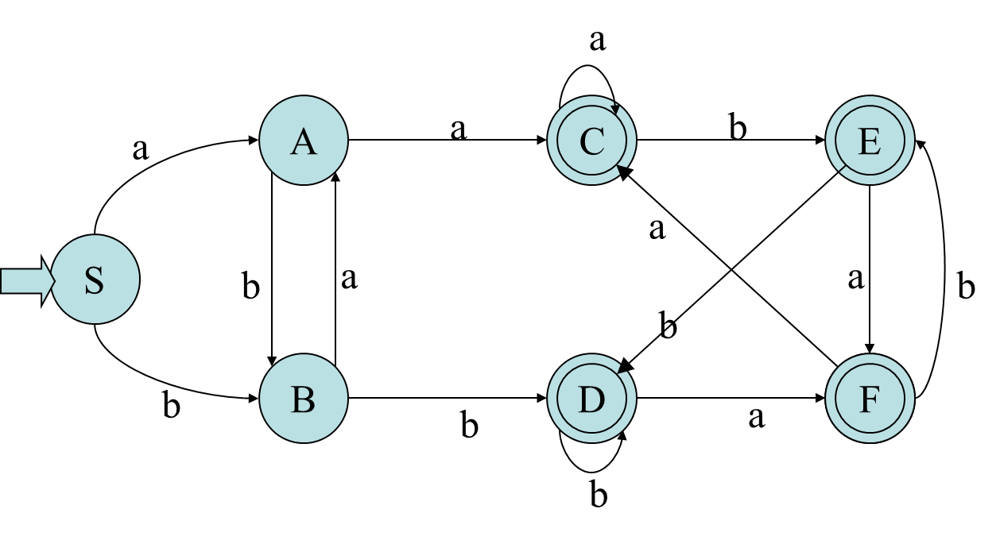

#### 补充

NFA带有 $\varepsilon$ 弧，称为具有 $\varepsilon$ 转移的不确定的有穷自动机

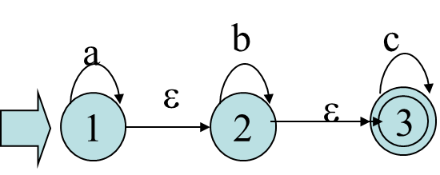

对任何一个具有 $\varepsilon$ 转移的不确定的有穷自动机NFA N，一定存在一个不具有 $\varepsilon$ 转移的不确定的有穷自动机 NFA Ｍ ，使得L(M)=L(N)

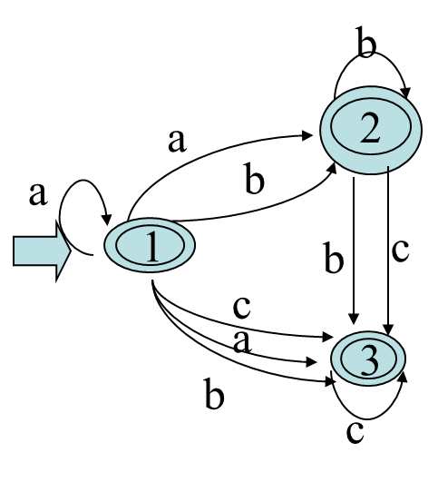

### 确定有穷自动机化简

- 与某一NFA等价的DFA不一定唯一
- 不同DFA识别的正规集可能是相同的
- 每一个正规集都可以由一个状态数最少的DFA所识别，这个DFA是唯一的（因状态名不同的同构情况除外）

#### DFA的最小化

1. DFA的最小化就是寻求状态数最少的DFA，它没有多余状态**（消去）**， 它的状态中没有两个是互相等价的**（合并）**。
2. **多余状态**是指：从开始状态出发，任何输入串也不能到达的那个状态；或者从这个状态没有通路到达终态
3. 状态S和T等价的条件：
   1. 一致性条件 —— 状态S和T必须同时为可接受状态或不可接受状态
   2. 蔓延性条件 —— 对于所有输入符号，状态S和状态T必须转换到等价的状态里

算法：

1. 所有状态分成两个子集——**终态集和非终态集**

2. 运用判定状态等价的原则分别对两个子集的状态进行分析和划分，若发现某个状态与其它状态不等价，则将其作为一个新的状态子集，如果无法区分，则放在同一子集中

3. 从每个子集中选出一个状态做代表，即可构成简化的DFA

4. 含有原来初态的子集仍为初态，各终态的子集仍为终态

示例：

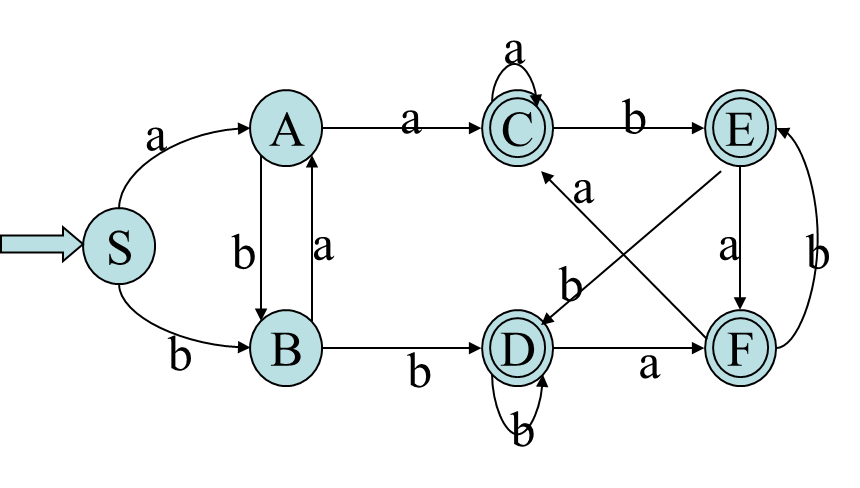

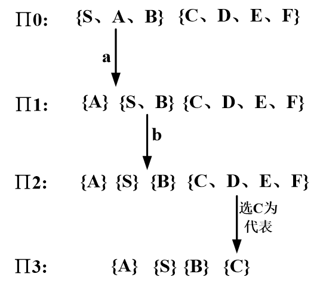

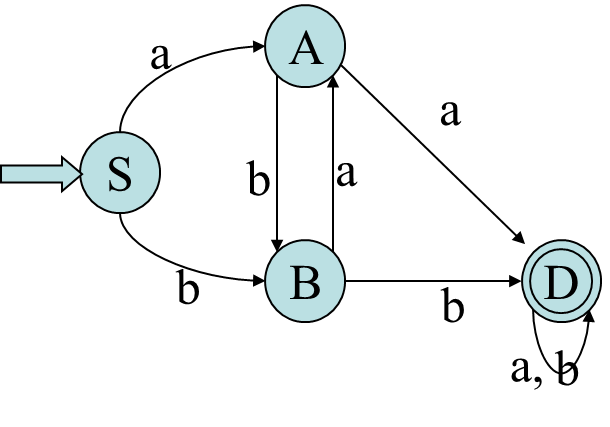

合并状态注意：

1. 由于一个子集中，各状态等价，故只需将原进入该子集中各状态的弧都改为进入所选的状态，子集中各状态射出的弧均改为从该状态射出
2. 含有原来初态的子集仍为初态，含原终态的子集仍为终态

## 正规式与有限自动机等价性

1. 对于Σ上的NFA M，可以构造一个Σ上的正规式R，使得L(R)=L(M)
2. 对于Σ上的每个正规式R，可以构造一个Σ上的NFA M，使得L(M)=L(R)

有穷自动机M转正规式R

1. 增加结点X,Y,使之成为新的唯一的初态和终态。从X引 **ε** 弧到原初态结点, 从原终态结点引 **ε** 弧到Y结点
2. 利用如下的规则消去新的状态图中的所有结点，直至只剩下X,Y结点

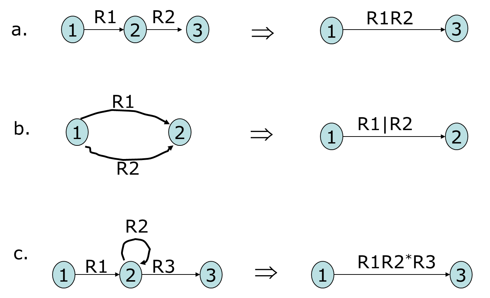

3. 最后得到从X到Y弧上的正规式

正则式R转有穷自动机NFA M

1. 正规式 $\Phi$，构造NFA

   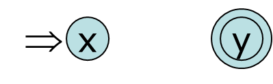

2. 对应正规式 $\varepsilon$，构造NFA

   

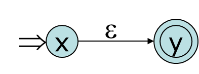

3. 对应正规式 $\alpha$，构造NFA

   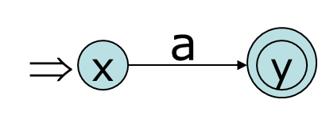

4. s,t是正规式，相应NFA为N(s),N(t)，则正规式R=s|t，构造NFA(R)

   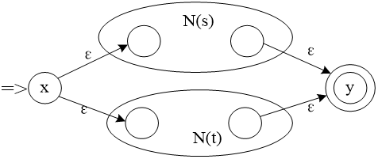

5. s,t是正规式，相应NFA为N(s),N(t)，则正规式R=st，构造NFA(R)

   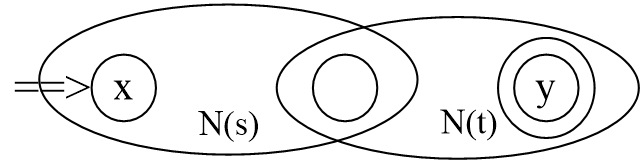

6. s是正规式，相应NFA为N(s) ，则正规式R=s*，构造NFA(R)

   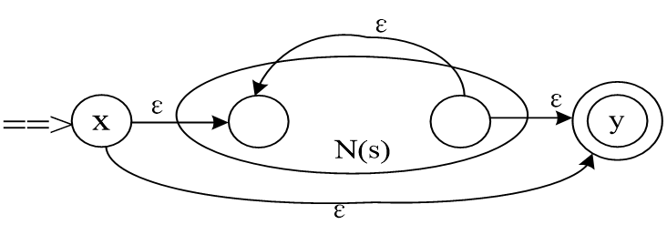

示例：

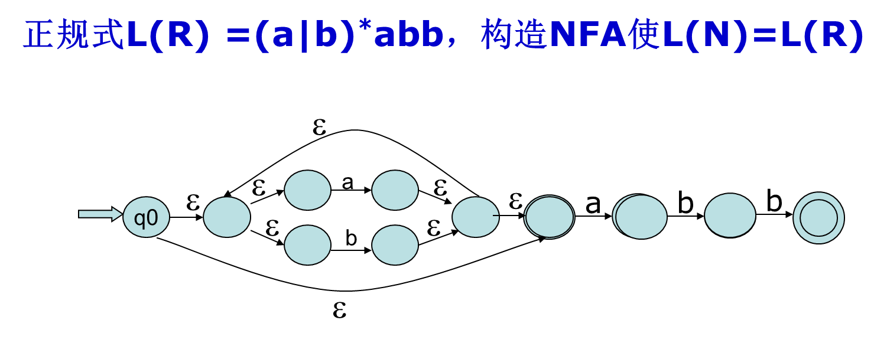

