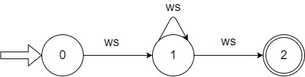
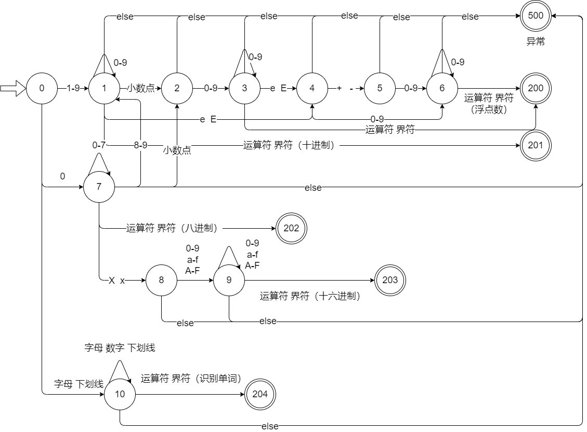

# 词法分析概述

## 主要任务

扫描源程序，按照构词规则识别出每个单词，构词错误，输出错误信息

1. 扫描源程序，读入字符到输入缓冲区
2. 按构词规则识别单词，输出单词本身及其种别码
3. 过滤源程序中无用成分，例如注释、空格、换行等
4. 调用错误处理程序，识别并定位错误

# 高级语言单词

## 分类

1. 关键字

   高级语言的关键字一般都是固定的，例如C语言中的 `int`，`break`，`while`等

2. 标识符

   标识符的作用是标识命名的对象，以便程序引用，可以代表变量、常量、函数、过程、类和对象。标识符有构词规则，例如C语言中，标识符以字母或下划线开头，后面跟着若干字母，下划线，数字

3. 运算符

   包括算术运算符、逻辑运算符和关系运算符

4. 界符

   主要用来分隔单词，例如C语言中的`,` `;` `""` `''`, `{}` `[]` `()` `/* */` 空格以及换行符等

5. 常数

   常数是程序设计语言中固定不变的值，又分为整型，实型，字符型和字符串型，其中整型中又有十进制，八进制，十六进制，实型常量用来表示带有小数和指数的数值

## 种别码

<table>
    <tr>
        <td>类别</td>
        <td>单词</td>
        <td>编码</td>
        <td>类别</td>
        <td>单词</td>
        <td>编码</td>
    </tr>
    <tr>
        <td rowspan='20'>关键字</td>
        <td>void</td>
        <td>101</td>
        <td rowspan='29'>运算符</td>
        <td>(</td>
        <td>301</td>
    </tr>
    <tr>
        
        <td>char</td>
        <td>102</td>
        
        <td>)</td>
        <td>302</td>
    </tr>
    <tr>
        
        <td>int</td>
        <td>103</td>
        
        <td>[</td>
        <td>303</td>
    </tr>
    <tr>
        
        <td>float</td>
        <td>104</td>
        
        <td>]</td>
        <td>304</td>
    </tr>
    <tr>
        
        <td>double</td>
        <td>105</td>
        
        <td>!</td>
        <td>305</td>
    </tr>
    <tr>
        
        <td>struct</td>
        <td>106</td>
        
        <td>*</td>
        <td>306</td>
    </tr>
    <tr>
        
        <td>typedef</td>
        <td>107</td>
        
        <td>*=</td>
        <td>307</td>
    </tr>
    <tr>
        
        <td>sizeof</td>
        <td>108</td>
        
        <td>/</td>
        <td>308</td>
    </tr>
    <tr>
        
        <td>const</td>
        <td>109</td>
        
        <td>/=</td>
        <td>309</td>
    </tr>
    <tr>
        
        <td>return</td>
        <td>110</td>
        
        <td>%</td>
        <td>310</td>
    </tr>
    <tr>
        
        <td>continue</td>
        <td>111</td>
        
        <td>%=</td>
        <td>311</td>
    </tr>
    <tr>
        
        <td>break</td>
        <td>112</td>
        
        <td>+</td>
        <td>312</td>
    </tr>
    <tr>
        
        <td>if</td>
        <td>113</td>
        
        <td>++</td>
        <td>313</td>
    </tr>
    <tr>
        
        <td>else</td>
        <td>114</td>
        
        <td>+=</td>
        <td>314</td>
    </tr>
    <tr>
        
        <td>switch</td>
        <td>115</td>
        
        <td>-</td>
        <td>315</td>
    </tr>
    <tr>
        
        <td>case</td>
        <td>116</td>
        
        <td>-=</td>
        <td>316</td>
    </tr>
    <tr>
        
        <td>default</td>
        <td>117</td>
        
        <td>&lt;</td>
        <td>317</td>
    </tr>
    <tr>
        
        <td>for</td>
        <td>118</td>
        
        <td>&lt;=</td>
        <td>318</td>
    </tr>
    <tr>
        
        <td>do</td>
        <td>119</td>
        
        <td>&gt;</td>
        <td>319</td>
    </tr>
    <tr>
        
        <td>while</td>
        <td>120</td>
        
        <td>&gt;=</td>
        <td>320</td>
    </tr>
    <tr>
        <td rowspan='4'>界符</td>
        <td>{</td>
        <td>201</td>
        
        <td>==</td>
        <td>321</td>
    </tr>
    <tr>
        
        <td>}</td>
        <td>202</td>
        
        <td>!=</td>
        <td>322</td>
    </tr>
    <tr>
        
        <td>;</td>
        <td>203</td>
        
        <td>&amp;&amp;</td>
        <td>323</td>
    </tr>
    <tr>
        
        <td>,</td>
        <td>204</td>
        
        <td>||</td>
        <td>324</td>
    </tr>
    <tr>
        <td rowspan='5'>单词类别</td>
        <td>整数</td>
        <td>500</td>
        
        <td>=</td>
        <td>325</td>
    </tr>
    <tr>
        
        <td>字符</td>
        <td>600</td>
        
        <td>&lt;&lt;</td>
        <td>326</td>
    </tr>
    <tr>
        
        <td>字符串</td>
        <td>700</td>
        
        <td>&gt;&gt;</td>
        <td>327</td>
    </tr>
    <tr>
        
        <td>标识符</td>
        <td>800</td>
        
        <td>&amp;</td>
        <td>328</td>
    </tr>
    <tr>
        
        <td>实数</td>
        <td>1000</td>
        
        <td>|</td>
        <td>329</td>
    </tr>
</table>

# 单词识别

状态转换图

1. 有限个结点，结点用圆圈表示，成为状态
2. 状态之间用带箭头的弧表示，成为边
3. 弧上标记的符号是状态转换的条件
4. 初态用双箭头标识 `=>`
5. 至少有一个终态，用双圈表示

## 状态图合并

1. 将多个状态图的开始状态合并成一个开始状态
2. 将各个图中读取相同符号到达的状态进行合并
3. 从开始状态出发画出多条边，分别识别原来多个状态图从开始状态出发的边上标识的符号类，将相同标识的边进行合并
4. 检查合并后的状态名称，修改至不同

下面是识别标识符和数字的状态图转换图

## 超前搜索技术

超前搜索技术是提前查看而不读取的方式，只有向前看到某个符号确定单词或单词类别后才继续读入

# 词法分析器设计

主要任务：扫描源程序，识别单词，查找单词的toke值，转换并输出token串，输出相应错误信息

1. 读一非空字符
2. 首字符分类
3. 识别标识符/关键字
4. 识别数值类型常数
5. 处理注释和除号
6. 识别字符常数
7. 识别字符串常数
8. 识别其他界符和运算符

# 正则表达式与有穷表达式

## 符号和符号串

符号

- 一个高级语言程序能够使用的全体字符构成的集合称为字母表，即该语言的合法字符集，通常用$\sum$表示，是一个有穷非空集合，其中每个元素称为一个符号。

符号串

- 符号串是指由该字母表中的符号构成的有穷序列，又称为字。集合$\sum$上的单个符号也可以称为符号串。

## 集合

若集合$U$中的所有元素都是字母表$\sum$上的符号串，则称为$U$为$\sum$上符号串的集合，也称$U$为$\sum$上的语言

> 注意：
>
> 1. $\varnothing$ 表示不含元素空集 $\{\}$
> 2. $\varepsilon$ 表示空字，空串
> 3. $\{\varepsilon\}$ 表示含有空字的集合

集合运算

|  运算  |     表示     |                          定义                          |      备注       |
| :----: | :----------: | :----------------------------------------------------: | :-------------: |
|   并   | $U\bigcup V$ |       $U\bigcup V=\{s|s\in U \; or \; s\in V\}$        |                 |
|  连接  |     $UV$     | $UV=\{\alpha\beta\;|\;\alpha\in U\;and\;\beta\in V\}$  |                 |
|  方幂  |   $V^{n}$    |           $V^n=V^{n-1}V,V^0=\{\varepsilon\}$           |                 |
|  闭包  |   $V^{*}$    | $V^*=V^0\bigcup V^1\bigcup V^2\bigcup V^3\bigcup\dots$ | V出现一次或多次 |
| 正闭包 |   $V^{+}$    |                       $V^+=VV^*$                       |  V至少出现一次  |

## 正则表达式

正则表达式也成为**正规式**，可以描述所有通过某个字母表上的符号串集合应用**并、连接和闭包运算**而得到的语言，是一种描述字符串构成模式（Pattern）的方法，检查某一个字符串是否含有某个特定的子模式串。

一个正则表达式 $r$ 所描述的符号串集合称为**正规集**，也称为正则表达式描述的语言，记为 $L(r)$ 

| 正规式                 | 正规集                                   |
| ---------------------- | ---------------------------------------- |
| a                      | {a}                                      |
| ba*                    | 所有以b开头后跟任意多个a的串             |
| a½b                    | {a,b}                                    |
| ab                     | {ab}                                     |
| (a½b)(a½b)             | {aa,ab,ba,bb}                            |
| a*                     | {e  ,a,aa, ……}  任意个a的串              |
| (a½b)*                 | {e  ,a,b,aa,ab  ……} 所有由a  或b组成的串 |
| (a\|b)*(aa\|bb)(a\|b)* | 所有含有两个相继的a或两个相继的b的串     |

1. $\varepsilon$ 是一个正则表达式，表示的正规集 $L(\varepsilon)=\{\varepsilon\}$，即该语言只包含空串

2. 对任何 $\alpha \in \sum$， $\alpha$ 是 $\sum$ 上的一个正则表达式，它所表示的正规集 $L(\alpha)=\{\alpha\}$

3. 设 $e_1$ 和 $e_2$ 是 $\sum$ 上的正则表达式，所表示的正规集分别为 $L(e_1)$ 和  $L(e_2)$，则：

   1. $(e_1)$ 是正则表达式，它表示的正规集为 $L(e_1)$

   2. $e_1|e_2$ 是正则表达式，它表示的正规集为 $L(e_1)\bigcup L(e_2)$

   3. $e_1\cdot e_2$ 是正则表达式，它表示的正规集为 $L(e_1)L(e_2)$

   4. $e_1^*$ 是正则表达式，它表示的正规集为 $(L(e_1))^*$

**有限次**使用上述三步骤而定义的表达式才是 $\sum$ 上的正规式，仅由这些正规式所表示的集合才是 $\sum$ 上的正规集

## 有穷自动机

有穷自动机(也称有限自动机)作为一种识别装置，它能准确地识别正规集，即识别正规文法所定义的语言和正规式所表示的集合，引入有穷自动机这个理论，是为词法分析程序的自动构造寻找特殊的方法和工具

有穷自动机分为**确定的有穷自动机（Deterministic Finite Automata，DFA）**和**不确定的有穷自动机（Nondeterministic Finite Automata，NFA）**

==确定的有穷自动机是指在一个状态下输入一个符号，状态换到唯一的下一个状态==

==不确定的有穷自动是指一个状态下输入一个符号，可能有两个或两个以上的后继状态==

### DFS