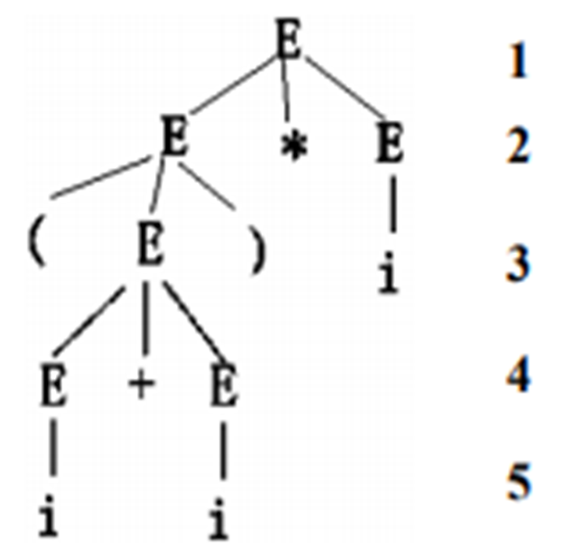
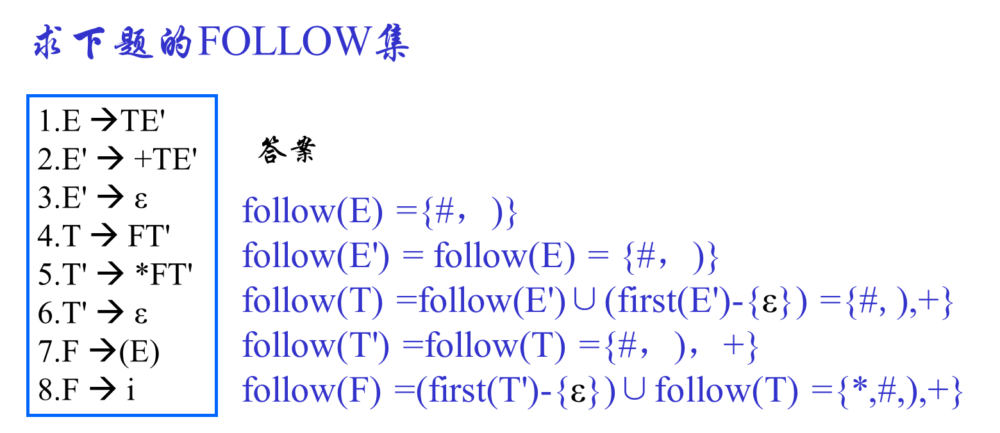
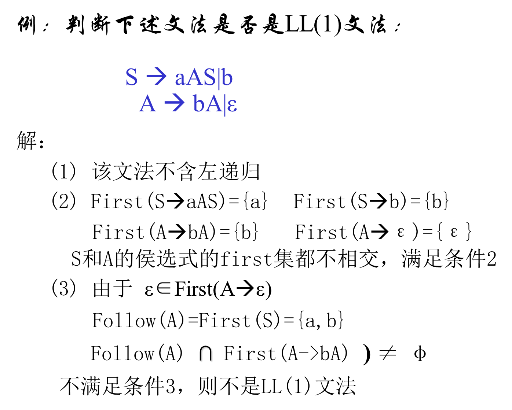

# 语法分析概述

在词法分析识别出正确的单词符号串的基础上，根据语言定义的语法规则，分析并识别出各种语法成分，同时进行语法检查和错误处理。

常用语法分析方法：

1. 自顶向下分析法：从文法的开始符号出发，向下推到（使用最左推导），尽可能使用各种产生式，推导出与输入串匹配的句子，从而建立语法树。
2. 自底向上分析法：从输入符号串开始，逐步进行归约（最右推导的逆过程），直至归约到文法的开始符号，从而建立语法树。


# 上下无关文法

1. 文法是描述语言的语法结构的形式规则。是一种工具，它可用于严格定义句子的结构；用有穷的规则刻划无穷的集合。
2. 文法是被用来精确而无歧义地描述语言的句子的构成方式。
3. 文法描述语言的时候不考虑语言的含义。


## 上下文无关文法定义


1. 终结符号：组成该语言的最基本的符号，是不可再分的基本符号，如保留字、标识符。
2. 非终结符：规则中用尖括号括起来的符号，表示语法成分，可以推导其他的语法成分，表示一定符号串的集合，是一个类，如表达式。
3. 开始符号：规则中一个特殊的非终结符号，语言句子都从它开始推到买入程序、句子
4. 产生式：定义语法成分的规则


表示为四元组：
$$
G=(Vn,Vt,P,S)
$$

- `Vn`：非终结符
- `Vt`：终结符，$Vn\cup Vt=V$，`V`表示字母表，$Vt\cap Vn=\Phi$

- `S`：开始符号
- `P`：产生式


## 推导

- 推导：连续使用产生式右部去替换左部某个非终结符的过程,得到的连续序列称为一个推导。

- 直接推导：又称一步推导(用 符号=>表示),就是用某条规则的右部去替换该规则的左部。

  如果$\alpha\rightarrow\beta$ 是文法 $G=(Vn,Vt,P,S)$的产生式，$\gamma$ 和 $\delta$ 是 $Ｖ^*$ 中的任意符号，若有符号串 $v,w$ 满足：
   $v=\gamma\alpha\delta,w=\gamma\beta\delta$ , 则说 $v$ 直接产生 $w$，(w是v的直接推导)记作：$v=>w$


- 句型：设Ｇ(s)是一文法，如果符号串x是从开始符号推导出来的，即有 $s\stackrel{*}{=>}x$ ,则称 x 是文法 G(s) 的一个句型。
- 句子：若x仅由**终结符号**组成，则称x为G(S)的句子。


- 文法G所产生的语言定义为：

  $L(G)={x|S=>x,其中S为文法的开始符号，x∈V_t^*} $。即: 一个文法G可以推导出的所有句子构成的一个集合, 就确定了一个语言定义为：

  $L(G)={x|S=>x, 其中S为文法的开始符号，x∈V_t^*}$ 。即: 一个文法G可以推导出的所有句子构成的一个集合, 就确定了一个语言。


- 文法等价

  若文法G1和文法G2所产生的语言相同，即L(G1) = L(G2)，则称文法G1和文法G2**等价**。


> 一个句型导到另一个句子句型的推导过程不是唯一的。


最左推导：

在整个推到过程中，任何一部推导 $\alpha=>\beta$ 都是对 $\alpha$ 中最左边的非终结符进行替换。

最右推导：

在整个推到过程中，任何一部推导 $\alpha=>\beta$ 都是对 $\alpha$ 中最右边的非终结符进行替换。


示例：


## 语法树


- **推导的形式化表示**
- 每个结点都有一个标记，该标记属字母集中的一个符号，根由开始符号Ｓ标记。
- 当某个非终结符被它的某个候选式所替换时，就产生相应的下一层的结点，候选式中自左至右的每个符号对应一个新的结点，并标记它，画出其与父结点之间的连线。




- 在语法树的推导过程中的任何时刻，没有后代的端末结点自左至右排列起来就是一个句型。
- 一棵语法树表示了一个句型很多可能的不同推导过程。(包括最左推导和最右推导)。


## 文法二义性


如果一个文法存在某个句子对应两棵不同的语法树，则说这个文法是二义的。

例如：


（分别对应之前示例的最左推导和最右推导）


==文法的二义性并不代表语言一定是二义的。只有当产生一个语言的所有文法都是二义的，这个语言才是二义的。==


## 形式语言

**Chomsky**于1956年建立形式语言体系，他把文法分成四种类型：**0，1，2，3**型。

与上下文无关文法一样，它们都由四部分组成，但对产生式的限制有所不同。


1. 0型（短语文法，图灵机）：
   $$
   \alpha\rightarrow\beta
   $$
   其中：$\alpha\in(V_T\cap V_N)^*$ 且至少含有一个非终结符，$\beta\in(V_T\cap V_N)^*$ 

   

2. 1型（上下文有关文法，线性界限自动机）：
   $$
   \alpha\rightarrow\beta
   $$
   其中 $|\alpha|<|\beta|$，仅 $S\rightarrow\varepsilon$

   

3. 2型（上下文无法文法，非确定下推自动机）：
   $$
   A\rightarrow B
   $$
   其中 $A\in V_N$，$\beta\in(V_T\cup V_N)^*$

   

4. 3型（正规文法，有限自动机）：
   $$
   A\rightarrow\alpha B \; or \; A\rightarrow\alpha \; 右线性文法 \\
   A\rightarrow B\alpha \; or \; A\rightarrow\alpha \; 左线性文法
   $$
   其中 $\alpha\in V_T^*$，$A,B\in V_N $

   


# 自上而下语法分析

1. 自上而下分析主要是：对任何输入串，试图用一切可能的办法，从文法的开始符号出发，自上而下地为输入串建立一个语法树
2. 从推导的角度看，从开始符号出发，使用最左推导，试图推导出与输入符号串相同的句子
3. 从语法树的角度看，从根节点出发，反复使用所有可能的产生式，谋求输入串的匹配，试图向下构造一棵语法树，其末端节点正好与输入符号串相同


## 存在问题

### 回溯


在匹配过程中，会先用 `>=` 试探，发现匹配错误，需要回退，重新选择 A 的候选式 

回溯产生的**真正原因**是：某非终结符对应多个侯选式，它们右部的第一个终结符相同，从而导致语法分析器选择了错误的侯选式。


### 左递归


在对第一个 `E`进行最左推导分析时候，会一直使用 `E` 的第一候选式，出现死循环。


### 结论

改造文法，使其不含左递归和回溯，才能确定的自顶向下分析。


## 解决问题


### 消除回溯

反复 **“提取公共左因子”**，使得文法的每个非终结符号的各个候选式的首终结符集两两不相交，来避免回溯。
$$
& A\rightarrow\delta\beta_1|\delta\beta_2|\dots|\delta\beta_n|\gamma_1|\gamma_2|\dots|\gamma_m \\
替换为 \\
& A\rightarrow\delta A'|\gamma_1|\gamma_2|\dots|\gamma_m \\
& A'\rightarrow\beta_1|\beta_2|\dots\beta_n
$$


示例：


### 消除左递归

$$
& A\rightarrow A\alpha|\beta \\
替换为 \\
& A\rightarrow\beta A' \\
& A'\rightarrow\alpha A'|\varepsilon
$$


一般而言产生式：
$$
& A\rightarrow A\alpha_1|A\alpha_2|\dots|A\alpha_m|\beta_1|\beta_2|\dots|\beta_n \\
替换为 \\
& A\rightarrow\beta_1A'|\beta_2A'|\dots'|\beta_nA' \\
& A'\rightarrow\alpha_1A'|\alpha_2A'|\dots|\alpha_mA'|
$$
示例：


### 间接左递归消除

例题：


解：

1. 为R、S、Q 排序，（推导的一次顺序）

2. 代入：将 R 代入 Q，Q 代入 S 得到新的文法产生式组：
   $$
   \begin{aligned}
   & R\rightarrow Sa|a \\
   & Q\rightarrow Sab|a|ab \\
   & S\rightarrow Sabc|abc|bc|c
   \end{aligned}
   $$

3. 消除 S 的直接左递归，得到：
   $$
   \begin{aligned}
   & S\rightarrow abcS'|bcS'|cS' \\
   & S'\rightarrow abcS'|\varepsilon
   \end{aligned}
   $$
   

## LL(1)文法


### 候选式的首终结符集定义

 
$$
\begin{aligned}
& First(\alpha)=\{a|\alpha\rightarrow a\dots,a\in V_T\} \\
& \text{若} \; \alpha\stackrel{*}{=>}\varepsilon, 则\;\varepsilon\in First(\alpha)
\end{aligned}
$$


> 某个非终结符的多个候选式的首终结符集相交，就会在推导的某个时刻产生回溯，导致语法分析器选择了错误的候选式。
>
> 
>
> 在给定的语法中，A 的候选式有两个，其首终结符集为：
> $$
> \begin{aligned}
> & First(A_1) = \{>\} \\
> & First(A_2) = \{>\}
> \end{aligned}
> $$
> 相交，就会产生回溯
>
> 因此，不产生回溯的条件是：==对非终结符 A 的任意两个不同候选式a~i~ 和 a~j~都有 $First(a_i)\cap First(a_j) = \Phi$==


### 非终结符A的First集算法


1. 若产生式形如 $A\rightarrow a\alpha,a\in V_T$, 则 $First(A\rightarrow a\alpha)=\{a\}$。
2. 若产生式形如 $A\rightarrow \varepsilon$, 则 $First(A\rightarrow a\alpha)=\{\varepsilon\}$。
3. 若产生式形如$A\rightarrow X\alpha,X\in V_N$，则把 $First(X)$ 中非 $\varepsilon$ 元素（记为 $First(X)\backslash\varepsilon$）加入到 $First(A\rightarrow X\alpha)$中。
4.  若有产生式形如$A\rightarrow X_1X_2X_3\dots X_k\alpha$，其中 $X_1,X_2,X_3\dots,X_k\in V_N$。则：
   1. 当 $X_1X_2X_3\dots X_i \stackrel{*}{=>}\varepsilon\;(1\le i\le k)$ 时，则把 $Fisrt(X_1X_2X_3\dots X_i)$ 的所有非 $\varepsilon$ 元素加入到 $First(A\rightarrow X_1X_2X_3\dots X_k\alpha)$中。
   2. 当 $X_1X_2X_3\dots X_k \stackrel{*}{=>}\varepsilon$ 时，则把 $First(\alpha)$ 加入 $First(A\rightarrow X_1X_2X_3\dots X_k\alpha)$中。

重复上述过程，直到 $First(A)$ 不再增大。


例题：


### 后随符号集定义

假定 S 是文法的开始符号，对于 $\forall A\in V_N$：
$$
FOLLOW(A)=\{a|S\stackrel{*}{=>}\dots Aa\dots,a\in V_T\}
$$
特别：$S \stackrel{*}{=>}\dots A$ 则 $\#\in FOLLOW(A)$，# 是输入符号串的结束标志。

利用 Follow 集的定义，使用 ε 产生式进行自动匹配的过程是：当非终结符 A 面临输入符号 a ，且 a 不属于 A 的任一候选式的首终结符集，但 A 的某个候选式的首终结符集含有 ε 时，只有当 a ∈ Follow(A)，才能使用 ε 产生式进行自动匹配。


### 非终结符A的Follow集算法


1. 如果 A 是开始符号，# ∈ Follow(A)。
2. 若有产生式 $B\rightarrow \alpha Aa\beta,\;a\in V_T$，则把 a 加入到 Follow(A) 中。
3. 若有产生式 $B\rightarrow \alpha AX\beta,\;X\in V_N$，则把 First(Xβ)\ε 加到 Follow(A)中。
4. 如 $B\rightarrow \alpha A$ 或 $B\rightarrow \alpha A\beta$ 且 $\beta\stackrel{*}{=>}\varepsilon$，把 Follow(B) 加到 Follow(A)中。
5. 对每个非终结符，浏览每个产生式，连续使用上述规则，直到 A 的 Follow 集不再增大为止。


示例：




### LL(1)文法条件

- 文法不含左递归
- 文法中的任一个非终结符 A 的各个产生式的候选首终结符集两两不相及，即没有回溯
- 对文法中的每个非终结符 A，若它的某个首终结符集含有 ε 则：$First(A)\cap Follow(A)=\phi$


判别：

1. 首先检查是否含有左递归

2. 若无，计算First集, 判别是否满足条件 (2) (即是否有回溯)

3. 若存在某个 $A\stackrel{*}{=>}\varepsilon$, 求A的 Follow集，并判别条件 (3) 是否满足(是否可以使用ε-产生式进行匹配)


示例




## 递归下降分析方法


1. 要求文法是LL(1)文法
2. 实现思想：
   - 识别程序由一组过程组成。每个过程对应于文法的一个非终结符号。
   - 每一个过程的功能是：选择正确的右部，扫描完相应的字。在右部中有非终结符号时，调用该非终结符号对应的过程来完成。


对于每个非终结符 U 假定 U 的候选式为 $U\rightarrow U_1|U_2|\dots|U_n$ 完成如下两项任务：

1. 根据输入符号决定使用 U 的哪一个候选式进行分析。如果 token ∈ First(U~1~) 则选择使用 U~1~ 进行分析。

   如果当前输入符号 token 不在任何一个 First(U~i~) ，但有 ε ∈ First(U~i~) ，则判断该输入符号是否在 Follow(U) 中，如果在 ε 将被使用，否则认为语法错误。

```cpp
void U( ){
    token = GetNextToken();  //从输入的token串中读取一个符号到token中，输入指针下移
    if  (token∈First (U1) )  U1();
    else if  (token∈First (U2) )  U2();
    ……
    else  if  ( (∈First(U)) && (token∈Follow(U))  ) 
    ……;
    else error();  // 没有找到匹配项，出错处理
}
```


2. 对于某个候选式 U~i~ 假定 U~i~ 是形如 X~1~X~2~...X~n~ 的候选式，处理 U~i~ ，就是通过顺序处理该候选式 U~i~：的每个符号 X~i~ 来完成其功能的。每个 X~i~ ：的处理要根据X~i~；是终结符或非终结符来确定：若 X~i~ 是非终结符，就调用该非终结符对应的函数 X~i~() ；若 X~i~ 是终结符，就直接调用 match() 函数进行比较，如果 X~i~ 和读人的符号匹配，就读人下一个输人符号，如果不匹配，则报告错误。

```cpp
void ui( )
{
    if (X1∈VN)         //处理X1
    X1( );    
    else  match(token ); 
    if (X2∈VN)         //处理X2
    X2( );  
    else match(token ); 
    …
    if (Xn∈VN)         //处理Xn
    Xn( );  
    else  match(token ); 
}
```

```cpp
void match (char *token)
{
    if (Xi == token)  {    			//与当前输入符号相同，即匹配
    	token = GetNextToken( ); 	// 取下一个符号到token中
    	return;                  	//匹配时直接返回
    }
    else error ( );  				// 不匹配，进行出错处理
}
```


## 递归下降分析器设计

此小结看书上对应章节举例。这里给出一个示例：


## 预测分析方法


### 预测分析工作过程

预测分析器由三部分组成：总控制程序、栈和预测分析表。


1. 栈用于存放分析过程中的文法符号序列。

2. 预测分析表 M 是一个二维数组，与文法有关。

   该**表的行表示所有的非终结符，列表示所有的终结符和#**（注：#不是文法的终结符，如果该语言中#是个合法字符，可以改用其他符号，把它**当成输人串的结束符**有利于简化分析算法的描述）

   表项元素M[A，a]存放着一条关于A的产生式，表明当用非终结符A向下推导时，如果面临输人符号a，应选用的候选式；当M[A，a]为空时，表明用A为左部向下推导时不应该面临输人符号a，因此表中内容为空表示出现语法错误。

   

3. 总控程序。分析器对每一个输入串的分析均在总控程序的控制下工作。总控程序的工作就是控制分析器读入输入符号，根据预测分析表的内容对栈进行操作。


首先将 # 和文法的开始符号压入栈中，然后总是根据栈顶符号 X 和当前的输人符号 a 工作

1. 如果栈顶符号是终结符，并且和 a 相等，则匹配成功，读取下一个输人符号
2. 如果栈顶符号和输人符号都是 #，则分析成功
3. 如果栈顶符号是非终结符，则查预测分析表，如果M[X，a]中存放有产生式 $X\rightarrow Y_1Y_2\dots Y_n$，**则将其按 $Y_n\dots Y_2Y_1$顺序压人堆栈（逆序压栈）**
4. 算法结束，要么成功匹配一个输人符号串，要么出错


### 预测分析方法

输入：一个待分析的输入符号串 w，以"#"作为结束标志；文法G的预测分析表M

输出：如果w ∈ L(G) ，输出 w 的最左推导，否则提示语法错误步骤

1. 将”#“和文法开始符号压入堆栈。
2. 设 IP 为输入指针，指向输入符号串的第一个符号a，a=w[IP]
3. 弹出栈顶符号，存入X。
4. 流程：


示例分析


### 预测分析表构造


1. 将文法改写为等价的LL(1)文法
2. 计算出每个候选式的 First集，如果含有 ε ，计算其左部非终结符 Follow集。


==关键在于计算出非终结符的 First集和 Follow 集==

可以参看书上例题熟悉过程。


