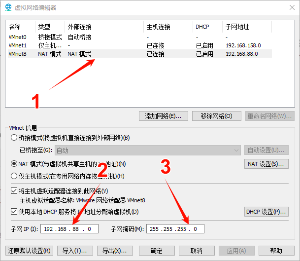

# 虚拟机准备

这里使用VM创建三个CentOS虚拟机，分别命名为`node1`, `node2`, `node3`，如图所示。


这里建议虚拟机`node1`的内存设置为4G，其余两个虚拟机设置为2G。大部分软件都在`node1`中运行。


固定虚拟机的网关IP地址，来设置虚拟机为静态IP。



操作流程

- 点击虚拟机的编辑选项，找到虚拟网络编辑器，点击打开，点击管理员更改设置。
- 第一步：选择NAT模式。
- 第二步：修改子网IP，修改前3个，这里设置为的是`192.168.88.0`。子网IP可任意设置，只是在后面的设置IP时要保持一致。
- 第三步：修改子网掩码，都设置为`255.255.255.0`。


# 系统内部配置


## 配置固定IP地址

修改虚拟机`node1`操作，在root权限下操作。

```sh
# 修改主机名
hostnamectl set-hostname node1

# 修改IP地址
vim /etc/sysconfig/network-scripts/ifcfg-ens33
# vim 修改文件内容
BOOTPROTO="static"
IPADDR="192.168.88.141"
NETMASK="255.255.255.0"
GATEWAY="192.168.88.2"
DNS1="192.168.88.2"

# 重启网卡
systemctl restart network
```

通过`node2`和`node3`是一样的操作，只是`IPADDR`设置不同。


## 配置主机名映射

1. 在Windows系统中修改host文件，填入内容：

```tex
192.168.88.141 node1
192.168.88.142 node2
192.168.88.143 node3
```

host文件路径`C:\Windows\System32\drivers\etc`

这里对应填写主机名和IP地址。（使用自己配置的）

2. 在Linux虚拟机中`/etc/hosts`文件中填入内容：

```sh
vim /etc/hosts
```

```tex
192.168.88.141 node1
192.168.88.142 node2
192.168.88.143 node3
```

每一天虚拟机都要进行配置。


## 配置SSH免密登录

在root用户权限下配置三台Linux服务器之间的免密互相SSH登录。

每一台都执行以下操作：

```sh
ssh-keygen -t rsa -b 4096
```

> - `ssh-keygen` 是一个用于生成和管理 SSH 密钥对的命令行工具。
> - `-t rsa` 指定了要生成 RSA 密钥对。RSA 是一种非对称加密算法，常用于 SSH 密钥对的生成。
> - `-b 4096` 指定了生成的 RSA 密钥的位数，这里是 4096 位。密钥位数越大，安全性越高，但生成和使用时也会更耗费计算资源。


```sh
ssh-copy-id node1
ssh-copy-id node2
ssh-copy-id node3
```

> - `ssh-copy-id node1` 命令会将本地用户的公钥复制到节点 `node1` 的 `~/.ssh/authorized_keys` 文件中。这样，可以使用私钥进行 SSH 登录时，服务器会验证该私钥是否与 `authorized_keys` 文件中的公钥匹配。
> - 同理，`ssh-copy-id node2` 和 `ssh-copy-id node3` 会分别将本地用户的公钥复制到节点 `node2` 和 `node3` 的 `~/.ssh/authorized_keys` 文件中。


这里配置的是root用户先SSH免密登录，而通常情况下我们不会以root用户启动（确保安全）这里我们单独创建新用户`hadoop`，配置SSH免密登录。

创建用户命令操作：

```sh
# 创建用户
useradd hadoop
# 初始化用户密码
passwd 123456

# 切换到hadoop用户下生成密钥，配置免密登录，配置过程和root用户下配置流程相同
```


## 配置JDK环境

从官网上下载linux版本的jdk环境，这里使用的jdk8。官网下载地址[Java Archive Downloads - Java SE 8u211 and later (oracle.com)](https://www.oracle.com/java/technologies/javase/javase8u211-later-archive-downloads.html)

将下载好的压缩包导入虚拟机进行解压，这里创建了一个`/export/server`目录将其导入进行解压，操作如下：

```sh
# 创建目录
mkdir -p /export/server

# 将压缩包导入虚拟机中，随便位置

# 解压jdk安装文件
tar -zxf jdk-8u361-linux-x64.tar.gz  -C /export/server/

# 配置jdk软链接
ln -s /export/server/jdk1.8.0_361 /export/server/jdk

# 配置java环境变量
vim /etc/profile

export JAVA_HOME=/export/server/jdk
export PATH=$PATH:$JAVA_HOME/bin

# 生效环境变量
source /etc/profile

# 配置java执行程序软链接
rm -f /usr/bin/java
ln -s /export/server/jdk/bin/java /usr/bin/java

# 执行验证
java -version
javac -version
```

三台虚拟机都进行上述操作进行环境变量的配置。


## 关闭防火墙和SELinux

集群化软件之间通过端口相互通信，在集权内部关闭防火墙，避免出现网络不同。

操作如下：（每台服务器都要执行）

```sh
# 关闭防火墙
systemctl stop firewalld
# 关闭防火墙自启动
systemctl disable firewalld
```

SELinux是限制用户和程序的相关权限，确保系统安全稳定，这里需要关闭SELinux功能，避免导致后面软件运行出现问题。

```sh
vim /etc/sysconfig/selinux

# 第7行 SELINUX=enforcing 修改为
SELINUX=disabled
```


## 修改时区配置时间自动同步

操作流程如下：（每一台服务器都执行）

```sh
# 安装ntp软件
yum install -y ntp
# 更新时区
rm -f /etc/localtime
ln -s /usr/share/zoneinfo/Asia/Shanghai /etc/localtime
# 同步时间
ntpdate -u ntp.aliyun.com
# 开启ntp服务并设置开机自启
systemctl start ntpd
systemctl enable ntpd
```
